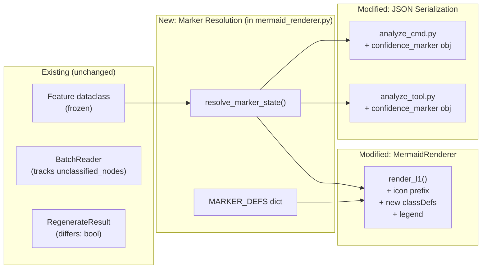

# Design Document — Confidence Markers Visual Specification (Phase 0b)

## Overview

This design extends the existing `MermaidRenderer` and JSON serialization to support four confidence marker states beyond the existing high/medium/low styling. The core addition is a **marker resolution function** that determines which single visual state to display based on priority, and the corresponding Mermaid classDef entries, icon prefixes, conditional legend, and JSON `confidence_marker` object.

**Design principle:** This is a rendering concern. The `Feature` dataclass gains one backward-compatible field (`source_reviewed: bool = False`). All other marker state is computed at render time from context passed by the caller.

## Architecture



### Decision: Marker context as a dict, not on Feature

The `Feature` dataclass is `frozen=True`. Rather than adding fields to it, the marker resolution function accepts the feature plus an optional context dict containing `regenerated_differs` and `incomplete_reading` flags. These flags are computed by the caller from `RegenerateResult.differs` and `BatchReader.unclassified_nodes` respectively.

**Rationale:** Keeps the model layer stable. The marker state is a rendering/presentation concern that depends on pipeline state (which nodes were regenerated, which were incomplete), not on the LLM output itself.

## Components and Interfaces

### 1. Marker State Definitions (module-level constant in `mermaid_renderer.py`)

```python
@dataclass(frozen=True)
class MarkerDef:
    """Visual definition for a single confidence marker state."""
    name: str           # classDef name in Mermaid
    icon: str           # Unicode prefix for node label
    fill: str           # CSS fill color
    stroke: str         # CSS stroke color
    stroke_dasharray: str | None  # None = solid
    stroke_width: int   # px
    display_label: str  # Human-readable label for JSON

MARKER_DEFS: dict[str, MarkerDef] = {
    "high":        MarkerDef("high",        "✓", "#d4edda", "#28a745", None,         2, "high confidence"),
    "medium":      MarkerDef("medium",      "?", "#fff3cd", "#ffc107", "5 5",        2, "medium confidence"),
    "low":         MarkerDef("low",         "⚠", "#f8d7da", "#dc3545", "2 2",        2, "low confidence"),
    "reviewed":    MarkerDef("reviewed",    "✔", "#cce5ff", "#007bff", None,         3, "source-reviewed"),
    "regenerated": MarkerDef("regenerated", "Δ", "#e8d5f5", "#6f42c1", "10 5 2 5",  2, "regenerated, differs from previous"),
    "incomplete":  MarkerDef("incomplete",  "…", "#e9ecef", "#6c757d", "2 2",        2, "incomplete reading"),
}
```

### 2. Marker Resolution Function (in `mermaid_renderer.py`)

```python
def resolve_marker_state(
    feature: Feature,
    *,
    regenerated_differs: bool = False,
    incomplete_reading: bool = False,
) -> str:
    """Return the MARKER_DEFS key for the active marker state.

    Priority (highest first): incomplete > regenerated > reviewed > base confidence.
    """
    if incomplete_reading:
        return "incomplete"
    if regenerated_differs:
        return "regenerated"
    if feature.source_reviewed:
        return "reviewed"
    return feature.confidence
```

The `Feature` dataclass gains one new field `source_reviewed: bool = False` (backward-compatible default). The BatchReader sets it to `True` after a successful source review pass.

### 3. Modified `MermaidRenderer.render_l1()` (in `mermaid_renderer.py`)

Changes to the existing method:

1. **classDef block**: Replace the 3 hardcoded classDef lines with all 6 from `MARKER_DEFS`
2. **Node labels**: Prepend the icon from the resolved marker state
3. **Class assignment**: Use the resolved marker key instead of `feature.confidence`
4. **Legend**: Append conditional legend subgraph

New signature:

```python
def render_l1(
    self,
    l1_output: L1Output,
    *,
    marker_context: dict[str, dict[str, bool]] | None = None,
    show_legend: bool = False,
) -> str:
```

`marker_context` maps `feature_id` → `{"regenerated_differs": bool, "incomplete_reading": bool}`. When `None`, all features use base confidence only. `show_legend` defaults to `False` to avoid breaking existing callers; opt-in when needed.

### 4. Legend Generation (in `mermaid_renderer.py`)

```python
def _render_legend(self, present_states: set[str]) -> list[str]:
    """Generate legend subgraph lines for the given marker states."""
    # Only non-high states trigger legend
    legend_states = present_states - {"high"}
    if not legend_states:
        return []

    lines = ['    subgraph Legend["Legend"]']
    for key in ["high", "medium", "low", "reviewed", "regenerated", "incomplete"]:
        if key in present_states:
            marker = MARKER_DEFS[key]
            lines.append(f'        legend_{key}["{marker.icon} {marker.display_label}"]')
            lines.append(f"        class legend_{key} {key}")
    lines.append("    end")
    return lines
```

The legend is appended only when `show_legend=True` and at least one non-high state exists.

### 5. JSON `confidence_marker` Object (public function in `mermaid_renderer.py`)

Shared helper used by both `analyze_cmd.py` and `analyze_tool.py`:

```python
def build_confidence_marker(
    feature: Feature,
    regenerated_differs: bool = False,
    incomplete_reading: bool = False,
) -> dict:
    state = resolve_marker_state(
        feature,
        regenerated_differs=regenerated_differs,
        incomplete_reading=incomplete_reading,
    )
    return {
        "confidence": feature.confidence,
        "source_reviewed": feature.source_reviewed,
        "regenerated_differs": regenerated_differs,
        "incomplete_reading": incomplete_reading,
        "display_label": MARKER_DEFS[state].display_label,
    }
```

Both `analyze_cmd.py` and `analyze_tool.py` import and call `build_confidence_marker` when building feature dicts. The `confidence_marker` key is added alongside existing fields.

## Data Models

### Modified: `Feature` (in `models.py`)

One new field added (with default, so backward-compatible):

```python
@dataclass(frozen=True)
class Feature:
    feature_id: str
    label: str
    description: str
    trigger: str
    trigger_description: str
    confidence: str
    confidence_reason: str
    source_nodes: list[str] = field(default_factory=list)
    needs_source_review: bool = False
    review_reason: str | None = None
    source_reviewed: bool = False  # NEW
```

### New: `MarkerDef` (in `mermaid_renderer.py`)

Frozen dataclass holding the visual definition for one marker state. See Components section above.

### New: `confidence_marker` JSON object

```json
{
  "confidence": "high",
  "source_reviewed": false,
  "regenerated_differs": false,
  "incomplete_reading": false,
  "display_label": "high confidence"
}
```

All boolean fields are always present regardless of which state is active. `display_label` reflects the priority-resolved active state.

## Correctness Properties

*A property is a characteristic or behavior that should hold true across all valid executions of a system — essentially, a formal statement about what the system should do. Properties serve as the bridge between human-readable specifications and machine-verifiable correctness guarantees.*

### Property 1: Marker priority resolution returns exactly one valid state

*For any* combination of confidence level (high/medium/low), source_reviewed flag, regenerated_differs flag, and incomplete_reading flag, `resolve_marker_state` SHALL return exactly one key from `MARKER_DEFS`, and that key SHALL correspond to the highest-priority active flag (incomplete > regenerated > reviewed > base confidence).

**Validates: Requirements 1.1, 1.2, 3.2**

### Property 2: JSON confidence_marker preserves all boolean states

*For any* Feature with any combination of marker flags, the `confidence_marker` JSON object SHALL contain all five fields (`confidence`, `source_reviewed`, `regenerated_differs`, `incomplete_reading`, `display_label`), and each boolean field SHALL match the input value regardless of which state is visually active.

**Validates: Requirements 1.3, 3.1**

### Property 3: Mermaid node labels contain the correct icon prefix

*For any* Feature rendered to Mermaid, the node label text SHALL begin with the icon character from `MARKER_DEFS[resolved_state]`, where `resolved_state` is the output of `resolve_marker_state` for that feature.

**Validates: Requirements 2.1, 2.3**

### Property 4: Conditional legend contains exactly the present states

*For any* set of Features rendered to Mermaid with `show_legend=True`, the legend subgraph SHALL appear if and only if at least one feature has a resolved marker state other than "high". When present, the legend SHALL contain entries for exactly the set of resolved marker states that appear among the features.

**Validates: Requirements 4.1, 4.2, 4.3**

## Error Handling

| Scenario | Handling |
|---|---|
| `feature.confidence` not in `MARKER_DEFS` | `resolve_marker_state` falls through to `feature.confidence` which will be an unknown key — raise `KeyError` at classDef lookup time. The existing `OutputValidator` already ensures confidence is one of high/medium/low, so this is a programming error. |
| `marker_context` missing a feature_id | Default to `regenerated_differs=False, incomplete_reading=False` — feature renders with base confidence. |
| `marker_context` is `None` | All features render with base confidence + source_reviewed only. No regenerated/incomplete states. |
| Empty feature list | Existing behavior: renders `empty["No features identified"]`. No legend generated. |

## Testing Strategy

### Property-Based Tests (Hypothesis)

PBT is appropriate here because the marker resolution and rendering functions are pure functions with clear input/output behavior and a combinatorial input space (3 confidence levels × 2³ boolean flags = 24 combinations, but generators should also vary labels, feature counts, and mixed states).

**Library:** Hypothesis (already used in the project)
**Minimum iterations:** 100 per property

Each property test references its design property:

| Test | Property | Tag |
|---|---|---|
| `test_resolve_returns_one_valid_state` | Property 1 | `Feature: confidence-markers-visual-spec, Property 1: Marker priority resolution` |
| `test_json_marker_preserves_all_booleans` | Property 2 | `Feature: confidence-markers-visual-spec, Property 2: JSON confidence_marker completeness` |
| `test_mermaid_labels_have_correct_icon` | Property 3 | `Feature: confidence-markers-visual-spec, Property 3: Icon prefix in Mermaid labels` |
| `test_legend_matches_present_states` | Property 4 | `Feature: confidence-markers-visual-spec, Property 4: Conditional legend correctness` |

### Example-Based Unit Tests

| Test | Validates |
|---|---|
| Verify all 6 fill colors are unique | Req 2.4 |
| Verify all 6 border styles are unique | Req 5.1 |
| Verify all 6 icon prefixes are unique | Req 5.2 |
| Verify exact classDef output for each state matches spec table | Req 2.2 |
| Verify `show_legend=False` suppresses legend | Req 4.4 |
| Verify `confidence_reason` still present in JSON output | Req 3.3 |
| Verify `regenerated_differs` cleared after accept | Req 1.4 |

### Test File Location

All new tests go in `the_door/tests/property/test_rendering_properties.py` (property tests) and `the_door/tests/unit/test_mermaid_renderer.py` (example tests), following existing project conventions.
