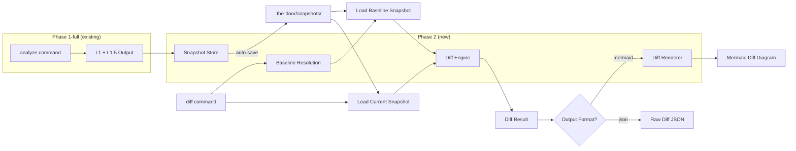
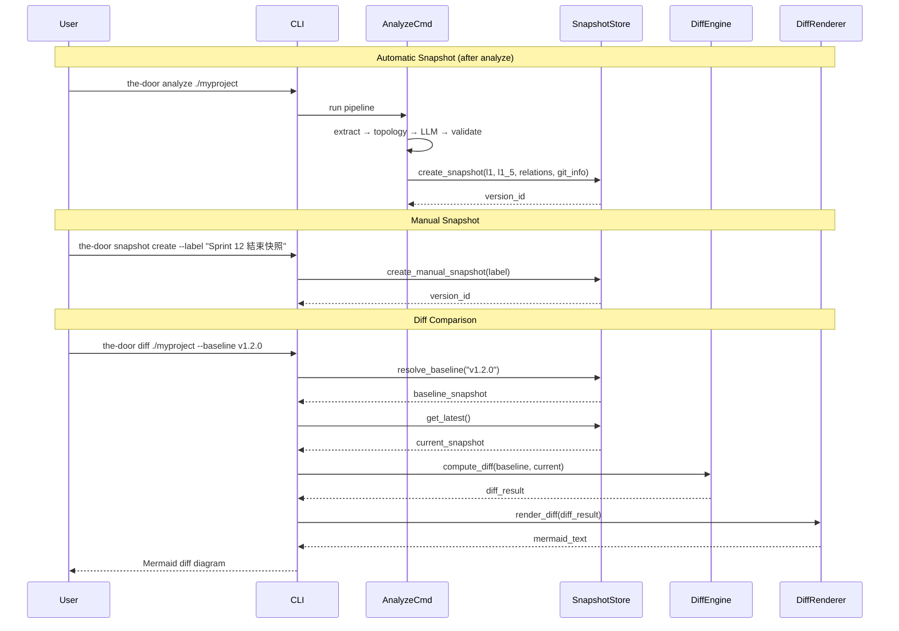

# Design Document — The Door Phase 2: Diff Engine

## Overview

Phase 2 adds version comparison capabilities to The Door. Where Phase 1-full delivers the complete LLM translation pipeline (AST extraction → topology → batch reading → validation → Mermaid rendering), Phase 2 adds the ability to compare two points in time and render the differences using the visual diff language defined in Phase 0a.

**What Phase 2 adds on top of Phase 1-full:**

| Capability | Description |
|---|---|
| **Snapshot Store** | Persist L1/L1.5 analysis output at each analysis run; manual snapshot creation |
| **Snapshot Retrieval** | Look up previous snapshots by git tag, commit SHA, date, or manual label |
| **Diff Engine** | Compute node-level and edge-level diffs between two snapshots (L1 and L1.5) |
| **Diff Priority Rules** | Deterministic classification when multiple change types affect one node |
| **Diff Renderer** | Extend MermaidRenderer with diff classDefs, edge styles, and diff symbols |
| **Diff Summary Panel** | Natural-language change summary in functional language (Traditional Chinese) |
| **Diff CLI** | `the-door diff` command with baseline resolution and output options |
| **Snapshot CLI** | `the-door snapshot create` and `the-door snapshot list` commands |
| **Diff Schemas** | `snapshot.schema.json` and `diff-result.schema.json` (Draft 2020-12) |
| **MCP Diff Tools** | 3 new MCP tools: `diff`, `snapshot_create`, `snapshot_list` |

### Design Decisions & Rationale

| Decision | Rationale |
|---|---|
| Snapshots as individual JSON files in `.the-door/snapshots/` | Simple, human-readable, no database dependency; consistent with narrative chain's file-based approach |
| Filename format: `{version_id}.json` with UUID v4 | Avoids filesystem-unsafe characters from git tags or labels; version_id is the canonical identifier |
| Hook snapshot creation into `analyze_cmd` output flow | Automatic snapshots require zero user effort; the analyze command already produces all needed data |
| Diff Engine as pure functions (no I/O) | Core diff computation is pure logic on two snapshot dicts — highly testable with property-based testing |
| DiffRenderer as separate class in `core/diff/`, sharing `escape_mermaid_label()` utility | Diff rendering is a distinct concern from L1/L1.5 rendering; shared utility extracted to `core/rendering/mermaid_utils.py` to avoid DRY violation |
| Baseline resolution priority: date → git ref → label | ISO 8601 dates are unambiguous format; git refs are next most specific; labels are fallback (may contain any string) |
| Summary panel as Mermaid comment block (`%% ...`) | Comments don't affect diagram parsing; summary is metadata, not a diagram element |
| `secondary_changes` field on node diff entries | Preserves attribute change details when dependency_changed takes priority, enabling side panel display |
| Same diff classDefs for L1 and L1.5 | Visual consistency across layers; the diff visual language is layer-agnostic per Phase 0a spec |
| Diff + confidence coexistence via label prefix | Follows Phase 0a §6.2 rule: one classDef per node (diff wins), confidence preserved as icon prefix in label |

## Architecture

### High-Level Data Flow (Phase 2 Diff Engine)



### Snapshot Lifecycle



### Module Boundaries

| Module | Package | Responsibility | Input | Output |
|---|---|---|---|---|
| `snapshot_store` | `core/diff/` | Create, persist, retrieve, and query version snapshots | L1/L1.5 output + git info | Snapshot JSON files |
| `diff_engine` | `core/diff/` | Compute node-level and edge-level diffs between two snapshots | Two snapshot dicts | DiffResult dataclass |
| `diff_renderer` | `core/diff/` | Generate Mermaid diff diagrams with classDefs, edge styles, summary panel | DiffResult + rendering options | Mermaid text string |
| `diff_cmd` | `cli/` | CLI command for running diff comparisons | CLI args (path, baseline, flags) | Mermaid text or JSON to stdout/file |
| `snapshot_cmd` | `cli/` | CLI commands for snapshot management (create, list) | CLI args (label) | Snapshot info or table |
| `diff_tool` | `mcp/tools/` | MCP tool for diff operations | MCP arguments | Mermaid text or DiffResult JSON |
| `snapshot_create_tool` | `mcp/tools/` | MCP tool for creating snapshots | MCP arguments | version_id |
| `snapshot_list_tool` | `mcp/tools/` | MCP tool for listing snapshots | MCP arguments | Snapshot list |

## Components and Interfaces

### Extended Folder Structure

```
the_door/
├── src/
│   └── the_door/
│       ├── models.py                         # Extended with Phase 2 diff models
│       ├── cli/
│       │   ├── main.py                       # Extended: add diff, snapshot commands
│       │   ├── analyze_cmd.py                # Extended: auto-snapshot after analysis
│       │   ├── diff_cmd.py                   # NEW: diff comparison command
│       │   └── snapshot_cmd.py               # NEW: snapshot create/list commands
│       ├── core/
│       │   ├── diff/                         # NEW: diff engine package
│       │   │   ├── __init__.py
│       │   │   ├── snapshot_store.py         # Snapshot CRUD + query
│       │   │   ├── diff_engine.py            # Pure diff computation
│       │   │   └── diff_renderer.py          # Mermaid diff rendering
│       │   ├── extraction/                   # (existing, unchanged)
│       │   ├── topology/                     # (existing, unchanged)
│       │   ├── validation/                   # (existing, unchanged)
│       │   ├── reading/                      # (existing, unchanged)
│       │   ├── rendering/                    # (existing, extended)
│       │   │   ├── mermaid_renderer.py       # (existing — _escape_label extracted to mermaid_utils)
│       │   │   ├── mermaid_utils.py          # NEW: shared escape_mermaid_label() utility
│       │   │   └── cost_estimator.py         # (existing, unchanged)
│       │   └── llm/                          # (existing, unchanged)
│       └── mcp/
│           ├── server.py                     # Extended: register 3 new tools
│           └── tools/
│               ├── diff_tool.py              # NEW: diff MCP tool
│               ├── snapshot_create_tool.py   # NEW: snapshot create MCP tool
│               └── snapshot_list_tool.py     # NEW: snapshot list MCP tool
├── schemas/
│   ├── snapshot.schema.json                  # NEW: version snapshot schema
│   └── diff-result.schema.json              # NEW: diff result schema
├── tests/
│   ├── unit/
│   │   ├── core/
│   │   │   └── diff/                         # NEW
│   │   │       ├── test_snapshot_store.py
│   │   │       ├── test_diff_engine.py
│   │   │       └── test_diff_renderer.py
│   │   ├── cli/
│   │   │   ├── test_diff_cmd.py              # NEW
│   │   │   └── test_snapshot_cmd.py          # NEW
│   │   └── mcp/
│   │       └── test_diff_tools.py            # NEW
│   └── property/
│       └── test_diff_properties.py           # NEW: diff engine PBT
└── pyproject.toml                            # (unchanged — no new dependencies)
```

### Component Interfaces

#### Snapshot Store

```python
# src/the_door/core/diff/snapshot_store.py

class SnapshotStore:
    """Manage version snapshot creation, persistence, and retrieval.
    
    All file I/O uses encoding="utf-8" for Windows compatibility.
    Snapshots stored as individual JSON files in .the-door/snapshots/.
    """

    def __init__(self, project_root: Path):
        self._snapshots_dir = project_root / ".the-door" / "snapshots"

    def create_snapshot(
        self,
        *,
        l1_snapshot: dict[str, dict],
        feature_relations: list[dict],
        analyzed_files: list[str],
        commit_hash: str | None = None,
        git_tags: list[str] | None = None,
        trigger: str = "commit",
        label: str | None = None,
        l1_5_snapshot: dict[str, dict] | None = None,
    ) -> VersionSnapshot:
        """Create and persist a new snapshot. Returns the created snapshot.
        
        Generates a UUID v4 version_id and ISO8601 timestamp.
        If trigger is "manual" and no label provided, auto-generates one.
        """
        ...

    def get_snapshot(self, version_id: str) -> VersionSnapshot | None:
        """Load a snapshot by version_id. Returns None if not found."""
        ...

    def get_latest(self) -> VersionSnapshot | None:
        """Return the most recently created snapshot, or None if empty."""
        ...

    def resolve_baseline(self, reference: str) -> VersionSnapshot:
        """Resolve a baseline reference to a snapshot.
        
        Resolution priority:
        1. Try ISO 8601 date format (YYYY-MM-DD) → most recent on or before date
        2. Try git tag or commit SHA match
        3. Fall back to manual label match
        
        Raises SnapshotNotFoundError with available snapshots if no match.
        """
        ...

    def list_snapshots(self) -> list[VersionSnapshot]:
        """Return all snapshots sorted by timestamp descending."""
        ...
```

#### Diff Engine

```python
# src/the_door/core/diff/diff_engine.py

class DiffEngine:
    """Compute structural diffs between two version snapshots.
    
    Pure functions — no I/O, no side effects. All inputs are dicts/dataclasses.
    Supports both L1 (feature-level) and L1.5 (block-level) diffs.
    """

    def compute_l1_diff(
        self,
        baseline: VersionSnapshot,
        current: VersionSnapshot,
    ) -> DiffResult:
        """Compute L1 feature-level diff.
        
        1. Match features by feature_id
        2. Classify each as added/removed/attribute_changed/unchanged
        3. Compare feature_relations (edges) for edge-level diffs
        4. Upgrade unchanged→dependency_changed when edges change
        5. Apply priority rules (added > removed > dep_changed > attr_changed)
        6. Compute summary counts
        """
        ...

    def compute_l1_5_diff(
        self,
        baseline: VersionSnapshot,
        current: VersionSnapshot,
    ) -> DiffResult:
        """Compute L1.5 block-level diff. Same algorithm as L1 but on blocks."""
        ...
```

#### Diff Renderer

```python
# src/the_door/core/diff/diff_renderer.py

class DiffRenderer:
    """Generate Mermaid diff diagrams from DiffResult.
    
    Extends the visual patterns from MermaidRenderer but specialized for diff output.
    Uses Phase 0a diff classDefs and edge styles.
    """

    # Diff classDef definitions (from Phase 0a §4.5)
    DIFF_CLASSDEFS = {
        "diff_added": "fill:#d4edda,stroke:#28a745,stroke-width:2",
        "diff_removed": "fill:#f8d7da,stroke:#dc3545,stroke-width:2",
        "diff_dep_changed": "fill:#f5c6a0,stroke:#e67e22,stroke-width:2",
        "diff_attr_changed": "fill:#ffe0cc,stroke:#fd7e14,stroke-width:2",
        "unchanged": "fill:#f8f9fa,stroke:#dee2e6,color:#6c757d,stroke-dasharray:2 2",
    }

    # Diff symbols (from Phase 0a §4.1)
    DIFF_SYMBOLS = {
        "added": "+",
        "removed": "−",
        "dependency_changed": "≠",
        "attribute_changed": "~",
    }

    def render_l1_diff(
        self,
        diff_result: DiffResult,
        *,
        marker_context: dict[str, dict[str, bool]] | None = None,
    ) -> str:
        """Render L1 diff as Mermaid flowchart.
        
        1. Emit summary panel as comment block
        2. Emit diff classDef definitions
        3. Emit node definitions with diff symbol prefix and confidence icon
        4. Assign classDef per node based on diff state
        5. Emit edge definitions with diff edge styles (unchanged edges rendered as light gray to match unchanged node de-emphasis)
        
        Label format: "[confidence_icon] [diff_symbol] node_label"
        """
        ...

    def render_l1_5_diff(
        self,
        diff_result: DiffResult,
    ) -> str:
        """Render L1.5 diff as Mermaid flowchart. Same pattern as L1 diff."""
        ...

    def _render_summary_panel(self, diff_result: DiffResult) -> list[str]:
        """Generate summary panel as Mermaid comment lines.
        
        Format:
        %% 📊 版本比較：[baseline_label] → [current_label]
        %%    新增 N 個功能 | 移除 N 個功能 | 修改 N 個功能（M 個依賴關係變更、K 個屬性變更）
        
        Omits categories with zero count. Shows no-change message when identical.
        """
        ...

    def _format_baseline_label(self, baseline_info: BaselineInfo) -> str:
        """Format baseline label based on trigger type.
        
        - git ref: "v1.2.0 (abc1234)"
        - date: "2024-01-15 的快照"
        - manual: "Sprint 12 結束快照"
        """
        ...

    def _build_node_label(
        self,
        node_diff: NodeDiff,
        confidence_icon: str,
    ) -> str:
        """Build label: "[confidence_icon] [diff_symbol] escaped_label"."""
        ...

    # NOTE: Uses escape_mermaid_label() from core/rendering/mermaid_utils.py
    # (extracted from MermaidRenderer._escape_label to avoid duplication)
```

#### CLI Commands

```python
# src/the_door/cli/diff_cmd.py

@click.command("diff")
@click.argument("codebase_path", type=click.Path(exists=True))
@click.option("--baseline", required=True, help="Baseline reference: git tag, commit SHA, date (YYYY-MM-DD), or snapshot label")
@click.option("--json", "output_json", is_flag=True, help="Output raw DiffResult JSON instead of Mermaid")
@click.option("--layer", type=click.Choice(["l1", "l1.5"]), default="l1", help="Layer to diff (default: l1)")
@click.option("-o", "--output", "output_file", type=click.Path(), default=None, help="Write output to file")
def diff_cmd(codebase_path, baseline, output_json, layer, output_file):
    """Compare current analysis against a baseline version."""
    ...
```

```python
# src/the_door/cli/snapshot_cmd.py

@click.group("snapshot")
def snapshot_group():
    """Manage version snapshots."""
    pass

@snapshot_group.command("create")
@click.argument("codebase_path", type=click.Path(exists=True), default=".")
@click.option("--label", required=True, help="Human-readable snapshot label")
def snapshot_create(codebase_path, label):
    """Create a manual snapshot from the most recent analysis output."""
    ...

@snapshot_group.command("list")
@click.argument("codebase_path", type=click.Path(exists=True), default=".")
def snapshot_list(codebase_path):
    """List all available snapshots."""
    ...
```

#### MCP Tools

```python
# src/the_door/mcp/tools/diff_tool.py

TOOL_SCHEMA = {
    "type": "object",
    "required": ["codebase_path", "baseline"],
    "properties": {
        "codebase_path": {"type": "string", "description": "Path to the codebase root"},
        "baseline": {"type": "string", "description": "Baseline reference (git tag, SHA, date, or label)"},
        "format": {"type": "string", "enum": ["mermaid", "json"], "default": "mermaid", "description": "Output format"},
        "layer": {"type": "string", "enum": ["l1", "l1.5"], "default": "l1", "description": "Layer to diff"},
    },
}

async def execute(arguments: dict) -> dict:
    """Execute the diff tool."""
    ...
```

```python
# src/the_door/mcp/tools/snapshot_create_tool.py

TOOL_SCHEMA = {
    "type": "object",
    "required": ["codebase_path"],
    "properties": {
        "codebase_path": {"type": "string", "description": "Path to the codebase root"},
        "label": {"type": "string", "description": "Optional snapshot label"},
    },
}

async def execute(arguments: dict) -> dict:
    """Execute the snapshot_create tool."""
    ...
```

```python
# src/the_door/mcp/tools/snapshot_list_tool.py

TOOL_SCHEMA = {
    "type": "object",
    "required": ["codebase_path"],
    "properties": {
        "codebase_path": {"type": "string", "description": "Path to the codebase root"},
    },
}

async def execute(arguments: dict) -> dict:
    """Execute the snapshot_list tool."""
    ...
```

## Data Models

### New Data Classes in models.py

All new models follow existing conventions: `frozen=True` for immutable value objects, `field(default_factory=...)` for mutable defaults.

```python
# === Phase 2: Diff Engine models ===

@dataclass(frozen=True)
class FeatureSummary:
    """Summarized feature data stored in a version snapshot.
    
    A lightweight projection of Feature — only the fields needed for diff comparison.
    """
    feature_id: str
    label: str
    description: str
    source_node_count: int
    confidence: str  # "high" | "medium" | "low"


@dataclass(frozen=True)
class BlockSummary:
    """Summarized block data stored in a version snapshot (L1.5)."""
    block_id: str
    label: str
    responsibility: str
    confidence: str = "medium"


@dataclass(frozen=True)
class RelationSummary:
    """Summarized feature relation stored in a version snapshot."""
    from_feature: str
    to_feature: str
    relation: str


@dataclass(frozen=True)
class BaselineInfo:
    """Metadata about a comparison baseline or current version."""
    version_id: str
    timestamp: str  # ISO8601
    trigger: str  # "commit" | "manual"
    commit_hash: str | None = None
    git_tags: list[str] = field(default_factory=list)
    label: str | None = None
    resolved_from: str | None = None  # Original query string used to resolve this baseline (e.g., "v1.2.0", "2024-01-15", "Sprint 12 結束快照")


@dataclass(frozen=True)
class VersionSnapshot:
    """A persisted record of L1/L1.5 output at a specific point in time."""
    version_id: str
    timestamp: str  # ISO8601
    trigger: str  # "commit" | "manual"
    l1_snapshot: dict[str, FeatureSummary] = field(default_factory=dict)
    analyzed_files: list[str] = field(default_factory=list)
    commit_hash: str | None = None
    git_tags: list[str] = field(default_factory=list)
    label: str | None = None
    l1_5_snapshot: dict[str, BlockSummary] = field(default_factory=dict)
    feature_relations_snapshot: list[RelationSummary] = field(default_factory=list)


@dataclass(frozen=True)
class NodeDiff:
    """A single node's diff classification."""
    node_id: str  # feature_id or block_id
    diff_state: str  # "added" | "removed" | "attribute_changed" | "dependency_changed" | "unchanged"
    current_label: str | None = None
    current_description: str | None = None
    baseline_label: str | None = None
    baseline_description: str | None = None
    current_confidence: str | None = None
    secondary_changes: dict | None = None  # e.g., {"attribute_changed": {"old_label": ..., "new_label": ...}}


@dataclass(frozen=True)
class EdgeDiff:
    """A single edge's diff classification."""
    from_node: str
    to_node: str
    diff_state: str  # "added" | "removed" | "modified"
    current_relation: str | None = None
    baseline_relation: str | None = None


@dataclass(frozen=True)
class DiffSummary:
    """Aggregate counts for a diff result."""
    added_count: int = 0
    removed_count: int = 0
    dependency_changed_count: int = 0
    attribute_changed_count: int = 0
    total_changed_count: int = 0


@dataclass(frozen=True)
class DiffResult:
    """Complete diff output between two snapshots."""
    baseline_info: BaselineInfo
    current_info: BaselineInfo
    node_diffs: list[NodeDiff] = field(default_factory=list)
    edge_diffs: list[EdgeDiff] = field(default_factory=list)
    summary: DiffSummary = field(default_factory=DiffSummary)
    layer: str = "l1"  # "l1" | "l1.5"
```

### New JSON Schemas

#### `schemas/snapshot.schema.json`

```json
{
  "$schema": "https://json-schema.org/draft/2020-12/schema",
  "$id": "https://the-door.dev/schemas/snapshot.schema.json",
  "title": "The Door Version Snapshot",
  "description": "A persisted record of L1/L1.5 analysis output at a specific point in time",
  "type": "object",
  "required": ["version_id", "timestamp", "trigger", "l1_snapshot", "analyzed_files"],
  "properties": {
    "version_id": { "type": "string" },
    "timestamp": { "type": "string", "format": "date-time" },
    "trigger": { "type": "string", "enum": ["commit", "manual"] },
    "commit_hash": { "type": ["string", "null"] },
    "git_tags": { "type": "array", "items": { "type": "string" } },
    "label": { "type": "string" },
    "l1_snapshot": {
      "type": "object",
      "additionalProperties": {
        "type": "object",
        "required": ["label", "description", "source_node_count", "confidence"],
        "properties": {
          "label": { "type": "string" },
          "description": { "type": "string" },
          "source_node_count": { "type": "integer", "minimum": 0 },
          "confidence": { "type": "string", "enum": ["high", "medium", "low"] }
        }
      }
    },
    "analyzed_files": { "type": "array", "items": { "type": "string" } },
    "l1_5_snapshot": {
      "type": "object",
      "additionalProperties": {
        "type": "object",
        "required": ["label", "responsibility"],
        "properties": {
          "label": { "type": "string" },
          "responsibility": { "type": "string" },
          "confidence": { "type": "string", "enum": ["high", "medium", "low"] }
        }
      }
    },
    "feature_relations_snapshot": {
      "type": "array",
      "items": {
        "type": "object",
        "required": ["from_feature", "to_feature", "relation"],
        "properties": {
          "from_feature": { "type": "string" },
          "to_feature": { "type": "string" },
          "relation": { "type": "string" }
        }
      }
    }
  },
  "if": { "properties": { "trigger": { "const": "manual" } } },
  "then": { "required": ["label"] }
}
```

#### `schemas/diff-result.schema.json`

```json
{
  "$schema": "https://json-schema.org/draft/2020-12/schema",
  "$id": "https://the-door.dev/schemas/diff-result.schema.json",
  "title": "The Door Diff Result",
  "description": "Structured diff output between two version snapshots",
  "type": "object",
  "required": ["baseline_info", "current_info", "node_diffs", "edge_diffs", "summary"],
  "properties": {
    "baseline_info": { "$ref": "#/$defs/version_info" },
    "current_info": { "$ref": "#/$defs/version_info" },
    "node_diffs": {
      "type": "array",
      "items": {
        "type": "object",
        "required": ["node_id", "diff_state"],
        "properties": {
          "node_id": { "type": "string" },
          "diff_state": { "type": "string", "enum": ["added", "removed", "attribute_changed", "dependency_changed", "unchanged"] },
          "current_label": { "type": ["string", "null"] },
          "current_description": { "type": ["string", "null"] },
          "baseline_label": { "type": ["string", "null"] },
          "baseline_description": { "type": ["string", "null"] },
          "current_confidence": { "type": ["string", "null"] },
          "secondary_changes": { "type": ["object", "null"] }
        }
      }
    },
    "edge_diffs": {
      "type": "array",
      "items": {
        "type": "object",
        "required": ["from_node", "to_node", "diff_state"],
        "properties": {
          "from_node": { "type": "string" },
          "to_node": { "type": "string" },
          "diff_state": { "type": "string", "enum": ["added", "removed", "modified"] },
          "current_relation": { "type": ["string", "null"] },
          "baseline_relation": { "type": ["string", "null"] }
        }
      }
    },
    "summary": {
      "type": "object",
      "required": ["added_count", "removed_count", "dependency_changed_count", "attribute_changed_count", "total_changed_count"],
      "properties": {
        "added_count": { "type": "integer", "minimum": 0 },
        "removed_count": { "type": "integer", "minimum": 0 },
        "dependency_changed_count": { "type": "integer", "minimum": 0 },
        "attribute_changed_count": { "type": "integer", "minimum": 0 },
        "total_changed_count": { "type": "integer", "minimum": 0 }
      }
    }
  },
  "$defs": {
    "version_info": {
      "type": "object",
      "required": ["version_id", "timestamp", "trigger"],
      "properties": {
        "version_id": { "type": "string" },
        "timestamp": { "type": "string", "format": "date-time" },
        "trigger": { "type": "string", "enum": ["commit", "manual"] },
        "commit_hash": { "type": ["string", "null"] },
        "git_tags": { "type": "array", "items": { "type": "string" } },
        "label": { "type": ["string", "null"] }
      }
    }
  }
}
```


## Correctness Properties

*A property is a characteristic or behavior that should hold true across all valid executions of a system — essentially, a formal statement about what the system should do. Properties serve as the bridge between human-readable specifications and machine-verifiable correctness guarantees.*

### Property 1: Diff symmetry

*For any* two snapshots A and B, computing diff(A, B) and diff(B, A) SHALL produce symmetric results: nodes classified as "added" in diff(A, B) SHALL be classified as "removed" in diff(B, A) and vice versa; nodes classified as "attribute_changed" or "dependency_changed" SHALL have the same classification in both directions.

**Validates: Requirements 3.6, 13.1**

### Property 2: Self-diff idempotency

*For any* valid snapshot S, computing diff(S, S) SHALL produce a DiffResult where all nodes are classified as "unchanged", all change counts are zero, and total_changed_count is zero.

**Validates: Requirements 13.2**

### Property 3: Count consistency

*For any* valid DiffResult, the sum of added_count + removed_count + dependency_changed_count + attribute_changed_count SHALL equal total_changed_count.

**Validates: Requirements 13.3**

### Property 4: Exclusive single classification

*For any* valid DiffResult, every node SHALL have exactly one diff_state from the set {"added", "removed", "attribute_changed", "dependency_changed", "unchanged"}.

**Validates: Requirements 3.1, 5.4**

### Property 5: Node classification correctness

*For any* pair of snapshots and any feature present in both, if the feature's label and description are identical in both snapshots (and no edge changes affect it), the diff_state SHALL be "unchanged"; if the label or description differs, the diff_state SHALL be "attribute_changed" (or "dependency_changed" if edges also changed).

**Validates: Requirements 3.3, 3.4**

### Property 6: Dependency change priority

*For any* node that has both attribute changes (label/description differ) and dependency changes (incoming/outgoing edges changed), the primary diff_state SHALL be "dependency_changed" and the attribute change details SHALL be recorded in the secondary_changes field.

**Validates: Requirements 4.3, 4.4, 5.1, 5.3**

### Property 7: Added/removed exclusivity

*For any* node classified as "added" or "removed" in a DiffResult, the secondary_changes field SHALL be None (added/removed nodes cannot simultaneously have attribute or dependency changes).

**Validates: Requirements 5.2**

### Property 8: Rendering node count preservation

*For any* valid DiffResult, the rendered Mermaid text SHALL contain exactly len(node_diffs) node definitions (one per node in the diff result).

**Validates: Requirements 6.7**

### Property 9: Rendering classDef assignment

*For any* valid DiffResult, each node in the rendered Mermaid text SHALL be assigned the classDef corresponding to its diff_state: "diff_added" for added, "diff_removed" for removed, "diff_dep_changed" for dependency_changed, "diff_attr_changed" for attribute_changed, and "unchanged" for unchanged. Diff classDefs SHALL override confidence classDefs.

**Validates: Requirements 6.2, 6.4, 12.1, 12.3**

### Property 10: Rendering diff symbol prefix

*For any* changed node (diff_state ≠ "unchanged") in a DiffResult, the rendered Mermaid label SHALL contain the correct diff symbol prefix: "+" for added, "−" for removed, "≠" for dependency_changed, "~" for attribute_changed.

**Validates: Requirements 6.3**

### Property 11: Diff + confidence label format

*For any* node in a DiffResult that has confidence data, the rendered label SHALL follow the format "[confidence_icon] [diff_symbol] node_label" where confidence_icon is preserved from the confidence marker (✓/?/⚠) and diff_symbol is the appropriate diff symbol (or empty for unchanged).

**Validates: Requirements 12.2, 12.4**

### Property 12: Summary panel count accuracy

*For any* DiffResult with at least one change, the summary panel SHALL contain count values matching the DiffSummary, and categories with zero count SHALL be omitted from the summary text.

**Validates: Requirements 7.3, 7.5**

### Property 13: Summary panel functional language

*For any* rendered diff diagram, the summary panel SHALL be rendered as Mermaid comment lines (starting with `%%`) and SHALL use the term "功能" (not "節點" or "模組").

**Validates: Requirements 7.1, 7.4**

### Property 14: Snapshot and DiffResult JSON round-trip

*For any* valid VersionSnapshot, serializing to JSON and deserializing back SHALL produce an equivalent object. The same round-trip property SHALL hold for DiffResult.

**Validates: Requirements 10.3**

### Property 15: Snapshot and DiffResult schema compliance

*For any* valid VersionSnapshot serialized to JSON, it SHALL validate against snapshot.schema.json. *For any* valid DiffResult serialized to JSON, it SHALL validate against diff-result.schema.json.

**Validates: Requirements 10.1, 10.2**

### Property 16: Date-based lookup returns most recent on or before

*For any* set of snapshots with distinct timestamps and any query date, the snapshot returned by date-based lookup SHALL be the one with the most recent timestamp that is on or before the query date. If no snapshot exists on or before the query date, the lookup SHALL fail.

**Validates: Requirements 2.3**

### Property 17: Snapshot list ordering

*For any* set of snapshots, listing them SHALL return them sorted by timestamp in descending order (most recent first).

**Validates: Requirements 9.3**

## Error Handling

### Snapshot Store Errors

| Error Condition | Behavior | User Message |
|---|---|---|
| No prior analysis output when creating snapshot | Raise `SnapshotError` | "No analysis output found. Run `the-door analyze` first." |
| Snapshot directory not writable | Raise `SnapshotError` | "Cannot write to .the-door/snapshots/: {os_error}" |
| Baseline reference not found | Raise `SnapshotNotFoundError` | "No snapshot matches '{reference}'. Available snapshots:\n{table}" |
| Snapshot file corrupted (invalid JSON) | Skip corrupted file, log warning | Warning logged; corrupted snapshot excluded from results |
| Git not available (for auto-snapshot) | Graceful fallback | Snapshot created with commit_hash=null, trigger="manual", auto-generated label |

### Diff Engine Errors

| Error Condition | Behavior | User Message |
|---|---|---|
| Baseline snapshot missing L1 data | Raise `DiffError` | "Baseline snapshot {version_id} has no L1 data." |
| Current snapshot missing L1 data | Raise `DiffError` | "Current snapshot {version_id} has no L1 data." |
| L1.5 diff requested but snapshot lacks L1.5 data | Raise `DiffError` | "Snapshot {version_id} has no L1.5 data. Run analyze with L1.5 output enabled." |

### CLI Errors

| Error Condition | Behavior | User Message |
|---|---|---|
| `diff` with no snapshots | Exit with error | "No snapshots found in {path}/.the-door/snapshots/. Run `the-door analyze` first." |
| `diff` with unresolvable baseline | Exit with error | "Cannot resolve baseline '{ref}'. Available snapshots:\n{table}" |
| `snapshot create` with no analysis output | Exit with error | "No analysis output found. Run `the-door analyze` first." |
| `-o` file path not writable | Exit with error | "Cannot write to {path}: {os_error}" |

### MCP Tool Errors

All MCP tools return structured error responses following the existing pattern:

```json
{"error": "Human-readable error message"}
```

Error responses use the same `TextContent` wrapper as existing MCP tools, ensuring consistent error handling across all tools.

### Custom Exception Classes

```python
# Added to core/diff/ or a shared exceptions module

class SnapshotError(Exception):
    """Base error for snapshot operations."""
    pass

class SnapshotNotFoundError(SnapshotError):
    """Raised when a baseline reference cannot be resolved."""
    def __init__(self, reference: str, available: list[dict]):
        self.reference = reference
        self.available = available
        super().__init__(f"No snapshot matches '{reference}'")

class DiffError(Exception):
    """Error during diff computation."""
    pass
```

## Testing Strategy

### Dual Testing Approach

Phase 2 uses the same testing methodology as previous phases:

- **Property-based tests** (Hypothesis): Verify universal properties across randomly generated inputs. Minimum 100 iterations per property.
- **Unit tests** (pytest): Verify specific examples, edge cases, error conditions, and integration points.

### Property-Based Testing Configuration

- **Library**: Hypothesis (already used across 37 properties in Phases 0a–1-full)
- **Minimum iterations**: 100 per property (via `@settings(max_examples=100)`)
- **Strategy conventions**: ASCII-only strings on Windows (cp950 encoding), `st.builds` for dataclass construction
- **Tag format**: `# Feature: diff-engine, Property N: {property_text}`
- **Test file**: `tests/property/test_diff_properties.py`

### Property Test Plan

Each correctness property maps to a single Hypothesis test:

| Property | Test Function | Key Generators |
|---|---|---|
| 1: Diff symmetry | `test_diff_symmetry` | Random snapshot pairs with overlapping/disjoint feature sets |
| 2: Self-diff idempotency | `test_self_diff_idempotency` | Random single snapshots |
| 3: Count consistency | `test_count_consistency` | Random snapshot pairs |
| 4: Exclusive single classification | `test_exclusive_classification` | Random snapshot pairs |
| 5: Node classification correctness | `test_node_classification` | Random feature pairs with varied label/description |
| 6: Dependency change priority | `test_dependency_change_priority` | Snapshots with both attribute and edge changes |
| 7: Added/removed exclusivity | `test_added_removed_exclusivity` | Random snapshot pairs |
| 8: Rendering node count | `test_rendering_node_count` | Random DiffResult objects |
| 9: Rendering classDef assignment | `test_rendering_classdef` | Random DiffResult objects |
| 10: Rendering diff symbols | `test_rendering_diff_symbols` | Random DiffResult objects with changed nodes |
| 11: Diff + confidence label format | `test_confidence_label_format` | Random DiffResult with confidence data |
| 12: Summary count accuracy | `test_summary_count_accuracy` | Random DiffResult objects |
| 13: Summary functional language | `test_summary_functional_language` | Random DiffResult objects |
| 14: JSON round-trip | `test_json_round_trip` | Random VersionSnapshot and DiffResult objects |
| 15: Schema compliance | `test_schema_compliance` | Random VersionSnapshot and DiffResult objects |
| 16: Date-based lookup | `test_date_lookup` | Random snapshot sets with timestamps + query dates |
| 17: Snapshot list ordering | `test_snapshot_list_ordering` | Random snapshot sets |

### Unit Test Plan

| Module | Test File | Key Test Cases |
|---|---|---|
| `snapshot_store` | `test_snapshot_store.py` | Create auto-snapshot, create manual snapshot, git fallback, UTF-8 encoding, error on no analysis, file persistence |
| `diff_engine` | `test_diff_engine.py` | Added/removed/changed/unchanged classification examples, edge diff examples, L1.5 diff, infrastructure block diff |
| `diff_renderer` | `test_diff_renderer.py` | ClassDef definitions present, edge styles correct, summary panel format (3 trigger types), no-change message, label escaping |
| `diff_cmd` | `test_diff_cmd.py` | CLI invocation, --json flag, --layer flag, -o flag, error messages |
| `snapshot_cmd` | `test_snapshot_cmd.py` | Create command, list command, table format, empty list |
| `diff_tool` | `test_diff_tools.py` | MCP tool registration, execute with valid args, error responses |
| `snapshot_create_tool` | `test_diff_tools.py` | MCP tool registration, execute with label |
| `snapshot_list_tool` | `test_diff_tools.py` | MCP tool registration, execute returns list |

### Hypothesis Strategy Design

```python
# Shared strategies for diff engine property tests

@st.composite
def feature_summaries(draw):
    """Generate a random FeatureSummary."""
    return FeatureSummary(
        feature_id=draw(st.text(alphabet=string.ascii_lowercase, min_size=3, max_size=10)),
        label=draw(st.text(alphabet=string.ascii_letters, min_size=1, max_size=30)),
        description=draw(st.text(alphabet=string.ascii_letters, min_size=1, max_size=50)),
        source_node_count=draw(st.integers(min_value=0, max_value=100)),
        confidence=draw(st.sampled_from(["high", "medium", "low"])),
    )

@st.composite
def relation_summaries(draw, feature_ids):
    """Generate a random RelationSummary from available feature_ids."""
    from_f = draw(st.sampled_from(feature_ids))
    to_f = draw(st.sampled_from([f for f in feature_ids if f != from_f]))
    return RelationSummary(
        from_feature=from_f,
        to_feature=to_f,
        relation=draw(st.text(alphabet=string.ascii_letters, min_size=3, max_size=20)),
    )

@st.composite
def version_snapshots(draw):
    """Generate a random VersionSnapshot with consistent internal data."""
    features = draw(st.lists(feature_summaries(), min_size=1, max_size=10))
    feature_ids = [f.feature_id for f in features]
    # Ensure unique feature_ids
    seen = set()
    unique_features = {}
    for f in features:
        if f.feature_id not in seen:
            seen.add(f.feature_id)
            unique_features[f.feature_id] = f
    
    relations = []
    if len(unique_features) >= 2:
        relations = draw(st.lists(
            relation_summaries(list(unique_features.keys())),
            min_size=0, max_size=5,
        ))
    
    return VersionSnapshot(
        version_id=draw(st.uuids()).hex,
        timestamp=draw(st.datetimes()).isoformat(),
        trigger=draw(st.sampled_from(["commit", "manual"])),
        l1_snapshot=unique_features,
        feature_relations_snapshot=relations,
        analyzed_files=draw(st.lists(st.text(alphabet=string.ascii_lowercase, min_size=3, max_size=15), max_size=5)),
    )
```

### Test Execution

```bash
# Run all Phase 2 tests
pytest tests/property/test_diff_properties.py tests/unit/core/diff/ tests/unit/cli/test_diff_cmd.py tests/unit/cli/test_snapshot_cmd.py tests/unit/mcp/test_diff_tools.py -v

# Run only property tests
pytest tests/property/test_diff_properties.py -v

# Run with Hypothesis verbose output
pytest tests/property/test_diff_properties.py -v --hypothesis-show-statistics
```

### No New Dependencies

Phase 2 requires no new Python dependencies. All functionality is built on:
- `json` (stdlib) — snapshot serialization
- `uuid` (stdlib) — version_id generation
- `datetime` (stdlib) — timestamp handling
- `pathlib` (stdlib) — file I/O
- `subprocess` (stdlib) — git info retrieval
- `jsonschema` (existing) — schema validation
- `click` (existing) — CLI commands
- `mcp` (existing) — MCP server tools
- `hypothesis` (existing dev dep) — property-based testing
