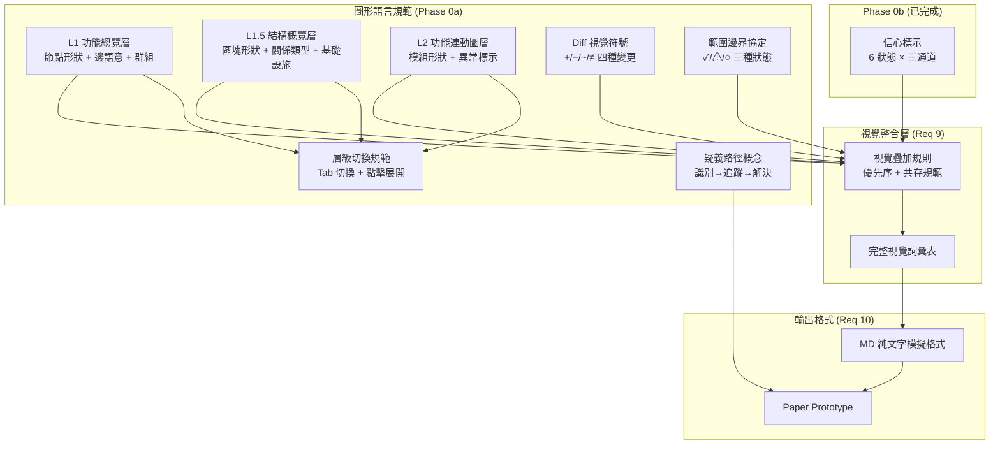
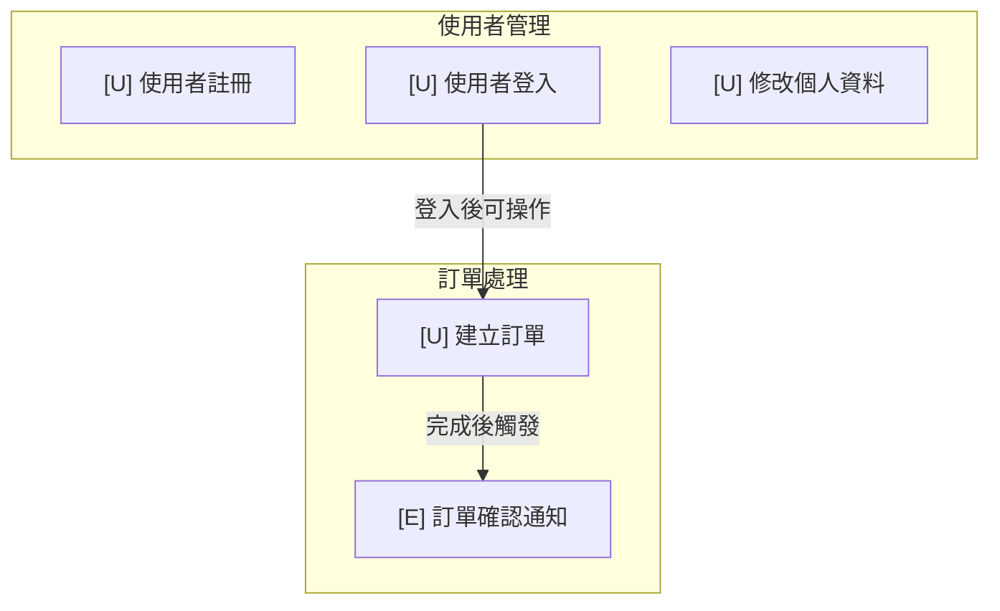
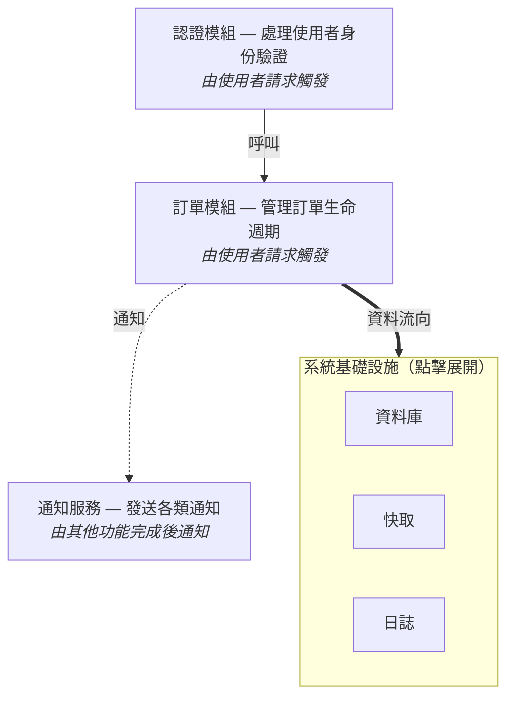
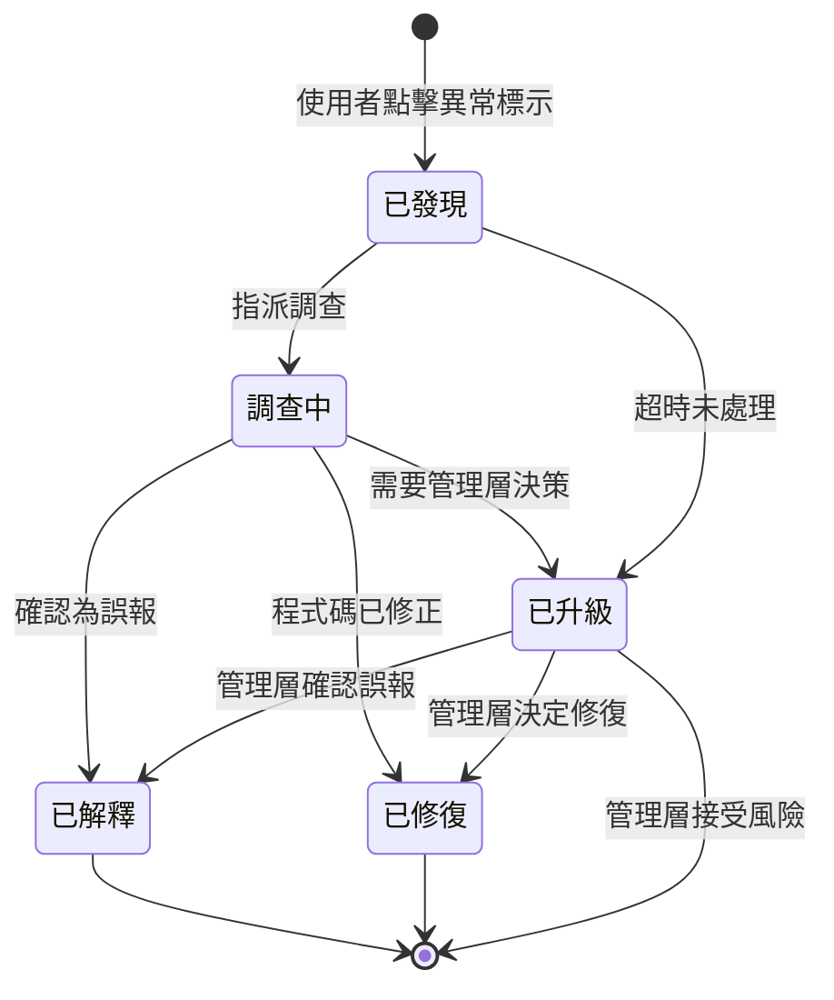

# Design Document — Graphical Language Specification (Phase 0a 圖形語言規範)

## 總覽 Overview

Phase 0a 定義 The Door 的完整圖形語言規範——一套讓非工程師能「讀懂程式碼結構與變化」的視覺詞彙系統。本 Phase 的交付物是**規範文件與 paper prototype**，不是程式碼實作。

**設計目標：** 建立一套視覺語言，使 PM / 發布經理能在 10 分鐘內回答「這次改了哪裡」，並識別出至少一個刻意埋入的疑義點。

**四大交付物：**

| # | 交付物 | 對應需求 |
|---|---|---|
| 1 | L1–L2 三層圖形語言定義（節點形狀、邊的含義、層級切換） | Req 1–4 |
| 2 | Diff 視覺符號（新增/移除/修改的視覺表達） | Req 5 |
| 3 | 範圍邊界協定（scope boundary protocol） | Req 6 |
| 4 | 疑義路徑概念設計（doubt-path concept） | Req 7 |

**與 Phase 0b 的關係：** Phase 0b 已完成信心標示（confidence markers）的 6 種狀態視覺規範（high/medium/low/reviewed/regenerated/incomplete），使用三通道區分（color + border + icon）。本設計必須與 Phase 0b 的視覺編碼完全相容，不得衝突。

**設計約束：**
- 所有視覺區分必須使用雙通道編碼（不得僅依賴顏色）
- Diff 符號使用 +/−/~/≠（不使用 emoji），確保無歧義
- 疑義路徑狀態機為概念層級，完整實作在 Phase 3
- MD 純文字格式必須讓非技術人員無需說明即可閱讀
- 必須與現有 `mermaid_renderer.py` 的 classDef 系統相容

## 架構 Architecture

Phase 0a 是規範文件，不是軟體模組。架構描述的是**視覺語言的層級結構**與**各視覺系統之間的關係**。

### 視覺語言層級架構



### 視覺通道分配策略

為避免不同視覺系統之間的衝突，各系統使用不同的主要視覺通道：

| 視覺系統 | 主要通道 | 次要通道 | 備註 |
|---|---|---|---|
| **節點類型**（L1/L1.5/L2） | 形狀 | — | 圓角矩形、六角形、圓柱等 |
| **信心標示**（Phase 0b） | 邊框樣式 | 邊框顏色 + 圖示前綴 | 已定義，不可變更 |
| **Diff 變更** | 節點填充色 | 文字符號（+/−/~/≠） | 與信心標示的邊框通道不衝突 |
| **範圍邊界** | 角標徽章 | 徽章符號（✓/⚠/○） | overlay 方式，不替換其他指標 |
| **異常標示**（L2） | 節點填充色 + 符號 | 側邊說明欄 | 僅 L2 層啟用 |

### 設計決策與理由

| 決策 | 理由 |
|---|---|
| 節點形狀編碼功能類別，不編碼技術類型 | L1 是功能語言層，使用者關心「做什麼」不是「怎麼做」 |
| Diff 使用 ASCII 符號（+/−/~/≠）不用 emoji | 跨平台一致性、Mermaid 渲染相容性、無歧義 |
| 範圍邊界用角標徽章而非改變節點形狀 | 範圍狀態是附加資訊，不應覆蓋節點的語意形狀 |
| 疑義路徑只做概念設計不做狀態機細節 | 完整狀態機在 Phase 3，此處驗證概念可行性即可 |
| L1↔L1.5 用 tab 切換，L2 用點擊展開 | L1 和 L1.5 是平行視角（功能 vs 結構），L2 是向下鑽取 |
| MD 純文字格式設計時考慮 Mermaid 轉換 | 確保 paper prototype 的語意概念都能在後續 Phase 中用 Mermaid 實現 |


## 元件與介面 Components and Interfaces

### 1. L1 功能總覽層圖形語言 (Req 1)

L1 是純功能語言層，零技術詞彙。節點代表「系統能做什麼」，邊代表功能之間的因果關係。

#### 1.1 節點形狀定義

節點形狀同時編碼**功能類別**與**觸發類型**，使用形狀 + 圖示雙通道：

| 觸發類型 | Mermaid 形狀 | 視覺描述 | 圖示 | 範例 |
|---|---|---|---|---|
| 使用者操作觸發 | `[" "]` 圓角矩形 | 圓角矩形（預設形狀） | 👤 或 `[U]` | `[U] 使用者登入` |
| 定時自動執行 | `[/" "/]` 平行四邊形 | 傾斜形狀暗示「自動、持續」 | ⏱ 或 `[S]` | `[S] 每日報表產出` |
| 由其他功能觸發 | `{" "}` 菱形 | 菱形暗示「條件、事件」 | ⚡ 或 `[E]` | `[E] 訂單完成後通知` |

**MD 純文字表示法：**
```
[U] 使用者登入          ← 圓角矩形（使用者觸發）
[S] 每日報表產出        ← 平行四邊形（定時觸發）
[E] 訂單完成後通知      ← 菱形（事件觸發）
```

**設計理由：**
- 形狀區分觸發類型，讓使用者一眼看出「誰啟動這個功能」
- 圖示前綴（`[U]`/`[S]`/`[E]`）提供第二通道，不依賴形狀辨識
- 圓角矩形作為預設形狀，因為使用者操作觸發是最常見的類型

#### 1.2 邊語意定義

L1 的邊表達功能之間的因果關係，使用人類可讀的標籤：

| 關係類型 | 線條樣式 | 標籤範例 | Mermaid 語法 |
|---|---|---|---|
| 完成後觸發 | 實線箭頭 | "完成後觸發" | `A -->|"完成後觸發"| B` |
| 依賴結果 | 虛線箭頭 | "依賴結果" | `A -.->|"依賴結果"| B` |
| 推斷關係（LLM 推斷） | 點線箭頭 | "可能相關" | `A -..->|"可能相關"| B` |

**語言規則：** 邊標籤必須使用功能語言，禁止技術詞彙。例如：
- ✅ "完成後觸發"、"需要先完成"、"依賴結果"
- ❌ "calls"、"invokes"、"subscribes to event"

#### 1.3 視覺群組機制

L1 使用 Mermaid `subgraph` 將相關功能聚集，但**不暗示階層結構**：



**群組規則：**
- 群組標題使用功能語言（「使用者管理」而非「UserModule」）
- 群組之間的邊表示跨群組的因果關係
- 群組不暗示技術模組邊界——同一群組的功能可能分散在不同技術模組中

### 2. L1.5 結構概覽層圖形語言 (Req 2)

L1.5 是過渡語言層，回答「各區塊負責哪一段、彼此如何關聯」。

#### 2.1 節點形狀定義

| 元素類型 | Mermaid 形狀 | 視覺描述 | 範例 |
|---|---|---|---|
| 結構區塊 | `[" "]` 圓角矩形 | 標準區塊 | `["認證模組 — 處理使用者身份驗證"]` |
| 基礎設施區塊 | `[(" ")]` 圓柱 | 資料庫/基礎設施意象 | `[("系統基礎設施")]` |

**節點標籤格式：** `模組名稱 — 功能說明`

每個 L1.5 節點標籤必須包含模組名稱和功能描述，使用過渡語言：
- ✅ `認證模組 — 處理使用者身份驗證`
- ✅ `通知服務 — 發送各類通知給使用者`
- ❌ `AuthService`（缺少功能說明）
- ❌ `處理使用者身份驗證`（缺少模組名稱）

#### 2.2 邊語意定義

| 關係類型 | 線條樣式 | 標籤 | 說明 |
|---|---|---|---|
| 直接呼叫 | 實線箭頭 `-->` | "呼叫" | 一個區塊直接使用另一個區塊的功能 |
| 事件通知 | 虛線箭頭 `-.->` | "通知" | 一個區塊完成後通知另一個區塊 |
| 資料流 | 粗線箭頭 `==>` | "資料流向" | 資料從一個區塊流向另一個區塊 |

#### 2.3 觸發機制標注

L1.5 節點上的觸發機制使用人類可讀標籤，顯示在節點副標題：

| 技術觸發 | L1.5 人話標籤 |
|---|---|
| HTTP route handler | "由使用者請求觸發" |
| Cron job / Scheduler | "定時自動執行" |
| Event subscriber | "由其他功能完成後通知" |
| IoC injection | "系統啟動時自動配置" |
| Middleware | "每次請求前自動檢查" |

#### 2.4 基礎設施區塊

基礎設施統一收攏為一個可展開的區塊，使用 Mermaid subgraph：



**展開指示器：** 基礎設施區塊預設收合，標題包含「（點擊展開）」提示。

#### 2.5 L2 展開指示器

L1.5 中可展開至 L2 的節點，在節點右下角顯示展開圖示：

- Mermaid 實現：節點標籤末尾加 `🔍` 或 `[+]`
- MD 純文字：節點後加 `[+]` 標記
- 範例：`認證模組 — 處理使用者身份驗證 [+]`

### 3. L2 功能連動圖層圖形語言 (Req 3)

L2 是技術語言層，顯示模組層次互動關係與異常標示。

#### 3.1 節點形狀定義

| 元素類型 | Mermaid 形狀 | 視覺描述 | 範例 |
|---|---|---|---|
| 模組 | `[" "]` 圓角矩形 | 標準模組 | `["auth_service"]` |
| 子模組 | `(" ")` 圓角矩形（較小） | 從屬模組 | `("token_validator")` |
| 外部依賴 | `[/" "/]` 平行四邊形 | 外部系統 | `[/"Redis Cache"/]` |

#### 3.2 邊語意定義

| 關係類型 | 線條樣式 | 說明 |
|---|---|---|
| 靜態呼叫 | 實線箭頭 `-->` | AST 可追蹤的直接呼叫 |
| 推斷關係 | 虛線箭頭 `-.->` | LLM 推斷的非靜態關係（標記 `[推斷]`） |
| 資料依賴 | 粗線箭頭 `==>` | 資料流向 |

**推斷關係視覺區分：** 推斷關係使用虛線 + `[推斷]` 標籤，與靜態呼叫的實線明確區分。

#### 3.3 異常標示（Anomaly Markers）

L2 層啟用異常標示，使用填充色 + 符號雙通道：

| 異常類型 | 填充色 | 符號 | classDef 名稱 | 嚴重程度 |
|---|---|---|---|---|
| 已知漏洞（高危） | `#f8d7da`（紅） | ⚑ | `vuln_high` | 1（最高） |
| 已知漏洞（中危） | `#ffe0cc`（橘） | ⚑ | `vuln_medium` | 2 |
| 邏輯死路 | `#fff3cd`（黃） | ⚠ | `logic_dead` | 3 |
| 死碼 | `#d6e9f8`（藍灰） | ◎ | `dead_code` | 4 |
| 不確定邊界 | `#e9ecef`（淺灰） | ⊙ | `uncertain` | 5（最低） |

**嚴重程度優先序：** 已知漏洞 > 邏輯死路 > 死碼 > 不確定邊界

**多異常共存規則（Req 3.5）：** 當一個節點有多種異常時：
- 節點上顯示最高優先級的異常符號和填充色
- 其餘異常列入側邊說明欄
- 說明欄格式：`⚑ 已知漏洞 CVE-2024-xxxx | ⚠ 邏輯死路：條件永遠為 false`

#### 3.4 異常標示的 Mermaid classDef

```
classDef vuln_high fill:#f8d7da,stroke:#dc3545,stroke-width:3
classDef vuln_medium fill:#ffe0cc,stroke:#fd7e14,stroke-width:3
classDef logic_dead fill:#fff3cd,stroke:#ffc107,stroke-dasharray:5 5
classDef dead_code fill:#d6e9f8,stroke:#6c8ebf,stroke-dasharray:2 2
classDef uncertain fill:#e9ecef,stroke:#6c757d,stroke-dasharray:2 2
```

**與 Phase 0b 信心標示的共存：** L2 異常標示使用節點填充色，Phase 0b 信心標示使用邊框樣式。但 **Mermaid classDef 是整體覆蓋的**——一個節點只能套用一個 classDef。因此當 L2 異常和信心標示同時存在時：
- **classDef 由異常標示控制**（因為異常是 L2 的核心資訊）
- **信心資訊退到圖示前綴通道**（`✓`/`?`/`⚠` 前綴仍然可見）
- 未來 Phase 若需要同時顯示兩者的邊框，需為每種組合生成複合 classDef（如 `vuln_high_conf_medium`），但這是 Phase 2+ 的實作決策，不在 Phase 0a 範圍內

### 4. 層級切換視覺規範 (Req 4)

#### 4.1 L1 ↔ L1.5：平行 Tab 切換

```
┌─────────────────────────────────────────┐
│  [L1 功能總覽]  │  L1.5 結構概覽  │     │  ← Tab 列，當前 Tab 高亮
├─────────────────────────────────────────┤
│                                         │
│  （L1 或 L1.5 的圖形內容）              │
│                                         │
└─────────────────────────────────────────┘
```

**視覺語意：** Tab 並列表示 L1 和 L1.5 是同等地位的平行視角，不是父子階層。

#### 4.2 L2：點擊展開

L1.5 節點帶有 `[+]` 展開指示器。點擊後：

```
┌─────────────────────────────────────────┐
│  L1 功能總覽  │  [L1.5 結構概覽]  │     │
├─────────────────────────────────────────┤
│                                         │
│  認證模組 [−]  ← 已展開，顯示 [−] 收合  │
│  ┌─────────────────────────────────┐    │
│  │  L2 詳細視圖                     │    │
│  │  auth_service ──→ token_validator│    │
│  │  ◎ password_hasher (死碼)        │    │
│  └─────────────────────────────────┘    │
│                                         │
│  訂單模組 [+]  ← 未展開                  │
│                                         │
└─────────────────────────────────────────┘
```

#### 4.3 當前層級指示器

畫面右上角始終顯示當前視圖層級：

```
📍 目前視圖：L1.5 結構概覽 > 認證模組 (L2)
```

#### 4.4 Paper Prototype 層級切換場景

Paper prototype 必須包含一個完整的導航場景：
1. 使用者從 L1 功能總覽開始
2. 切換 Tab 到 L1.5 結構概覽
3. 點擊某個區塊展開 L2 詳細視圖
4. 在 L2 中發現異常標示
5. 收合 L2 回到 L1.5

### 5. Diff 視覺符號 (Req 5)

#### 5.1 節點層級 Diff 符號

| 變更類型 | 填充色 | 符號 | classDef 名稱 | 優先序 |
|---|---|---|---|---|
| 節點新增 | `#d4edda`（綠） | + | `diff_added` | 1 |
| 節點移除 | `#f8d7da`（紅） | − | `diff_removed` | 2 |
| 依賴關係變更 | `#f5c6a0`（深橘） | ≠ | `diff_dep_changed` | 3 |
| 節點屬性變更 | `#ffe0cc`（淺橘） | ~ | `diff_attr_changed` | 4 |

**優先序規則（Req 5.2）：** 當同一節點同時有依賴關係變更和屬性變更時，顯示依賴關係變更（≠），屬性變更列入說明欄。

**視覺區分設計（Req 5.1）：** 依賴關係變更（≠）與屬性變更（~）透過**色調深淺**和**符號**雙通道區分：
- 深橘 `#f5c6a0` + ≠ = 依賴關係變更（更嚴重）
- 淺橘 `#ffe0cc` + ~ = 屬性變更（較輕微）

#### 5.2 邊層級 Diff 符號

| 變更類型 | 線條樣式 | 顏色 | 說明 |
|---|---|---|---|
| 新增邊 | 綠色虛線 | `stroke:#28a745` | `A -.->|"新增"| B` |
| 移除邊 | 紅色虛線 + 刪除線 | `stroke:#dc3545` | `A -.-x|"移除"| B` |
| 修改邊 | 橘色實線 | `stroke:#fd7e14` | `A -->|"修改"| B` |

#### 5.3 未變更節點的視覺降調（Req 5.7）

未變更的節點在 Diff 視圖中降低視覺權重：

```
classDef unchanged fill:#f8f9fa,stroke:#dee2e6,color:#6c757d,stroke-dasharray:2 2
```

效果：淺灰填充 + 淺灰邊框 + 灰色文字 + 虛線邊框，讓變更節點自然突出。

#### 5.4 Diff classDef 定義

```
classDef diff_added fill:#d4edda,stroke:#28a745,stroke-width:2
classDef diff_removed fill:#f8d7da,stroke:#dc3545,stroke-width:2
classDef diff_dep_changed fill:#f5c6a0,stroke:#e67e22,stroke-width:2
classDef diff_attr_changed fill:#ffe0cc,stroke:#fd7e14,stroke-width:2
classDef unchanged fill:#f8f9fa,stroke:#dee2e6,color:#6c757d,stroke-dasharray:2 2
```

#### 5.5 Diff 摘要面板

Diff 視圖頂部顯示變更摘要，使用自然語言：

```
📊 版本比較：v1.2.0 → v1.3.0
   新增 2 個功能 | 移除 1 個功能 | 修改 3 個功能（1 個依賴關係變更、2 個屬性變更）
```

#### 5.6 「上一版本」觸發方式的視覺表達（Req 5.5）

Diff 視圖標頭清楚顯示比較基準：

| 觸發方式 | 標頭顯示 |
|---|---|
| Git tag / commit SHA | `比較基準：v1.2.0 (abc1234)` |
| 日期選擇器 | `比較基準：2024-01-15 的快照` |
| 手動版本快照 | `比較基準：Sprint 12 結束快照` |

### 6. 範圍邊界協定 (Req 6)

#### 6.1 範圍邊界標記

| 狀態 | 符號 | 顏色 | 說明 |
|---|---|---|---|
| 範圍內已完成 | ✓ | 綠色 `#28a745` | 預期功能，已完成 |
| 超出範圍（意外） | ⚠ | 橘色 `#fd7e14` | 未預期的變更，需要調查 |
| 範圍內未完成 | ○ | 灰色 `#6c757d` | 預期功能，尚未完成 |

#### 6.2 標記呈現方式

範圍邊界標記以**角標徽章**形式疊加在節點右上角，不替換其他視覺指標：

```
┌──────────────────────┐ [✓]
│ [U] 使用者登入        │
│ ✓ high confidence     │
└──────────────────────┘

┌──────────────────────┐ [⚠]
│ [+] 未預期的新功能    │
│ ? medium confidence   │
└──────────────────────┘
```

**Mermaid 實現方式：** 在節點標籤中加入角標符號：
```
f1["[U] 使用者登入 ✓<sup>scope</sup>"]
```

**MD 純文字實現方式：** 在節點行末加標記：
```
[U] 使用者登入 .............. [✓ 範圍內]
[+] 未預期的新功能 .......... [⚠ 超出範圍]
[U] 報表匯出 ................ [○ 未完成]
```

#### 6.3 範圍摘要面板

```
📋 Sprint 12 範圍驗核
   ✓ 範圍內已完成：8 個功能
   ⚠ 超出範圍：1 個功能（需調查）
   ○ 範圍內未完成：2 個功能
```

#### 6.4 超出範圍的疑義路徑入口（Req 6.4）

當節點標記為 ⚠（超出範圍）時，提供「點擊調查」的視覺提示：

```
[⚠ 超出範圍] 未預期的新功能 → 點擊查看詳情 → 進入疑義路徑
```

### 7. 疑義路徑概念設計 (Req 7)

#### 7.1 三階段流程


#### 7.2 識別階段（Identify）

使用者可從以下視覺元素進入疑義路徑：
- **異常標示**（L2）：⚠ 邏輯死路、⊙ 不確定邊界、◎ 死碼、⚑ 已知漏洞
- **範圍邊界警告**：⚠ 超出範圍、○ 範圍內未完成
- **信心標示**（Phase 0b）：? medium、⚠ low

**互動流程：** 使用者點擊帶有上述標示的節點 → 系統顯示疑義詳情面板。

#### 7.3 追蹤階段（Track）

系統記錄疑義的 metadata：
- **誰發現的**：使用者身份
- **何時發現**：時間戳
- **哪個節點**：節點 ID + 功能描述
- **什麼類型**：異常類型 / 範圍問題 / 信心問題
- **追蹤狀態**：從發現到解決的進展

#### 7.4 概念層級狀態機（Req 7.5）



**注意：** 這是概念層級的狀態流程圖。具體的狀態名稱、轉換條件、超時規則將在 Phase 3 完整定義。此處的目的是驗證「使用者發現疑義後有明確的下一步」這個概念是否可行。

#### 7.5 解決階段（Resolve）

三種解決方式：
1. **已解釋（false alarm）：** 疑義經調查後確認為誤報，標記原因
2. **已修復（code change）：** 疑義對應的程式碼問題已修正
3. **已升級（management decision）：** 疑義需要管理層決策（接受風險 / 排入修復計畫）

#### 7.6 超時升級概念（Req 7.6）

疑義若在可配置的時間內未處理，自動升級：

```
疑義發現 → [N 天未處理] → 自動升級至管理層
```

**N 的預設值和具體升級規則在 Phase 3 定義。** 此處僅確認概念：超時機制存在，防止疑義永遠停在「已標記」狀態。

#### 7.7 Paper Prototype 疑義路徑場景（Req 7.7）

Paper prototype 必須包含以下場景：
1. 使用者在圖形上看到 ⚠ 標示
2. 點擊 ⚠ → 看到疑義詳情（什麼類型、哪個節點、為什麼標記）
3. 看到「下一步」選項（指派調查 / 直接升級）
4. 測試對象能說出「發現疑義後的下一步是什麼」


### 8. 視覺語言一致性與可區分性 (Req 9)

#### 8.1 完整視覺詞彙表

以下表格映射每個語意概念到其視覺編碼，跨所有層級：

**L1 節點形狀：**

| 語意 | 形狀 | 符號 | 填充色 | 邊框 |
|---|---|---|---|---|
| 使用者觸發功能 | 圓角矩形 | [U] | 預設白 | 預設 |
| 定時觸發功能 | 平行四邊形 | [S] | 預設白 | 預設 |
| 事件觸發功能 | 菱形 | [E] | 預設白 | 預設 |

**L1.5 節點形狀：**

| 語意 | 形狀 | 填充色 | 邊框 |
|---|---|---|---|
| 結構區塊 | 圓角矩形 | 預設白 | 預設 |
| 基礎設施區塊 | 圓柱 / subgraph | 淺灰 | 預設 |

**L2 異常標示：**

| 語意 | 符號 | 填充色 | 邊框 |
|---|---|---|---|
| 已知漏洞（高危） | ⚑ | `#f8d7da` 紅 | `#dc3545` 粗線 |
| 已知漏洞（中危） | ⚑ | `#ffe0cc` 橘 | `#fd7e14` 粗線 |
| 邏輯死路 | ⚠ | `#fff3cd` 黃 | `#ffc107` 虛線 |
| 死碼 | ◎ | `#d6e9f8` 藍灰 | `#6c8ebf` 虛線 |
| 不確定邊界 | ⊙ | `#e9ecef` 淺灰 | `#6c757d` 虛線 |

**Diff 符號：**

| 語意 | 符號 | 填充色 | 邊框 |
|---|---|---|---|
| 節點新增 | + | `#d4edda` 綠 | `#28a745` |
| 節點移除 | − | `#f8d7da` 紅 | `#dc3545` |
| 依賴關係變更 | ≠ | `#f5c6a0` 深橘 | `#e67e22` |
| 屬性變更 | ~ | `#ffe0cc` 淺橘 | `#fd7e14` |
| 未變更 | — | `#f8f9fa` 極淺灰 | `#dee2e6` |

**範圍邊界：**

| 語意 | 符號 | 顏色 |
|---|---|---|
| 範圍內已完成 | ✓ | `#28a745` 綠 |
| 超出範圍 | ⚠ | `#fd7e14` 橘 |
| 範圍內未完成 | ○ | `#6c757d` 灰 |

**信心標示（Phase 0b，已定義）：**

| 語意 | 圖示 | 填充色 | 邊框樣式 |
|---|---|---|---|
| high | ✓ | `#d4edda` 綠 | 實線 |
| medium | ? | `#fff3cd` 黃 | 虛線 5 5 |
| low | ⚠ | `#f8d7da` 紅 | 點線 2 2 |
| reviewed | ✔ | `#cce5ff` 藍 | 實線粗 |
| regenerated | Δ | `#e8d5f5` 紫 | 點劃線 10 5 2 5 |
| incomplete | … | `#e9ecef` 灰 | 點線 2 2 |

#### 8.2 Phase 0b 相容性設計（Req 9.4）

**通道分離原則：** Phase 0b 信心標示佔用**邊框樣式 + 邊框顏色 + 圖示前綴**三個通道。Phase 0a 的其他視覺系統必須避開這些通道：

| 視覺系統 | 使用的通道 | 與 Phase 0b 衝突？ |
|---|---|---|
| L1/L1.5/L2 節點形狀 | 形狀 | ❌ 不衝突 |
| Diff 變更 | 節點填充色 + 文字符號 | ❌ 不衝突（填充色 vs 邊框色） |
| 範圍邊界 | 角標徽章 | ❌ 不衝突（overlay） |
| L2 異常標示 | 節點填充色 + 文字符號 | ⚠ 需注意：L2 異常填充色與信心標示填充色可能重疊 |

**L2 異常與信心標示共存規則（Req 9.5）：**

當 L2 節點同時有異常標示和信心標示時（Mermaid classDef 限制：一個節點只能套用一個 classDef）：
- **classDef**：由異常標示控制（異常是 L2 的核心資訊，優先於信心邊框）
- **圖示前綴**：信心圖示在前，異常符號在後（雙通道保留）
- 範例：`✓ ◎ password_hasher`（高信心 + 死碼，classDef 用 `dead_code`，信心透過 ✓ 前綴傳達）

#### 8.3 視覺疊加規則（Req 9.6）

當多種指標同時出現在一個節點上時，各指標佔用不同的視覺「層」：

```
┌─ classDef 層：異常標示（L2）或 Diff 變更 控制 fill + stroke
│  │  （Mermaid 限制：一個節點一個 classDef，異常/Diff 優先於信心邊框）
│  ┌─ 標籤層：信心圖示 + 異常符號 + 節點文字（信心資訊透過圖示前綴保留）
│  │  ┌─ 角標層：範圍邊界標記（overlay）
│  │  │
│  │  └─ [✓] 或 [⚠] 或 [○]
│  └─ "✓ ◎ password_hasher"
└─ classDef dead_code: fill:#d6e9f8, stroke:#6c8ebf
```

#### 8.4 多指標優先序（Req 9.7）

當節點同時攜帶 Diff 變更和範圍邊界標記時：

| 組合 | 填充色由誰控制 | 角標顯示 | 範例 |
|---|---|---|---|
| Diff 新增 + 超出範圍 | Diff（綠色） | ⚠ 超出範圍 | 新增了一個不在計畫中的功能 |
| Diff 修改 + 範圍內完成 | Diff（橘色） | ✓ 範圍內 | 預期的修改已完成 |
| 無 Diff + 範圍內未完成 | 預設白 | ○ 未完成 | 預期功能尚未開始 |

**規則：** Diff 填充色優先於預設填充色；範圍邊界始終以角標形式顯示，不受 Diff 影響。

#### 8.5 Diff + 範圍合併摘要面板（Req 9.8）

```
📊 Sprint 12 變更驗核
   ✓ 範圍內變更：5 個（3 新增、2 修改）
   ⚠ 範圍外變更：1 個（需調查）
   ○ 預期變更缺失：2 個（尚未完成）
```

### 9. MD 純文字模擬圖格式規範 (Req 10)

#### 9.1 格式設計原則

- 非技術人員無需說明即可閱讀
- 所有語意概念都有對應的 Mermaid 表示
- 使用 ASCII/Unicode 字元表示視覺狀態
- 結構清晰，層級分明

#### 9.2 節點表示法

```
[U] 使用者登入                    ← 使用者觸發功能
[S] 每日報表產出                  ← 定時觸發功能
[E] 訂單完成後通知                ← 事件觸發功能
```

#### 9.3 邊（關係）表示法

```
[U] 使用者登入
  └──→ [U] 瀏覽商品目錄          "登入後可操作"
  └──→ [U] 管理個人資料          "登入後可操作"

[U] 建立訂單
  └──→ [E] 訂單確認通知          "完成後觸發"
  └- - → [S] 庫存同步            "可能相關"（推斷）
```

- `└──→` 實線箭頭（直接關係）
- `└- - →` 虛線箭頭（推斷關係）

#### 9.4 視覺狀態標記

```
[+] 新功能名稱 .................. [新增]
[−] 已移除功能 .................. [移除]
[~] 屬性已變更的功能 ............ [屬性變更]
[≠] 依賴關係變更的功能 .......... [依賴變更]
    功能名稱（無變更）........... [未變更]

[✓] 範圍內已完成 ............... [scope: ✓]
[⚠] 超出範圍 ................... [scope: ⚠]
[○] 範圍內未完成 ............... [scope: ○]
```

#### 9.5 層級結構表示

```
═══════════════════════════════════════════
  📍 L1 功能總覽
═══════════════════════════════════════════

┌─ 使用者管理 ─────────────────────────┐
│  [U] 使用者註冊                       │
│  [U] 使用者登入                       │
│  [U] 修改個人資料                     │
└───────────────────────────────────────┘

┌─ 訂單處理 ───────────────────────────┐
│  [U] 建立訂單                         │
│  [E] 訂單確認通知                     │
└───────────────────────────────────────┘

關係：
  使用者登入 ──→ 建立訂單              "登入後可操作"
  建立訂單 ──→ 訂單確認通知            "完成後觸發"

═══════════════════════════════════════════
  📍 L1.5 結構概覽
═══════════════════════════════════════════

  認證模組 — 處理使用者身份驗證 [+]
    由使用者請求觸發
  訂單模組 — 管理訂單生命週期 [+]
    由使用者請求觸發
  通知服務 — 發送各類通知 [+]
    由其他功能完成後通知

  [基礎設施] 資料庫 | 快取 | 日誌

關係：
  認證模組 ──→ 訂單模組                "呼叫"
  訂單模組 - - → 通知服務              "通知"
  訂單模組 ═══→ [基礎設施]             "資料流向"
```

#### 9.6 Diff 視圖 MD 範例

```
═══════════════════════════════════════════
  📊 Diff 視圖：v1.2.0 → v1.3.0
═══════════════════════════════════════════

  [+] 批次匯出功能 .............. [新增]     [scope: ⚠ 超出範圍]
  [~] 使用者登入 ................ [屬性變更]  [scope: ✓ 範圍內]
  [≠] 訂單處理 .................. [依賴變更]  [scope: ✓ 範圍內]
  [−] 舊版報表 .................. [移除]     [scope: ✓ 範圍內]
      使用者註冊 ................ [未變更]
      修改個人資料 .............. [未變更]

摘要：新增 1 | 移除 1 | 修改 2（1 依賴變更、1 屬性變更）
範圍：✓ 範圍內 3 | ⚠ 超出範圍 1 | ○ 未完成 0
```

### 10. Paper Prototype 驗收場景 (Req 8)

#### 10.1 場景設計

Paper prototype 使用一個虛構的「線上商店」系統，包含：

**L1 功能總覽（8 個功能）：**
- [U] 使用者註冊、[U] 使用者登入、[U] 瀏覽商品、[U] 建立訂單
- [S] 每日庫存同步、[E] 訂單確認通知
- [+] 批次匯出功能（新增，**Planted Doubt #1：超出範圍**）
- [U] 退貨處理

**L1.5 結構概覽（5 個區塊）：**
- 認證模組、商品模組、訂單模組、通知服務、[基礎設施]

**L2 詳細視圖（訂單模組展開）：**
- order_service、payment_processor、inventory_checker
- **Planted Doubt #2：** inventory_checker 標記 ⚠ 邏輯死路（某條件永遠為 false）

**Diff 視圖（v1.2.0 → v1.3.0）：**
- 新增：批次匯出功能
- 修改：訂單處理（依賴關係變更）、使用者登入（屬性變更）
- 移除：舊版報表

#### 10.2 測試任務

測試對象需在 10 分鐘內完成：
1. 從 L1 識別「這個系統能做什麼」（列出主要功能）
2. 從 Diff 視圖回答「這次改了哪裡」（識別所有變更）
3. 識別至少一個疑義點（超出範圍的批次匯出 或 邏輯死路的 inventory_checker）
4. 說出「發現疑義後的下一步」（進入疑義路徑）

#### 10.3 Go 標準

- 5 人中 ≥ 4 人（80%）能在 10 分鐘內完成所有任務
- 停損條件：≥ 3 輪迭代後仍有 > 50% 無法完成 → 根本性重設計


## 資料模型 Data Models

Phase 0a 是規範文件，不產出程式碼。此處僅記錄與現有資料模型的相容性和未來擴展點。

### 與現有資料模型的相容性

Phase 0a 的視覺規範需要與以下現有模型相容：

| 現有模型 | 位置 | Phase 0a 影響 |
|---|---|---|
| `Feature` | `models.py` | L1 節點形狀由 `trigger` 欄位決定 |
| `FeatureRelation` | `models.py` | L1 邊樣式由 `relation_type` 欄位決定 |
| `L1_5Block` | `models.py` | L1.5 節點形狀由區塊類型決定 |
| `MarkerDef` / `MARKER_DEFS` | `mermaid_renderer.py` | Phase 0b 信心標示，Phase 0a 不修改 |
| `Anomaly` | `models.py` | L2 異常標示由 `anomaly_type` 欄位決定 |

**未來實作時的擴展點：**
- `MermaidRenderer` 需新增 Diff 視圖渲染方法（Phase 2）
- `MermaidRenderer` 需新增範圍邊界標記渲染（Phase 3）
- L2 異常標示的 classDef 需加入 `render_l2()` 方法（Phase 1-full L2 擴展時）


## 錯誤處理 Error Handling

Phase 0a 是規範文件，不是軟體模組，因此「錯誤處理」在此指的是**規範層級的邊界情況與衝突解決規則**。

### 視覺衝突解決

| 衝突場景 | 解決規則 |
|---|---|
| 同一節點有 Diff 填充色和 L2 異常填充色 | Diff 填充色優先（Diff 視圖是暫時性的比較視圖，異常標示在非 Diff 視圖中仍然可見） |
| 信心標示的 ⚠ (low) 與範圍邊界的 ⚠ (超出範圍) 符號相同 | 信心 ⚠ 在節點標籤前綴，範圍 ⚠ 在角標徽章。位置不同，不會混淆 |
| 信心標示填充色 `#d4edda` (high) 與 Diff 新增填充色 `#d4edda` 相同 | 在 Diff 視圖中，Diff classDef 優先於信心 classDef。信心資訊透過圖示前綴（✓）保留 |
| 節點同時有多種異常（L2） | 最高優先級異常控制填充色和符號，其餘列入側邊說明欄 |
| L1 節點形狀（觸發類型）在 Diff 視圖中如何呈現 | 保持原有形狀，Diff 只改變填充色和加入 Diff 符號 |

### Paper Prototype 測試失敗處理

| 失敗場景 | 處理方式 |
|---|---|
| 測試對象無法區分 Diff 符號 +/−/~/≠ | 增加符號說明文字（如 `[+ 新增]`），或調整色彩對比度 |
| 測試對象混淆 L1 和 L1.5 的切換語意 | 強化 Tab 標籤的文字說明，加入「功能視角」/「結構視角」副標題 |
| 測試對象無法找到疑義路徑入口 | 增加視覺提示（如閃爍效果、更醒目的顏色），或在 Diff 摘要中直接列出疑義項目 |
| ≥ 3 輪迭代後仍有 > 50% 無法完成 | 觸發停損條件，進行圖形語言規範根本性重設計 |

### 規範一致性檢查清單

在規範完成後，需人工檢查以下項目：

1. ☐ 視覺詞彙表中沒有兩個不同語意使用相同的（形狀 + 顏色 + 符號）組合
2. ☐ 所有視覺區分都有至少兩個獨立通道
3. ☐ Phase 0b 的 6 種信心標示 classDef 未被修改或覆蓋
4. ☐ Diff 符號 +/−/~/≠ 在 MD 純文字和 Mermaid 中都能正確顯示
5. ☐ 疑義路徑的每個狀態都有明確的「下一步」
6. ☐ Paper prototype 包含至少一個超出範圍的 Planted Doubt
7. ☐ Paper prototype 包含至少一個異常標示的 Planted Doubt

## 測試策略 Testing Strategy

### PBT 適用性評估

**Property-based testing 不適用於 Phase 0a。**

原因：
1. **Phase 0a 的交付物是規範文件和 paper prototype**，不是可執行的程式碼
2. 規範的正確性透過**人工審查**（視覺詞彙表一致性檢查）和**使用者測試**（paper prototype 驗收場景）驗證
3. 視覺語言的「可讀性」和「可區分性」是人類感知問題，無法用 property-based testing 自動化驗證
4. 疑義路徑的概念設計是流程圖，不是可執行的狀態機（完整實作在 Phase 3）

因此，本設計文件**省略 Correctness Properties 章節**。

### 替代測試策略

Phase 0a 使用以下測試方法替代 PBT：

#### 1. 規範一致性審查（靜態檢查）

| 檢查項目 | 方法 | 驗證目標 |
|---|---|---|
| 視覺詞彙表唯一性 | 人工審查完整詞彙表 | Req 9.1：無兩個語意共用相同編碼 |
| 雙通道可區分性 | 人工審查每個視覺元素 | Req 9.2：至少兩個獨立通道 |
| Phase 0b 相容性 | 比對 Phase 0b 的 MARKER_DEFS | Req 9.4：信心標示編碼未被衝突 |
| Diff 符號無歧義 | 審查 +/−/~/≠ 在各格式中的呈現 | Req 5.1：四種符號視覺可區分 |
| MD 格式可讀性 | 給非技術人員閱讀測試 | Req 10.3：無需說明即可閱讀 |

#### 2. Paper Prototype 使用者測試（動態驗證）

| 測試項目 | 測試對象 | 成功標準 | 對應需求 |
|---|---|---|---|
| L1 功能識別 | 3–5 位非工程師 | 能列出主要功能 | Req 1 |
| Diff 變更識別 | 同上 | 能回答「改了哪裡」 | Req 5 |
| 疑義點識別 | 同上 | 能找到至少一個 Planted Doubt | Req 7, 8 |
| 疑義路徑操作 | 同上 | 能說出「下一步」 | Req 7.7 |
| 層級切換理解 | 同上 | 能從 L1 導航到 L1.5 到 L2 | Req 4 |
| 10 分鐘時限 | 同上 | 80% 在時限內完成 | Req 8 Go 標準 |

#### 3. 未來 Phase 的測試銜接

Phase 0a 的規範在後續 Phase 實作時，將產生可測試的程式碼：

| 未來 Phase | 可測試的程式碼 | 建議測試方法 |
|---|---|---|
| Phase 2（Diff 引擎） | Diff 計算邏輯、Diff Mermaid 渲染 | PBT：Diff 計算的冪等性、對稱性 |
| Phase 3（範圍驗核） | 範圍比對邏輯、疑義狀態機 | PBT：狀態機轉換的完整性 |
| Phase 1-full L2 擴展 | L2 異常標示渲染 | PBT：異常優先序的正確性 |
| Mermaid 渲染擴展 | Diff classDef 生成 | PBT：classDef 唯一性 |

這些測試將在對應 Phase 的設計文件中定義具體的 correctness properties。

