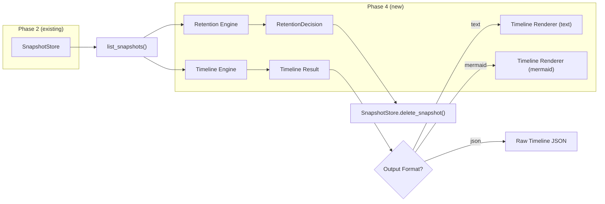
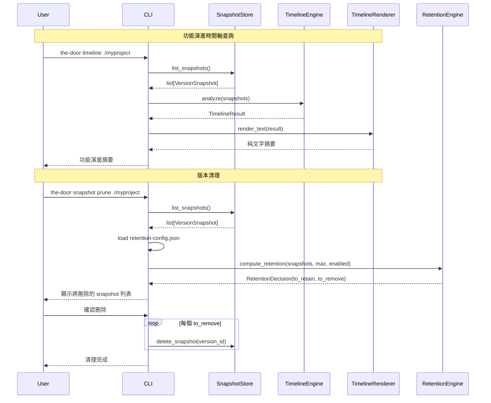

# Design Document — The Door Phase 4: History Timeline Layer (歷史時間軸層)

## Overview

Phase 4 在 Phase 2（Diff Engine）的 SnapshotStore + DiffEngine 基礎上，擴展為**多版本時間軸分析**與**版本保留策略**。Phase 2 提供兩版比對能力，Phase 4 則將視角從「兩點比較」拉升到「全時間軸演進」——讓驗核者能回答：「這個功能在過去三個月的演進路徑是否符合承諾」。

**Phase 4 在既有基礎上新增的能力：**

| 能力 | 說明 |
|---|---|
| **Timeline Engine** | 多版本時間軸分析引擎（pure function）：分析 snapshot 序列，為每個功能建立完整演進記錄 |
| **語意漂移偵測** | 偵測功能名稱未變但說明實質改變的情況（spec §12.2：🔵 標記） |
| **Retention Engine** | 以次數為基礎的版本保留策略引擎（pure function）：計算哪些 snapshot 應保留/清理 |
| **Timeline Renderer** | Mermaid 時間軸圖形 + 純文字摘要渲染 |
| **SnapshotStore.delete_snapshot** | 擴展既有 SnapshotStore，新增刪除方法 |
| **Timeline CLI** | `the-door timeline` 新指令（不影響既有 `the-door history`） |
| **Snapshot Prune CLI** | `the-door snapshot prune` 子指令（加入既有 `snapshot_group`） |
| **MCP Tools** | 2 個新 MCP tools：`timeline`、`snapshot_prune`（既有 `history` tool 不變） |
| **JSON Schema** | `timeline-result.schema.json`（Draft 2020-12） |

### 設計決策與理由

| 決策 | 理由 |
|---|---|
| Timeline Engine 為 pure function（無 I/O） | 同 DiffEngine 模式：核心計算為純邏輯，高度可測試，Hypothesis PBT 友好 |
| Retention Engine 為 pure function（無 I/O） | 保留決策計算與實際刪除分離；CLI/MCP 層負責 I/O（呼叫 SnapshotStore.delete_snapshot） |
| `the-door timeline` 為獨立新指令，不覆蓋 `the-door history` | `history` 顯示敘事鏈（NarrativeChain），`timeline` 顯示功能演進時間軸——兩者語意不同 |
| `snapshot prune` 加入既有 `snapshot_group` | 與 `snapshot create`、`snapshot list` 同屬快照管理群組，CLI 結構一致 |
| 保留策略以次數為基礎（max_snapshots），非時間 | 簡單可預測；手動快照和 tagged 快照受保護不計入上限 |
| 保留策略設定存於 `.the-door/retention-config.json` | 同 `.the-door/scope-config.json` 模式：project-level 配置，與 user-level `config.toml` 分離 |
| 語意漂移定義：label 未變 + description 變更 | spec §12.2 明確定義；label 變更已明確表示功能改變，不需額外標記 |
| confidence 變更不計入 change_count | confidence 是 LLM 自評的元資料，不是功能本身的屬性 |
| Timeline Renderer 用 Mermaid `gantt` 圖形類型 | Mermaid `timeline` 是線性單軸，不支援「功能 × 版本」矩陣佈局；`gantt` 圖可用 section 分組功能、task 表示版本區間，視覺上接近時間軸矩陣 |
| Timeline Renderer 複用 `escape_mermaid_label` | 同 DiffRenderer/ScopeRenderer 模式：共用 mermaid_utils 工具 |
| 摘要面板用 Mermaid comments（`%%`） | 同 DiffRenderer/ScopeRenderer 模式：不影響圖形解析 |
| MCP tools 各自獨立檔案 | 同既有模式：每個 tool 一個檔案，TOOL_SCHEMA + async execute() |
| delete_snapshot 靜默忽略不存在的檔案 | 冪等操作，避免 race condition 或重複刪除時的錯誤 |

## Architecture

### 高層資料流（Phase 4 History Timeline）



### Timeline 分析生命週期



### 模組邊界

| 模組 | 套件 | 職責 | 輸入 | 輸出 |
|---|---|---|---|---|
| `timeline_engine` | `core/timeline/` | 多版本時間軸分析（pure function） | `list[VersionSnapshot]` | `TimelineResult` |
| `retention_engine` | `core/timeline/` | 版本保留策略計算（pure function） | `list[VersionSnapshot]`, max_snapshots, enabled | `RetentionDecision` |
| `timeline_renderer` | `core/timeline/` | Mermaid 時間軸圖形 + 純文字摘要渲染 | `TimelineResult` | Mermaid text / plain text |
| `snapshot_store` | `core/diff/`（既有，擴展） | 新增 `delete_snapshot()` 方法 | version_id | 刪除 JSON 檔案 |
| `timeline_cmd` | `cli/` | `the-door timeline` 指令 | CLI args | stdout / file |
| `snapshot_cmd` | `cli/`（既有，擴展） | 新增 `snapshot prune` 子指令 | CLI args | stdout |
| `timeline_tool` | `mcp/tools/` | MCP timeline tool | MCP arguments | TimelineResult JSON |
| `snapshot_prune_tool` | `mcp/tools/` | MCP snapshot_prune tool | MCP arguments | RetentionDecision JSON |

## Components and Interfaces

### 擴展後的資料夾結構

```
the_door/
├── src/
│   └── the_door/
│       ├── models.py                         # 擴展：Phase 4 timeline + retention models
│       ├── cli/
│       │   ├── main.py                       # 擴展：加入 timeline 指令
│       │   ├── timeline_cmd.py               # NEW: timeline 指令
│       │   └── snapshot_cmd.py               # 擴展：加入 prune 子指令
│       ├── core/
│       │   ├── timeline/                     # NEW: timeline 引擎套件
│       │   │   ├── __init__.py
│       │   │   ├── timeline_engine.py        # 多版本時間軸分析（pure function）
│       │   │   ├── retention_engine.py       # 版本保留策略計算（pure function）
│       │   │   └── timeline_renderer.py      # Mermaid + 純文字渲染
│       │   ├── diff/                         # (existing)
│       │   │   └── snapshot_store.py         # 擴展：新增 delete_snapshot()
│       │   ├── rendering/                    # (existing, unchanged)
│       │   ├── scope/                        # (existing, unchanged)
│       │   └── vulnerability/                # (existing, unchanged)
│       └── mcp/
│           ├── server.py                     # 擴展：註冊 2 個新 tools（共 17 tools）
│           └── tools/
│               ├── timeline_tool.py          # NEW
│               └── snapshot_prune_tool.py    # NEW
├── schemas/
│   └── timeline-result.schema.json           # NEW
├── tests/
│   ├── unit/
│   │   ├── core/
│   │   │   └── timeline/                     # NEW
│   │   │       ├── test_timeline_engine.py
│   │   │       ├── test_retention_engine.py
│   │   │       └── test_timeline_renderer.py
│   │   ├── cli/
│   │   │   ├── test_timeline_cmd.py          # NEW
│   │   │   └── test_snapshot_prune_cmd.py    # NEW
│   │   └── mcp/
│   │       └── test_timeline_tools.py        # NEW
│   └── property/
│       ├── test_timeline_properties.py       # NEW: timeline PBT
│       └── test_retention_properties.py      # NEW: retention PBT
└── pyproject.toml                            # unchanged — no new dependencies
```

### 元件介面

#### Timeline Engine

```python
# src/the_door/core/timeline/timeline_engine.py

class TimelineEngine:
    """多版本時間軸分析引擎。
    
    Pure function — 無 I/O，無副作用。
    接收 list[VersionSnapshot]（按 timestamp 排序），
    為每個曾出現在任一 snapshot 中的功能產生 Feature_Timeline 記錄。
    """

    def analyze(
        self,
        snapshots: list[VersionSnapshot],
    ) -> TimelineResult:
        """分析 snapshot 序列，產生完整的時間軸結果。
        
        演算法：
        1. 按 timestamp 排序 snapshots
        2. 收集所有出現過的 feature_id（union of all l1_snapshot keys）
        3. 對每個 feature_id：
           a. 找出 first_seen / last_seen snapshot
           b. 逐對比較連續 snapshot，計算 change_count
           c. 偵測語意漂移（label 未變 + description 變更）
           d. 判斷 current_state（active/removed）
        4. 計算聚合統計
        5. 回傳 TimelineResult
        
        給定相同輸入，產出相同結果（冪等性）。
        """
        ...

    def analyze_feature(
        self,
        snapshots: list[VersionSnapshot],
        feature_id: str,
    ) -> FeatureTimeline | None:
        """分析單一功能的演進歷史。
        
        回傳 FeatureTimeline，若 feature_id 不存在於任何 snapshot 則回傳 None。
        """
        ...

    def _detect_drift(
        self,
        prev_feature: FeatureSummary,
        curr_feature: FeatureSummary,
        snapshot: VersionSnapshot,
    ) -> SemanticDriftEvent | None:
        """偵測語意漂移：label 未變 + description 變更。
        
        若 label 和 description 同時變更 → 一般屬性變更，不產生漂移事件。
        若 label 未變且 description 也未變 → 無漂移。
        若 label 未變但 description 變更 → 產生 SemanticDriftEvent。
        """
        ...

    def _compute_summary(
        self,
        feature_timelines: list[FeatureTimeline],
    ) -> TimelineSummary:
        """計算聚合統計：active_count、removed_count、total_drift_events。"""
        ...
```

#### Retention Engine

```python
# src/the_door/core/timeline/retention_engine.py

class RetentionEngine:
    """版本保留策略計算引擎。
    
    Pure function — 無 I/O，無副作用。
    以快照數量為單位，根據 max_snapshots 上限決定保留/清理。
    手動快照（trigger="manual"）和有 git_tags 的快照受保護。
    """

    def compute_retention(
        self,
        snapshots: list[VersionSnapshot],
        max_snapshots: int = 50,
        enabled: bool = True,
    ) -> RetentionDecision:
        """計算保留決策。
        
        演算法：
        1. 若 enabled=False → 全部保留
        2. 分類：protected（manual 或有 git_tags）vs unprotected
        3. Protected 全部保留
        4. Unprotected 按 timestamp 降序排列（最新優先）
        5. 保留前 max_snapshots 個 unprotected，其餘歸入 to_remove
        6. 回傳 RetentionDecision(to_retain, to_remove)
        
        保證：to_retain ∪ to_remove = 全部輸入，to_retain ∩ to_remove = ∅
        """
        ...

    def _is_protected(self, snapshot: VersionSnapshot) -> bool:
        """判斷 snapshot 是否受保護。
        
        受保護條件（OR）：
        - trigger == "manual"
        - git_tags 非空列表
        """
        ...
```

#### Timeline Renderer

```python
# src/the_door/core/timeline/timeline_renderer.py

class TimelineRenderer:
    """將 TimelineResult 渲染為 Mermaid 時間軸圖形或純文字。
    
    複用 escape_mermaid_label() 共用函式。
    摘要面板用 Mermaid comments（%%）。
    """

    # 時間軸視覺標記
    TIMELINE_MARKERS = {
        "first_seen": "🟢",      # 功能首次出現
        "removed": "🔴",          # 功能被移除
        "attribute_changed": "🟠", # 功能屬性變更
        "semantic_drift": "🔵",   # 語意漂移
        "unchanged": "⚪",        # 功能無變化
    }

    def render_mermaid(
        self,
        result: TimelineResult,
    ) -> str:
        """渲染 Mermaid gantt 圖形。
        
        1. 輸出摘要面板（Mermaid comments）
        2. 輸出 gantt 圖形宣告
        3. 以功能為 section，版本狀態為 task
        4. 使用視覺標記前綴區分狀態（🟢/🔴/🟠/🔵/⚪）
        5. 語意漂移事件附加提示文字
        """
        ...

    def render_text(
        self,
        result: TimelineResult,
    ) -> str:
        """渲染純文字功能演進摘要。
        
        格式：
        === 功能演進時間軸 ===
        分析版本數：N | 時間範圍：YYYY-MM-DD ~ YYYY-MM-DD
        活躍功能：N | 已移除功能：N | 語意漂移事件：N
        
        功能名稱          首次出現      變更次數  狀態    漂移次數
        ─────────────────────────────────────────────────────
        使用者認證          2024-01-15    3        active  1
          🔵 2024-02-01: 功能說明已更新
        ...
        
        按 first_seen_timestamp 排序（最早出現的功能排在前面）。
        """
        ...

    def render_feature_detail(
        self,
        feature_timeline: FeatureTimeline,
        snapshots: list[VersionSnapshot],
    ) -> str:
        """渲染單一功能的詳細演進記錄。
        
        格式：
        === 功能詳細演進：{feature_id} ===
        
        版本 1: {commit_hash} ({git_tags}) {label}
          時間：{timestamp}
          Label: {label}
          Description: {description}
          Confidence: {confidence}
          Source Nodes: {source_node_count}
          狀態：首次出現 🟢
        
        版本 2: ...
          狀態：語意漂移 🔵
          前版說明：{previous_description}
          新版說明：{new_description}
        ...
        """
        ...

    def _render_summary_panel(
        self,
        result: TimelineResult,
    ) -> list[str]:
        """產生摘要面板（Mermaid 註解行）。
        
        格式：
        %% 📈 功能演進時間軸
        %%    分析版本數：N | 時間範圍：YYYY-MM-DD ~ YYYY-MM-DD
        %%    活躍功能：N | 已移除功能：N | 語意漂移事件：N
        """
        ...
```

#### SnapshotStore 擴展

```python
# src/the_door/core/diff/snapshot_store.py（擴展）

class SnapshotStore:
    # ... 既有方法不變 ...

    def delete_snapshot(self, version_id: str) -> None:
        """刪除指定 version_id 的 snapshot JSON 檔案。
        
        若檔案不存在則靜默忽略（冪等操作）。
        """
        file_path = self._snapshots_dir / f"{version_id}.json"
        if file_path.exists():
            file_path.unlink()
```

#### CLI Commands

```python
# src/the_door/cli/timeline_cmd.py

@click.command("timeline")
@click.argument("codebase_path", type=click.Path(exists=True))
@click.option("--render", is_flag=True, help="輸出 Mermaid 時間軸圖形")
@click.option("--json", "output_json", is_flag=True, help="輸出完整 Timeline_Result JSON")
@click.option("--feature", "feature_id", default=None, help="僅顯示指定功能的演進歷史")
@click.option("--since", default=None, help="僅分析指定日期之後的 snapshot（ISO 8601）")
@click.option("-o", "--output", "output_file", type=click.Path(), default=None, help="輸出到檔案")
def timeline_cmd(codebase_path, render, output_json, feature_id, since, output_file):
    """顯示功能演進時間軸。"""
    ...
```

```python
# src/the_door/cli/snapshot_cmd.py（擴展）

@snapshot_group.command("prune")
@click.argument("codebase_path", type=click.Path(exists=True), default=".")
@click.option("--dry-run", is_flag=True, help="僅顯示將被刪除的 snapshot，不實際刪除")
@click.option("--force", is_flag=True, help="跳過確認直接執行刪除")
@click.option("--max", "max_snapshots", type=int, default=None, help="覆蓋 max_snapshots 設定")
def snapshot_prune(codebase_path, dry_run, force, max_snapshots):
    """根據保留策略清理過期的 snapshot。"""
    ...
```

#### MCP Tools

```python
# src/the_door/mcp/tools/timeline_tool.py

TOOL_SCHEMA = {
    "type": "object",
    "required": ["codebase_path"],
    "properties": {
        "codebase_path": {"type": "string", "description": "Codebase 根目錄路徑"},
        "feature_id": {"type": "string", "description": "僅查詢指定功能的演進歷史"},
        "since": {"type": "string", "description": "僅分析指定日期之後的 snapshot（ISO 8601）"},
    },
}

async def execute(arguments: dict) -> dict:
    """執行 timeline MCP tool。回傳 TimelineResult JSON。"""
    ...
```

```python
# src/the_door/mcp/tools/snapshot_prune_tool.py

TOOL_SCHEMA = {
    "type": "object",
    "required": ["codebase_path"],
    "properties": {
        "codebase_path": {"type": "string", "description": "Codebase 根目錄路徑"},
        "dry_run": {"type": "boolean", "description": "僅計算不實際刪除", "default": True},
        "max_snapshots": {"type": "integer", "description": "覆蓋 max_snapshots 設定"},
    },
}

async def execute(arguments: dict) -> dict:
    """執行 snapshot_prune MCP tool。
    
    預設 dry_run=True（MCP 環境下安全優先）。
    回傳 RetentionDecision JSON（to_retain + to_remove 列表）。
    """
    ...
```

#### MCP Server 擴展

```python
# src/the_door/mcp/server.py（擴展）

# 新增 import
from the_door.mcp.tools import timeline_tool, snapshot_prune_tool

# 在 list_tools() 中新增：
Tool(
    name="timeline",
    description="Analyze feature evolution timeline across snapshots.",
    inputSchema=timeline_tool.TOOL_SCHEMA,
),
Tool(
    name="snapshot_prune",
    description="Compute snapshot retention decisions based on retention policy.",
    inputSchema=snapshot_prune_tool.TOOL_SCHEMA,
),

# 在 call_tool() 中新增：
elif name == "timeline":
    return await self._dispatch_tool(timeline_tool, arguments)
elif name == "snapshot_prune":
    return await self._dispatch_tool(snapshot_prune_tool, arguments)
```

#### main.py 擴展

```python
# src/the_door/cli/main.py（擴展）

from the_door.cli.timeline_cmd import timeline_cmd

main.add_command(timeline_cmd)
```

## Data Models

### 新增 Data Classes（models.py）

所有新 model 遵循既有慣例：`frozen=True` 用於不可變值物件，`field(default_factory=...)` 用於可變預設值。

```python
# ============================================================================
# Phase 4: History Timeline models
# ============================================================================


@dataclass(frozen=True)
class SemanticDriftEvent:
    """語意漂移事件記錄。
    
    當功能的 label 未變但 description 實質改變時觸發。
    """
    snapshot_version_id: str
    previous_description: str
    new_description: str
    timestamp: str  # ISO8601


@dataclass(frozen=True)
class FeatureTimeline:
    """單一功能的完整演進記錄。"""
    feature_id: str
    first_seen_timestamp: str  # ISO8601
    last_seen_timestamp: str   # ISO8601
    change_count: int          # label 或 description 變更次數
    current_state: str         # "active" | "removed"
    current_label: str         # 最新 snapshot 中的 label（若已移除則為最後已知 label）
    drift_events: list[SemanticDriftEvent] = field(default_factory=list)


@dataclass(frozen=True)
class TimelineSummary:
    """時間軸聚合統計。"""
    active_count: int = 0
    removed_count: int = 0
    total_drift_events: int = 0


@dataclass(frozen=True)
class TimelineResult:
    """Timeline Engine 的完整輸出。"""
    snapshot_count: int
    time_range_start: str | None  # ISO8601（最早 snapshot 時間戳），空序列時為 None
    time_range_end: str | None    # ISO8601（最新 snapshot 時間戳），空序列時為 None
    feature_timelines: list[FeatureTimeline] = field(default_factory=list)
    summary: TimelineSummary = field(default_factory=TimelineSummary)


@dataclass(frozen=True)
class RetentionDecision:
    """保留策略計算結果。"""
    to_retain: list[str] = field(default_factory=list)   # version_id 列表
    to_remove: list[str] = field(default_factory=list)   # version_id 列表


# === Phase 4: Custom exceptions ===


class TimelineError(Exception):
    """時間軸分析錯誤。"""
    pass


class RetentionConfigError(Exception):
    """保留策略配置錯誤。"""
    pass
```

### 新增 JSON Schema

#### `schemas/timeline-result.schema.json`

```json
{
  "$schema": "https://json-schema.org/draft/2020-12/schema",
  "$id": "https://the-door.dev/schemas/timeline-result.schema.json",
  "title": "The Door Timeline Result",
  "description": "多版本時間軸分析結果",
  "type": "object",
  "required": ["snapshot_count", "time_range_start", "time_range_end", "feature_timelines", "summary"],
  "properties": {
    "snapshot_count": { "type": "integer", "minimum": 0 },
    "time_range_start": { "type": ["string", "null"], "format": "date-time" },
    "time_range_end": { "type": ["string", "null"], "format": "date-time" },
    "feature_timelines": {
      "type": "array",
      "items": {
        "type": "object",
        "required": ["feature_id", "first_seen_timestamp", "last_seen_timestamp", "change_count", "current_state", "current_label", "drift_events"],
        "properties": {
          "feature_id": { "type": "string" },
          "first_seen_timestamp": { "type": "string", "format": "date-time" },
          "last_seen_timestamp": { "type": "string", "format": "date-time" },
          "change_count": { "type": "integer", "minimum": 0 },
          "current_state": { "type": "string", "enum": ["active", "removed"] },
          "current_label": { "type": "string" },
          "drift_events": {
            "type": "array",
            "items": {
              "type": "object",
              "required": ["snapshot_version_id", "previous_description", "new_description", "timestamp"],
              "properties": {
                "snapshot_version_id": { "type": "string" },
                "previous_description": { "type": "string" },
                "new_description": { "type": "string" },
                "timestamp": { "type": "string", "format": "date-time" }
              }
            }
          }
        }
      }
    },
    "summary": {
      "type": "object",
      "required": ["active_count", "removed_count", "total_drift_events"],
      "properties": {
        "active_count": { "type": "integer", "minimum": 0 },
        "removed_count": { "type": "integer", "minimum": 0 },
        "total_drift_events": { "type": "integer", "minimum": 0 }
      }
    }
  }
}
```


## Correctness Properties

*A property is a characteristic or behavior that should hold true across all valid executions of a system — essentially, a formal statement about what the system should do. Properties serve as the bridge between human-readable specifications and machine-verifiable correctness guarantees.*

### Property 1: Timeline completeness

*For any* snapshot sequence, the number of FeatureTimeline entries in the TimelineResult SHALL equal the number of distinct feature_ids across all input snapshots (the union of all `l1_snapshot` keys).

**Validates: Requirements 1.1, 1.6**

### Property 2: Change count correctness

*For any* snapshot sequence and any feature present in multiple snapshots, the `change_count` SHALL equal the number of consecutive snapshot pairs where the feature's `label` or `description` differs (confidence changes are excluded).

**Validates: Requirements 1.4**

### Property 3: Semantic drift detection correctness

*For any* snapshot sequence and any pair of consecutive snapshots containing the same feature: (a) if the feature's `label` is unchanged but `description` changed, exactly one `SemanticDriftEvent` SHALL be produced for that transition; (b) if both `label` and `description` changed, no `SemanticDriftEvent` SHALL be produced; (c) if neither `label` nor `description` changed, no `SemanticDriftEvent` SHALL be produced.

**Validates: Requirements 2.1, 2.3, 2.5**

### Property 4: Drift events time-ordered

*For any* snapshot sequence, the `drift_events` list in each FeatureTimeline SHALL be sorted by `timestamp` in ascending order.

**Validates: Requirements 2.4**

### Property 5: Timeline idempotency

*For any* snapshot sequence S, running `TimelineEngine.analyze(S)` twice SHALL produce identical `TimelineResult` objects.

**Validates: Requirements 1.5, 10.6**

### Property 6: Time ordering invariant

*For any* snapshot sequence, every FeatureTimeline's `first_seen_timestamp` SHALL be less than or equal to its `last_seen_timestamp`.

**Validates: Requirements 10.1**

### Property 7: Change count upper bound

*For any* snapshot sequence of length N, every FeatureTimeline's `change_count` SHALL be less than or equal to N - 1.

**Validates: Requirements 10.2**

### Property 8: State consistency with latest snapshot

*For any* snapshot sequence, features with `current_state == "active"` SHALL exist in the latest snapshot's `l1_snapshot`; features with `current_state == "removed"` SHALL NOT exist in the latest snapshot's `l1_snapshot`.

**Validates: Requirements 10.3**

### Property 9: Drift event traceability

*For any* snapshot sequence, every `SemanticDriftEvent.timestamp` in every FeatureTimeline SHALL correspond to the `timestamp` of an actual input snapshot.

**Validates: Requirements 10.4**

### Property 10: Retention partition completeness

*For any* snapshot list and retention parameters, the union of `to_retain` and `to_remove` version_ids SHALL equal the set of all input snapshot version_ids, and their intersection SHALL be empty.

**Validates: Requirements 3.6, 11.4**

### Property 11: Protected snapshots always retained

*For any* snapshot list, all manual snapshots (`trigger == "manual"`) and all tagged snapshots (`git_tags` non-empty) SHALL appear in `to_retain`, regardless of `max_snapshots` value.

**Validates: Requirements 3.2, 11.1, 11.2**

### Property 12: Disabled retention retains all

*For any* snapshot list, when `enabled == False`, all snapshots SHALL appear in `to_retain` and `to_remove` SHALL be empty.

**Validates: Requirements 3.3, 11.3**

### Property 13: Retention removal count predictable

*For any* snapshot list with `enabled == True`, the number of snapshots in `to_remove` SHALL equal `max(0, unprotected_count - max_snapshots)`, where `unprotected_count` is the number of snapshots that are neither manual nor tagged.

**Validates: Requirements 11.6**

### Property 14: Retention idempotency

*For any* snapshot list and identical parameters, running `RetentionEngine.compute_retention()` twice SHALL produce identical `RetentionDecision` objects.

**Validates: Requirements 3.5, 11.5**

### Property 15: Timeline result serialization round-trip

*For any* valid `TimelineResult`, serializing to JSON and deserializing back SHALL produce an equivalent object.

**Validates: Requirements 9.3**

### Property 16: Mermaid rendering contains all features

*For any* valid `TimelineResult`, the rendered Mermaid text SHALL contain a reference to every `feature_id` present in the `feature_timelines` list.

**Validates: Requirements 5.1**

### Property 17: Text output contains all feature information

*For any* valid `TimelineResult`, the rendered text output SHALL contain each feature's `feature_id` (or `current_label`), `change_count`, and `current_state`. For features with drift events, the text output SHALL also contain drift event details.

**Validates: Requirements 6.1, 6.2**

### Property 18: Text output ordering

*For any* valid `TimelineResult` with multiple features, the features in the rendered text output SHALL appear in ascending order of `first_seen_timestamp`.

**Validates: Requirements 6.3**

## Error Handling

### Timeline Engine 錯誤處理

| 情境 | 處理方式 |
|---|---|
| 空的 snapshot 列表 | 回傳空的 TimelineResult（snapshot_count=0，空的 feature_timelines） |
| 單一 snapshot | 正常處理：所有功能 change_count=0，drift_events 為空 |
| Snapshot 時間戳格式不一致 | 依賴 VersionSnapshot 既有的 ISO8601 格式保證（SnapshotStore 已驗證） |
| 重複的 version_id | 不影響分析（feature_id 追蹤基於 l1_snapshot 內容，非 version_id） |

### Retention Engine 錯誤處理

| 情境 | 處理方式 |
|---|---|
| max_snapshots ≤ 0 | 所有非保護快照歸入 to_remove |
| 空的 snapshot 列表 | 回傳空的 RetentionDecision |
| retention-config.json 不存在 | 使用預設值（max_snapshots=50, enabled=true） |
| retention-config.json 格式錯誤 | 記錄 warning log，使用預設值 |

### SnapshotStore.delete_snapshot 錯誤處理

| 情境 | 處理方式 |
|---|---|
| 檔案不存在 | 靜默忽略（冪等操作） |
| 檔案系統權限錯誤 | 拋出 SnapshotError，由 CLI/MCP 層處理 |

### CLI 錯誤處理

| 情境 | 處理方式 |
|---|---|
| 無 snapshot 存在 | 顯示提示訊息：「尚無版本快照。請先執行 `the-door analyze` 或 `the-door snapshot create`」 |
| `--feature` 指定的 feature_id 不存在 | 顯示錯誤訊息並列出可用的 feature_id 清單 |
| `--since` 日期格式錯誤 | 顯示錯誤訊息並提示正確格式（YYYY-MM-DD） |
| `--since` 過濾後無 snapshot | 顯示提示訊息：「指定日期之後無版本快照」 |
| `snapshot prune` 使用者取消確認 | 顯示「已取消」並退出 |

### MCP 錯誤處理

| 情境 | 處理方式 |
|---|---|
| 無 snapshot 存在 | 回傳 `{"error": "No snapshots found. Run analyze first."}` |
| 無效的 feature_id | 回傳 `{"error": "Feature not found", "available_features": [...]}` |
| 無效的 since 日期 | 回傳 `{"error": "Invalid date format. Use ISO 8601 (YYYY-MM-DD)."}` |

## Testing Strategy

### 測試方法

Phase 4 採用雙軌測試策略：

1. **Property-based tests（Hypothesis）**：驗證 Timeline Engine 和 Retention Engine 的正確性屬性
2. **Unit tests（pytest）**：驗證具體範例、邊界條件、CLI 行為、MCP 工具、渲染輸出

### Property-Based Testing 配置

- **測試框架**：Hypothesis（既有依賴，無需新增）
- **最低迭代次數**：每個 property test 100 次
- **標記格式**：`# Feature: history-timeline, Property {N}: {property_text}`
- **每個 correctness property 對應一個 property-based test**
- **Windows 相容**：Hypothesis 策略使用 ASCII-only 字串（避免 cp950 編碼問題）

### Hypothesis 策略設計

```python
# 核心策略：產生 VersionSnapshot 序列
@st.composite
def snapshot_sequences(draw, min_size=1, max_size=10):
    """產生按 timestamp 排序的 VersionSnapshot 序列。"""
    n = draw(st.integers(min_value=min_size, max_value=max_size))
    feature_pool = draw(st.lists(
        st.text(alphabet=string.ascii_lowercase, min_size=1, max_size=10),
        min_size=1, max_size=8, unique=True,
    ))
    snapshots = []
    for i in range(n):
        # 從 feature_pool 中隨機選取子集
        features = draw(st.lists(
            st.sampled_from(feature_pool),
            min_size=0, max_size=len(feature_pool), unique=True,
        ))
        l1_snapshot = {}
        for fid in features:
            l1_snapshot[fid] = FeatureSummary(
                feature_id=fid,
                label=draw(st.text(alphabet=string.ascii_letters, min_size=1, max_size=20)),
                description=draw(st.text(alphabet=string.ascii_letters + " ", min_size=1, max_size=50)),
                source_node_count=draw(st.integers(min_value=1, max_value=100)),
                confidence=draw(st.sampled_from(["high", "medium", "low"])),
            )
        snapshot = VersionSnapshot(
            version_id=str(uuid.uuid4()),
            timestamp=f"2024-01-{(i+1):02d}T00:00:00+00:00",
            trigger=draw(st.sampled_from(["commit", "manual"])),
            l1_snapshot=l1_snapshot,
            analyzed_files=[],
            git_tags=draw(st.lists(st.text(alphabet=string.ascii_lowercase, min_size=1, max_size=5), max_size=2)),
            label=draw(st.one_of(st.none(), st.text(alphabet=string.ascii_letters, min_size=1, max_size=15))),
        )
        snapshots.append(snapshot)
    return snapshots
```

### 測試檔案結構

| 測試檔案 | 測試對象 | 測試類型 |
|---|---|---|
| `tests/property/test_timeline_properties.py` | TimelineEngine | PBT（Property 1–9, 15–18） |
| `tests/property/test_retention_properties.py` | RetentionEngine | PBT（Property 10–14） |
| `tests/unit/core/timeline/test_timeline_engine.py` | TimelineEngine | Unit（具體範例、邊界條件） |
| `tests/unit/core/timeline/test_retention_engine.py` | RetentionEngine | Unit（具體範例、邊界條件） |
| `tests/unit/core/timeline/test_timeline_renderer.py` | TimelineRenderer | Unit（渲染輸出驗證） |
| `tests/unit/core/diff/test_snapshot_store_delete.py` | SnapshotStore.delete_snapshot | Unit（刪除行為） |
| `tests/unit/cli/test_timeline_cmd.py` | timeline CLI | Unit（CliRunner） |
| `tests/unit/cli/test_snapshot_prune_cmd.py` | snapshot prune CLI | Unit（CliRunner） |
| `tests/unit/mcp/test_timeline_tools.py` | MCP tools | Unit（execute() 呼叫） |

### Unit Test 重點

- **TimelineEngine**：空序列、單一 snapshot、兩個 snapshot（各種變更組合）、功能出現又消失、語意漂移具體案例
- **RetentionEngine**：全部受保護、全部不受保護、混合、enabled=false、max_snapshots=0、max_snapshots 大於 snapshot 數量
- **TimelineRenderer**：Mermaid 語法正確性、特殊字元 escape、摘要面板內容、純文字格式、單一功能詳細輸出
- **SnapshotStore.delete_snapshot**：刪除存在的檔案、刪除不存在的檔案（靜默）、刪除後 list_snapshots 不包含該 snapshot
- **CLI**：各旗標組合、錯誤訊息、確認流程、--dry-run 不刪除、--force 跳過確認
- **MCP**：正常回傳、錯誤回傳格式
