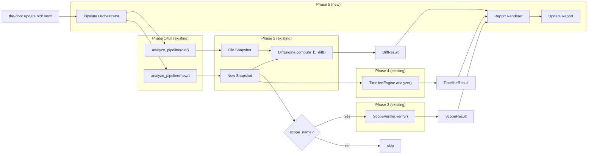
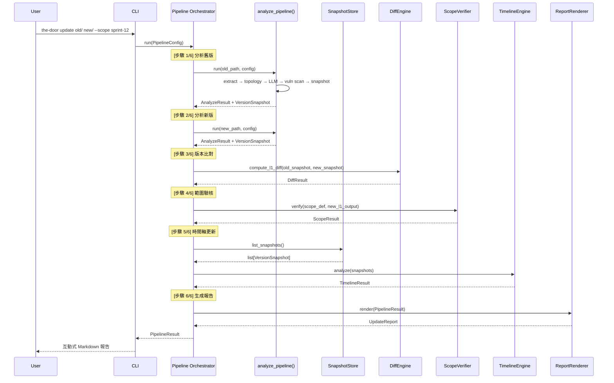
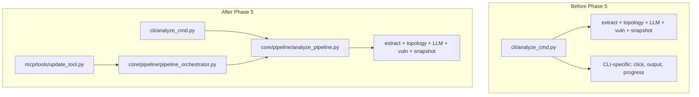

# Design Document — The Door Phase 5: Realtime Dynamic Layer (即時動態層)

## Overview

Phase 5 在 Phase 1–4 的完整分析能力之上，新增**版本更新自動管線**（Update Pipeline）與**互動式逐層展開報告**（Update Report）。Phase 1-full 提供 LLM 翻譯管線，Phase 2 加入版本比對，Phase 2.5 加入漏洞掃描，Phase 3 加入範圍驗核，Phase 4 加入歷史時間軸——Phase 5 將這些能力串接為一條自動化管線，讓使用者指定舊版路徑與新版路徑後，一鍵取得完整的版本更新報告。

**核心定位：** Phase 5 是 orchestration layer，不新增任何分析引擎。所有分析能力完全委派給 Phase 1–4 的既有模組。Phase 5 的價值在於：
1. **管線編排**：自動化 analyze → diff → scope verify → timeline 的完整流程
2. **報告展開設計**：以非工程師的閱讀習慣組織分析結果（L0 摘要 → L1 變更總覽 → L2 細節 → L3 附錄）
3. **analyze 邏輯提取**：將目前嵌入 `cli/analyze_cmd.py` 的分析編排邏輯提取為可複用的核心函式

**「即時」的定義：** 不是邊寫程式碼邊顯示變化，而是對一個已完成的程式包進行前後版本的完整分析與比對。基礎層（extract + analyze）執行完全辨認，不做增量或部分分析。

**Phase 5 在既有基礎上新增的能力：**

| 能力 | 說明 |
|---|---|
| **Analyze Pipeline（核心函式）** | 從 `cli/analyze_cmd.py` 提取的可複用分析管線函式，供 Pipeline_Orchestrator 和 CLI 共同使用 |
| **Pipeline Orchestrator** | 管線編排引擎：analyze(old) → analyze(new) → diff → scope verify → timeline → report |
| **File Fingerprint Validation** | 檔案指紋驗證（路徑 + 大小 + mtime），智慧判斷是否可複用既存 snapshot。指紋獨立儲存在 `.the-door/fingerprints/`，不修改 VersionSnapshot schema |
| **Update Report** | 四層展開結構：L0 摘要 → L1 變更總覽 → L2 細節 → L3 技術附錄 |
| **Report Renderer** | 三種輸出格式：互動式 Markdown（details/summary）、結構化 JSON、Mermaid 圖形 |
| **Progress Reporting** | 步驟級進度回報（stderr）+ 步驟耗時記錄 |
| **SIGINT Handling** | 使用者中斷時完成當前步驟，生成部分報告 |
| **Step Timeouts** | 各步驟超時上限（analyze=300s, 其他=30s） |
| **Update CLI** | `the-door update <old-path> <new-path>` 指令 |
| **MCP Update Tool** | 新 MCP tool：`update`（共 18 tools） |
| **JSON Schema** | `update-report.schema.json`（Draft 2020-12） |

### 設計決策與理由

| 決策 | 理由 |
|---|---|
| 從 `cli/analyze_cmd.py` 提取分析邏輯到 `core/pipeline/analyze_pipeline.py` | 目前 analyze 的編排邏輯（extract → topology → LLM → snapshot）嵌入在 CLI 層，Pipeline_Orchestrator 無法直接複用。提取為核心函式後，CLI 和 Pipeline_Orchestrator 共用同一份邏輯，避免重複實作 |
| Pipeline_Orchestrator 為 pure orchestration（不含分析邏輯） | 同 Phase 1–4 的設計原則：核心計算與 I/O 分離。Orchestrator 只負責呼叫順序、錯誤處理、進度回報 |
| analyze 失敗 = 管線終止；其他步驟失敗 = 繼續執行 | analyze 產出是所有後續步驟的輸入，無法跳過。diff/scope/timeline 彼此獨立，單一失敗不影響其他步驟 |
| 檔案指紋用（路徑 + 大小 + mtime），不用內容 hash | 內容 hash 需讀取所有檔案，大型 codebase 耗時過長。路徑 + 大小 + mtime 是 O(1) 操作，足以偵測大多數變更 |
| 報告用 HTML `<details>/<summary>` 實現展開 | 標準 HTML，所有支援 Markdown 的環境（GitHub、GitLab、VS Code、Obsidian）均可渲染。純文字模式下內容全部可見，不影響可讀性 |
| L1 變更總覽按風險優先排序 | 非工程師最需要先看到「計畫外的事」（超出範圍）和「危險的事」（漏洞），而非按字母或時間排序 |
| Mermaid 輸出複用既有 DiffRenderer/ScopeRenderer | Phase 5 不新增渲染邏輯，完全委派給既有 renderer。合併摘要面板整合 diff + scope + vuln 資訊 |
| Mermaid 漏洞標記用文字摘要，不用節點邊框 | Phase 5 管線不觸發 L2 分析，而 `VulnerabilityRenderer.build_l1_border_styles()` 需要 L2 anomalies 作為輸入。改為在摘要面板中以文字呈現漏洞摘要，避免引入不存在的資料依賴 |
| 檔案指紋獨立儲存（`.the-door/fingerprints/`），不修改 VersionSnapshot schema | VersionSnapshot 是 Phase 2 的核心資料結構，修改其 schema 會影響所有既有 snapshot 的相容性。指紋資料只在 Phase 5 的智慧跳過機制中使用，獨立儲存更安全 |
| PipelineConfig 用 composition 包含 AnalyzeConfig | 避免 PipelineConfig 和 AnalyzeConfig 之間的欄位重複，Pipeline_Orchestrator 直接將 `config.analyze_config` 傳給 `run_analyze_pipeline()`，無需轉換 |
| AnalyzeResult 包含 L1Output 物件 | ScopeVerifier.verify() 接收 L1Output（不是 dict），AnalyzeResult 同時保留 L1Output 物件和 dict 格式，避免 Pipeline_Orchestrator 需要反序列化 |
| MCP update tool 預設 JSON 格式 | MCP 環境下 JSON 最適合程式化消費；Markdown 和 Mermaid 作為可選格式 |
| 進度訊息輸出到 stderr | 同既有 CLI 慣例：stderr 用於進度/警告，stdout 用於實際輸出，支援管線重導向 |
| SIGINT 處理：完成當前步驟後停止 | 避免中途中斷導致不一致狀態（例如 snapshot 寫入一半）。已完成的步驟結果仍可用於生成部分報告 |

## Architecture

### 高層資料流（Phase 5 Realtime Dynamic Layer）



### 管線執行序列



### Analyze Pipeline 提取



### 模組邊界

| 模組 | 套件 | 職責 | 輸入 | 輸出 |
|---|---|---|---|---|
| `analyze_pipeline` | `core/pipeline/` | 可複用的分析管線核心函式（從 analyze_cmd 提取） | codebase_path + AnalyzeConfig | AnalyzeResult（含 snapshot） |
| `pipeline_orchestrator` | `core/pipeline/` | 管線編排：analyze(old) → analyze(new) → diff → scope → timeline → report | PipelineConfig | PipelineResult |
| `report_renderer` | `core/pipeline/` | 將 PipelineResult 渲染為三種格式 | PipelineResult + 格式選項 | Markdown / JSON / Mermaid text |
| `update_cmd` | `cli/` | `the-door update` CLI 指令 | CLI args | stdout / file |
| `update_tool` | `mcp/tools/` | MCP update tool | MCP arguments | UpdateReport JSON |

## Components and Interfaces

### 擴展後的資料夾結構

```
the_door/
├── src/
│   └── the_door/
│       ├── models.py                         # 擴展：Phase 5 pipeline + report models
│       ├── cli/
│       │   ├── main.py                       # 擴展：加入 update 指令
│       │   ├── analyze_cmd.py                # 重構：委派給 analyze_pipeline()
│       │   └── update_cmd.py                 # NEW: update 指令
│       ├── core/
│       │   ├── pipeline/                     # NEW: 管線編排套件
│       │   │   ├── __init__.py
│       │   │   ├── analyze_pipeline.py       # 從 analyze_cmd 提取的可複用分析管線
│       │   │   ├── pipeline_orchestrator.py  # 管線編排引擎
│       │   │   └── report_renderer.py        # 報告渲染（Markdown / JSON / Mermaid）
│       │   ├── diff/                         # (existing, unchanged)
│       │   ├── extraction/                   # (existing, unchanged)
│       │   ├── rendering/                    # (existing, unchanged)
│       │   ├── scope/                        # (existing, unchanged)
│       │   ├── timeline/                     # (existing, unchanged)
│       │   └── vulnerability/                # (existing, unchanged)
│       └── mcp/
│           ├── server.py                     # 擴展：註冊 update tool（共 18 tools）
│           └── tools/
│               └── update_tool.py            # NEW: update MCP tool
├── schemas/
│   └── update-report.schema.json             # NEW
├── tests/
│   ├── unit/
│   │   ├── core/
│   │   │   └── pipeline/                     # NEW
│   │   │       ├── test_analyze_pipeline.py
│   │   │       ├── test_pipeline_orchestrator.py
│   │   │       └── test_report_renderer.py
│   │   ├── cli/
│   │   │   └── test_update_cmd.py            # NEW
│   │   └── mcp/
│   │       └── test_update_tool.py           # NEW
│   └── property/
│       ├── test_pipeline_properties.py       # NEW: pipeline PBT
│       └── test_report_properties.py         # NEW: report PBT
└── pyproject.toml                            # unchanged — no new dependencies
```

### 元件介面

#### Analyze Pipeline（從 analyze_cmd 提取）

```python
# src/the_door/core/pipeline/analyze_pipeline.py

@dataclass(frozen=True)
class AnalyzeConfig:
    """分析管線的配置參數。"""
    provider: str | None = None       # LLM provider 覆蓋
    model: str | None = None          # Model name 覆蓋
    skip_cost_confirm: bool = False   # 跳過成本確認
    offline_vuln: bool = False        # 漏洞掃描離線模式
    timeout_seconds: int = 300        # 分析超時秒數


@dataclass(frozen=True)
class AnalyzeResult:
    """分析管線的完整結果。"""
    snapshot: VersionSnapshot         # 自動建立的 snapshot
    l1_output: L1Output               # L1 輸出物件（供 ScopeVerifier 使用）
    l1_output_data: dict              # L1 輸出 JSON（含 features, relations 等）
    scan_result: ScanResult           # 漏洞掃描結果
    file_fingerprint: dict[str, tuple[int, float]]  # 分析時的檔案指紋（path → (size, mtime)）
    total_batches: int
    total_tokens: int


def run_analyze_pipeline(
    codebase_path: Path,
    config: AnalyzeConfig,
    *,
    progress_callback: Callable[[str], None] | None = None,
) -> AnalyzeResult:
    """執行完整的分析管線：extract → topology → LLM → vuln scan → snapshot。
    
    此函式從 cli/analyze_cmd.py 提取而來，是可複用的核心函式。
    CLI 和 Pipeline_Orchestrator 共用此函式。
    
    progress_callback：可選的進度回報函式，接收進度訊息字串。
    CLI 傳入 click.echo(err=True)，MCP 傳入 logger.info。
    
    流程：
    1. 計算檔案指紋（compute_file_fingerprint）
    2. 載入 config（ConfigManager.load() + 覆蓋參數）
    3. 並行執行 AST extraction + vulnerability scan（ThreadPoolExecutor）
    4. 拓撲分析
    5. 成本估算（若 skip_cost_confirm=False 且超過閾值，拋出 CostConfirmationRequired）
    6. LLM batch reading
    7. 自動建立 snapshot（含 git info 偵測）
    8. 回傳 AnalyzeResult（含 L1Output 物件 + 檔案指紋）
    
    Raises:
        AnalyzeError: 分析過程中的不可恢復錯誤
        CostConfirmationRequired: 需要使用者確認成本（僅 CLI 互動模式）
    """
    ...


def compute_file_fingerprint(codebase_path: Path) -> dict[str, tuple[int, float]]:
    """計算 codebase 的檔案指紋。
    
    回傳 dict[relative_path → (file_size_bytes, mtime_timestamp)]。
    只包含 AST 可處理的原始碼檔案（同 ASTExtractor 的檔案發現邏輯）。
    用於判斷既存 snapshot 是否仍然有效。
    """
    ...


def validate_snapshot_fingerprint(
    stored_fingerprint: dict[str, tuple[int, float]],
    current_fingerprint: dict[str, tuple[int, float]],
) -> bool:
    """驗證既存分析結果的檔案指紋是否與當前 codebase 一致。
    
    比對 stored_fingerprint（上次分析時記錄）與 current_fingerprint 的 key set。
    若檔案清單完全一致且每個檔案的 size + mtime 均未變，回傳 True。
    否則回傳 False（需重新分析）。
    
    注意：指紋儲存在 `.the-door/fingerprints/<snapshot_version_id>.json`，
    與 snapshot 分開儲存，避免修改 VersionSnapshot schema。
    """
    ...
```

#### Pipeline Orchestrator

```python
# src/the_door/core/pipeline/pipeline_orchestrator.py

class PipelineOrchestrator:
    """版本更新管線編排引擎。
    
    Pure orchestration — 不包含任何新的分析邏輯。
    所有分析能力完全委派給既有模組。
    
    步驟執行順序：
    1. analyze(old_path) — 分析舊版
    2. analyze(new_path) — 分析新版
    3. diff — 版本比對
    4. scope_verify — 範圍驗核（可選）
    5. timeline — 時間軸更新（可選）
    6. report — 生成報告
    
    錯誤處理策略：
    - analyze 失敗 → 管線終止
    - diff/scope/timeline 失敗 → 標記 failed，繼續執行後續步驟
    - 所有步驟結果（含失敗）記錄在 PipelineResult 中
    """

    def run(
        self,
        config: PipelineConfig,
        *,
        progress_callback: Callable[[str], None] | None = None,
    ) -> PipelineResult:
        """執行完整的版本更新管線。
        
        1. 驗證輸入路徑（存在、是目錄、不相同）
        2. 依序執行各步驟，記錄 PipelineStep 狀態
        3. 處理 SIGINT：設定 signal handler，收到信號後完成當前步驟再停止
        4. 處理步驟超時：超時的步驟標記為 failed
        5. 組裝 PipelineResult
        
        progress_callback：進度回報函式。
        格式：「[步驟 N/M] 正在執行：<step_name>...」
              「[步驟 N/M] ✓ <step_name>（耗時 X.Xs）」
              「[步驟 N/M] ✗ <step_name> — <error_message>」
        """
        ...

    def _run_analyze_step(
        self,
        path: Path,
        step_name: str,
        config: PipelineConfig,
    ) -> tuple[PipelineStep, AnalyzeResult | None]:
        """執行 analyze 步驟。
        
        1. 計算當前檔案指紋
        2. 檢查 `.the-door/fingerprints/` 下是否有既存指紋檔案（若 force_reanalyze=False）
        3. 載入最新 snapshot + 對應指紋，比對是否一致
        4. 指紋一致 → 使用既存 snapshot（跳過 LLM 呼叫）
        5. 指紋不一致或無既存 → 執行 run_analyze_pipeline()
        6. 儲存新的指紋檔案（以 snapshot.version_id 為檔名）
        7. 回傳 (PipelineStep, AnalyzeResult | None)
        """
        ...

    def _run_diff_step(
        self,
        old_snapshot: VersionSnapshot,
        new_snapshot: VersionSnapshot,
    ) -> tuple[PipelineStep, DiffResult | None]:
        """執行 diff 步驟。"""
        ...

    def _run_scope_step(
        self,
        scope_name: str,
        new_path: Path,
        new_l1_output: L1Output,
    ) -> tuple[PipelineStep, ScopeResult | None]:
        """執行 scope verify 步驟。
        
        使用 ScopeVerifier.verify(scope_def, l1_output) — 
        接收 L1Output 物件（不是 dict），與既有 API 一致。
        scope_def 從 new_path 下的 .the-door/ 目錄載入。
        """
        ...

    def _run_timeline_step(
        self,
        new_path: Path,
    ) -> tuple[PipelineStep, TimelineResult | None]:
        """執行 timeline 步驟。"""
        ...
```

#### Report Renderer

```python
# src/the_door/core/pipeline/report_renderer.py

class ReportRenderer:
    """將 PipelineResult 渲染為版本更新報告。
    
    支援三種輸出格式：
    1. 互動式 Markdown（HTML details/summary）
    2. 結構化 JSON（符合 update-report.schema.json）
    3. Mermaid 圖形（複用既有 DiffRenderer/ScopeRenderer）
    
    設計原則：
    - 使用功能語言（「功能」而非「節點」或「模組」）
    - 風險優先排序（超出範圍 → 漏洞 → 語意漂移 → 一般變更）
    - 複用既有 renderer 的共用工具（escape_mermaid_label 等）
    """

    def render_markdown(
        self,
        result: PipelineResult,
    ) -> str:
        """渲染互動式 Markdown 報告。
        
        結構：
        1. 目錄（Table of Contents）
        2. L0 摘要（<details open>）
        3. L1 變更總覽（<details open>）
           - 超出範圍的變更（⚠）
           - 新增的功能（🟢）
           - 修改的功能（🟠）
           - 移除的功能（🔴）
           - 漏洞摘要
           - 語意漂移警告
        4. L2 細節展開（<details>，每個功能一個可展開區段）
        5. L3 技術附錄（<details>）
           - 完整 JSON 資料
           - 管線執行統計
        """
        ...

    def render_json(
        self,
        result: PipelineResult,
    ) -> dict:
        """渲染結構化 JSON 報告。
        
        符合 update-report.schema.json schema。
        包含 report_version、generated_at、pipeline_summary、
        l0_summary、l1_changes、l2_details、l3_appendix。
        """
        ...

    def render_mermaid(
        self,
        result: PipelineResult,
    ) -> str:
        """渲染 Mermaid 圖形報告。
        
        複用既有 renderer：
        - DiffRenderer.render_l1_diff() 生成 diff 圖形
        - ScopeRenderer.render_l1_diff_with_scope() 疊加 scope badges（若有）
        
        漏洞標記策略：Phase 5 管線不觸發 L2 分析，因此無法使用
        VulnerabilityRenderer.build_l1_border_styles()（該函式需要 L2 anomalies）。
        改為在 L0/L1 摘要面板中以文字形式呈現漏洞摘要（複用
        VulnerabilityRenderer.format_summary_header()），不在圖形節點上
        疊加邊框樣式。若使用者需要節點級漏洞標記，應使用 `the-door analyze`
        + `the-door render` 的完整流程。
        
        在圖形頂部加入合併摘要面板（Mermaid comment %%）。
        """
        ...

    def _build_l0_summary(
        self,
        result: PipelineResult,
    ) -> str:
        """建構 L0 一句話結論。
        
        格式：「本次更新：新增 N 個功能、修改 M 個功能、移除 K 個功能」
        附加風險提示（若有高風險漏洞或超出範圍項目）。
        若無異常：「本次更新在預期範圍內，未發現異常」。
        """
        ...

    def _build_l1_changes(
        self,
        result: PipelineResult,
    ) -> list[L1ChangeEntry]:
        """建構 L1 變更清單。
        
        排序規則（風險優先）：
        1. 超出範圍的變更（⚠）
        2. 有高風險漏洞的功能（🔴⚑）
        3. 有語意漂移的功能（🔵）
        4. 新增的功能（🟢）
        5. 修改的功能（🟠）
        6. 移除的功能（🔴）
        """
        ...

    def _build_merged_summary_panel(
        self,
        result: PipelineResult,
    ) -> list[str]:
        """建構合併摘要面板（Mermaid comment 行）。
        
        整合 diff 摘要 + scope 摘要 + 漏洞摘要為一個統一面板。
        """
        ...
```

#### CLI Command

```python
# src/the_door/cli/update_cmd.py

@click.command("update")
@click.argument("old_path", type=click.Path(exists=True))
@click.argument("new_path", type=click.Path(exists=True))
@click.option("--scope", "scope_name", default=None, help="Scope definition 名稱，用於範圍驗核")
@click.option("--json", "output_json", is_flag=True, help="輸出結構化 JSON 報告")
@click.option("--render", is_flag=True, help="輸出 Mermaid diff 圖形")
@click.option("--offline", is_flag=True, help="漏洞掃描使用本地 OSV 資料庫")
@click.option("--skip-timeline", is_flag=True, help="跳過時間軸更新步驟")
@click.option("--provider", default=None, help="LLM provider 覆蓋")
@click.option("--yes", "-y", is_flag=True, help="跳過 LLM 成本確認")
@click.option("-o", "--output", "output_file", type=click.Path(), default=None, help="輸出到檔案（UTF-8）")
@click.option("--force-reanalyze", is_flag=True, help="強制重新分析（忽略既存 snapshot）")
def update_cmd(
    old_path: str,
    new_path: str,
    scope_name: str | None,
    output_json: bool,
    render: bool,
    offline: bool,
    skip_timeline: bool,
    provider: str | None,
    yes: bool,
    output_file: str | None,
    force_reanalyze: bool,
):
    """執行完整的版本更新分析管線。
    
    比較 OLD_PATH（舊版）和 NEW_PATH（新版）兩個 codebase，
    自動執行分析、比對、範圍驗核、時間軸更新，
    輸出互動式版本更新報告。
    
    CLI 層負責將旗標組裝為 PipelineConfig（含 AnalyzeConfig），
    然後委派給 PipelineOrchestrator.run()。
    """
    ...
```

#### MCP Tool

```python
# src/the_door/mcp/tools/update_tool.py

TOOL_SCHEMA = {
    "type": "object",
    "required": ["old_path", "new_path"],
    "properties": {
        "old_path": {"type": "string", "description": "舊版 codebase 根目錄路徑"},
        "new_path": {"type": "string", "description": "新版 codebase 根目錄路徑"},
        "scope_name": {"type": "string", "description": "Scope definition 名稱（可選）"},
        "offline_vuln": {"type": "boolean", "default": False, "description": "漏洞掃描使用本地 OSV 資料庫"},
        "skip_timeline": {"type": "boolean", "default": False, "description": "跳過時間軸更新"},
        "output_format": {
            "type": "string",
            "enum": ["json", "markdown", "mermaid"],
            "default": "json",
            "description": "輸出格式",
        },
    },
}

async def execute(arguments: dict) -> dict:
    """執行 update MCP tool。回傳對應格式的 UpdateReport。
    
    MCP 環境下 AnalyzeConfig.skip_cost_confirm 預設為 True，
    因為 MCP client 無法進行互動式成本確認。
    """
    ...
```


## Data Models

### 新增 Data Classes（models.py）

所有新 model 遵循既有慣例：`frozen=True` 用於不可變值物件，`field(default_factory=...)` 用於可變預設值。

```python
# ============================================================================
# Phase 5: Realtime Dynamic Layer (Pipeline + Report) models
# ============================================================================


# === Pipeline Configuration ===


@dataclass(frozen=True)
class StepTimeouts:
    """各管線步驟的超時秒數（immutable）。"""
    analyze_old: int = 300
    analyze_new: int = 300
    diff: int = 30
    scope_verify: int = 30
    timeline: int = 30
    report: int = 30


@dataclass(frozen=True)
class PipelineConfig:
    """版本更新管線的完整配置。"""
    old_path: Path
    new_path: Path
    analyze_config: AnalyzeConfig = field(default_factory=AnalyzeConfig)  # 分析管線配置（composition，避免欄位重複）
    scope_name: str | None = None
    skip_timeline: bool = False
    force_reanalyze: bool = False
    step_timeouts: StepTimeouts = field(default_factory=StepTimeouts)


# === Pipeline Execution State ===


@dataclass(frozen=True)
class PipelineStep:
    """管線中的單一執行步驟狀態。"""
    step_name: str
    status: str  # "completed" | "failed" | "skipped"
    started_at: str | None = None   # ISO8601
    completed_at: str | None = None # ISO8601
    duration_ms: int | None = None
    error_message: str | None = None


@dataclass(frozen=True)
class PipelineSummary:
    """管線執行摘要。"""
    old_path: str
    new_path: str
    total_duration_ms: int
    steps: list[PipelineStep] = field(default_factory=list)


# === Report Data ===


@dataclass(frozen=True)
class L1ChangeEntry:
    """L1 變更總覽中的單一項目。"""
    feature_id: str
    change_type: str  # "added" | "removed" | "attribute_changed" | "dependency_changed"
    risk_flags: list[str] = field(default_factory=list)  # "out_of_scope" | "vulnerability" | "semantic_drift"
    current_label: str = ""
    baseline_label: str | None = None


@dataclass(frozen=True)
class L2DetailEntry:
    """L2 細節展開中的單一項目。"""
    feature_id: str
    change_type: str
    current_label: str = ""
    current_description: str = ""
    baseline_label: str | None = None
    baseline_description: str | None = None
    scope_state: str | None = None  # "in_scope_complete" | "out_of_scope" | "in_scope_incomplete" | None
    related_vulnerabilities: list[str] = field(default_factory=list)  # CVE IDs
    affected_relations: list[str] = field(default_factory=list)  # 受影響的依賴關係描述


@dataclass(frozen=True)
class L3Appendix:
    """L3 技術附錄。"""
    diff_result_json: dict | None = None
    scope_result_json: dict | None = None
    timeline_result_json: dict | None = None
    pipeline_summary: PipelineSummary | None = None  # 各步驟耗時統計（typed，非 dict）


@dataclass(frozen=True)
class UpdateReport:
    """版本更新報告的完整結構化資料。"""
    report_version: str = "1.0.0"
    generated_at: str = ""  # ISO8601
    pipeline_summary: PipelineSummary | None = None
    l0_summary: str = ""
    l1_changes: list[L1ChangeEntry] = field(default_factory=list)
    l2_details: list[L2DetailEntry] = field(default_factory=list)
    l3_appendix: L3Appendix = field(default_factory=L3Appendix)
    interrupted: bool = False  # 管線是否被使用者中斷


# === Pipeline Result ===


@dataclass(frozen=True)
class PipelineResult:
    """管線執行的完整結果。"""
    config: PipelineConfig
    steps: list[PipelineStep] = field(default_factory=list)
    old_snapshot: VersionSnapshot | None = None
    new_snapshot: VersionSnapshot | None = None
    diff_result: DiffResult | None = None
    scope_result: ScopeResult | None = None
    timeline_result: TimelineResult | None = None
    scan_result_old: ScanResult | None = None
    scan_result_new: ScanResult | None = None
    total_duration_ms: int = 0
    interrupted: bool = False  # 管線是否被使用者中斷


# === Phase 5: Custom exceptions ===


class PipelineError(Exception):
    """管線執行錯誤（不可恢復）。"""
    def __init__(self, step_name: str, message: str):
        self.step_name = step_name
        super().__init__(f"Pipeline error at '{step_name}': {message}")


class AnalyzeError(Exception):
    """分析管線錯誤。"""
    pass


class CostConfirmationRequired(Exception):
    """需要使用者確認 LLM 呼叫成本。"""
    def __init__(self, estimated_cost: float, total_tokens: int):
        self.estimated_cost = estimated_cost
        self.total_tokens = total_tokens
        super().__init__(
            f"Estimated cost: ${estimated_cost:.4f} ({total_tokens} tokens). Confirmation required."
        )
```

### 新增 JSON Schema

#### `schemas/update-report.schema.json`

```json
{
  "$schema": "https://json-schema.org/draft/2020-12/schema",
  "$id": "https://the-door.dev/schemas/update-report.schema.json",
  "title": "The Door Update Report",
  "description": "版本更新報告的結構化 JSON 格式",
  "type": "object",
  "required": [
    "report_version",
    "generated_at",
    "pipeline_summary",
    "l0_summary",
    "l1_changes",
    "l2_details",
    "l3_appendix"
  ],
  "properties": {
    "report_version": {
      "type": "string",
      "description": "Schema 版本字串"
    },
    "generated_at": {
      "type": "string",
      "format": "date-time",
      "description": "報告生成時間（ISO8601）"
    },
    "pipeline_summary": {
      "type": "object",
      "required": ["old_path", "new_path", "total_duration_ms", "steps"],
      "properties": {
        "old_path": { "type": "string" },
        "new_path": { "type": "string" },
        "total_duration_ms": { "type": "integer", "minimum": 0 },
        "steps": {
          "type": "array",
          "items": {
            "type": "object",
            "required": ["step_name", "status"],
            "properties": {
              "step_name": { "type": "string" },
              "status": {
                "type": "string",
                "enum": ["completed", "failed", "skipped"]
              },
              "duration_ms": { "type": ["integer", "null"], "minimum": 0 },
              "error_message": { "type": ["string", "null"] }
            }
          }
        }
      }
    },
    "l0_summary": {
      "type": "string",
      "description": "一句話結論"
    },
    "l1_changes": {
      "type": "array",
      "items": {
        "type": "object",
        "required": ["feature_id", "change_type", "risk_flags", "current_label"],
        "properties": {
          "feature_id": { "type": "string" },
          "change_type": {
            "type": "string",
            "enum": ["added", "removed", "attribute_changed", "dependency_changed"]
          },
          "risk_flags": {
            "type": "array",
            "items": {
              "type": "string",
              "enum": ["out_of_scope", "vulnerability", "semantic_drift"]
            }
          },
          "current_label": { "type": "string" },
          "baseline_label": { "type": ["string", "null"] }
        }
      }
    },
    "l2_details": {
      "type": "array",
      "items": {
        "type": "object",
        "required": ["feature_id", "change_type"],
        "properties": {
          "feature_id": { "type": "string" },
          "change_type": {
            "type": "string",
            "enum": ["added", "removed", "attribute_changed", "dependency_changed"]
          },
          "current_label": { "type": "string" },
          "current_description": { "type": "string" },
          "baseline_label": { "type": ["string", "null"] },
          "baseline_description": { "type": ["string", "null"] },
          "scope_state": {
            "type": ["string", "null"],
            "enum": ["in_scope_complete", "out_of_scope", "in_scope_incomplete", null]
          },
          "related_vulnerabilities": {
            "type": "array",
            "items": { "type": "string" }
          },
          "affected_relations": {
            "type": "array",
            "items": { "type": "string" }
          }
        }
      }
    },
    "l3_appendix": {
      "type": "object",
      "properties": {
        "diff_result_json": { "type": ["object", "null"] },
        "scope_result_json": { "type": ["object", "null"] },
        "timeline_result_json": { "type": ["object", "null"] },
        "pipeline_summary": {
          "type": ["object", "null"],
          "description": "管線執行摘要（同 pipeline_summary 結構）"
        }
      }
    },
    "interrupted": {
      "type": "boolean",
      "default": false,
      "description": "管線是否被使用者中斷"
    }
  }
}
```


## Correctness Properties

*A property is a characteristic or behavior that should hold true across all valid executions of a system — essentially, a formal statement about what the system should do. Properties serve as the bridge between human-readable specifications and machine-verifiable correctness guarantees.*

### Property 1: Step status partition completeness

*For any* PipelineResult, the number of steps with status "completed" plus the number with status "failed" plus the number with status "skipped" SHALL equal the total number of steps defined in the pipeline. The union of all step statuses SHALL cover every defined step exactly once.

**Validates: Requirements 2.5, 12.4**

### Property 2: Analyze failure terminates pipeline

*For any* PipelineConfig where the analyze step for old_path or new_path fails, the PipelineResult SHALL contain no diff_result, no scope_result, and no timeline_result. All steps after the failed analyze step SHALL have status "skipped" or not be present.

**Validates: Requirements 2.1**

### Property 3: Non-critical failure continuation

*For any* PipelineConfig where the diff, scope_verify, or timeline step fails (but both analyze steps succeed), the PipelineResult SHALL still contain results from all successfully completed steps. Specifically: if diff fails, scope_verify and timeline SHALL still be attempted; if scope_verify fails, timeline SHALL still be attempted; if timeline fails, the report SHALL still be generated from available results.

**Validates: Requirements 2.2, 2.3, 2.4**

### Property 4: Skip logic correctness

*For any* PipelineConfig: (a) the analyze_old, analyze_new, and diff steps SHALL never have status "skipped" — they are always executed or failed; (b) if skip_timeline is true, the timeline step SHALL have status "skipped"; (c) if scope_name is None, the scope_verify step SHALL have status "skipped"; (d) if scope_name is provided, the scope_verify step SHALL have status "completed" or "failed" (never "skipped").

**Validates: Requirements 3.2, 3.3, 3.4**

### Property 5: L0 summary count consistency

*For any* PipelineResult with a successfully completed diff step, the L0 summary string SHALL contain numbers that exactly match the l1_changes counts: the count of entries with change_type "added" SHALL match the "新增 N 個" number, the count of "attribute_changed" plus "dependency_changed" SHALL match the "修改 M 個" number, and the count of "removed" SHALL match the "移除 K 個" number. When no risk items (out_of_scope, vulnerability, semantic_drift) exist in any l1_changes entry, the L0 summary SHALL contain the positive conclusion phrase.

**Validates: Requirements 4.2, 5.4, 12.5**

### Property 6: L1 risk-first ordering

*For any* PipelineResult with l1_changes containing mixed risk_flags and change_types, the l1_changes list SHALL be ordered such that: (a) all entries with "out_of_scope" in risk_flags appear before entries without it; (b) within the same risk category, entries with "vulnerability" in risk_flags appear before entries without it; (c) within the same risk category, entries with "semantic_drift" in risk_flags appear before entries without it; (d) after all risk-flagged entries, remaining entries are ordered by change_type: added before attribute_changed/dependency_changed before removed.

**Validates: Requirements 4.3, 5.1, 5.2, 5.3, 5.5**

### Property 7: Report-DiffResult count consistency

*For any* PipelineResult with a successfully completed diff step, the number of l1_changes entries with change_type "added" SHALL equal the DiffResult's summary.added_count, the number with "removed" SHALL equal summary.removed_count, the number with "attribute_changed" SHALL equal summary.attribute_changed_count, and the number with "dependency_changed" SHALL equal summary.dependency_changed_count.

**Validates: Requirements 12.1**

### Property 8: Report-ScopeResult flag consistency

*For any* PipelineResult with a successfully completed scope_verify step, the set of feature_ids in l1_changes that have "out_of_scope" in their risk_flags SHALL be identical to the set of feature_ids in the ScopeResult with scope_state "out_of_scope".

**Validates: Requirements 12.2**

### Property 9: JSON schema conformance

*For any* valid PipelineResult, the JSON output produced by ReportRenderer.render_json() SHALL validate against the `update-report.schema.json` schema without errors. Every l1_changes entry SHALL contain the required fields: feature_id, change_type, risk_flags, current_label. Every pipeline_summary.steps entry SHALL contain the required fields: step_name, status.

**Validates: Requirements 7.2, 11.1, 11.2, 11.3**

### Property 10: JSON report round-trip

*For any* valid UpdateReport, serializing to JSON and deserializing back SHALL produce an equivalent object: all field values SHALL be preserved, including report_version, generated_at, l0_summary, all l1_changes entries (with feature_id, change_type, risk_flags, current_label, baseline_label), all l2_details entries, and l3_appendix contents.

**Validates: Requirements 7.4, 11.4**

### Property 11: Failed step visibility in report

*For any* PipelineResult where one or more steps have status "failed", the rendered report (both Markdown and JSON formats) SHALL contain a failure indicator for each failed step. Specifically: (a) in Markdown, the section corresponding to the failed step SHALL contain the error_message text; (b) in JSON, the pipeline_summary.steps entry for the failed step SHALL have a non-null error_message; (c) no section corresponding to a failed step SHALL be blank or empty.

**Validates: Requirements 15.3**


## Error Handling

### Analyze Pipeline 錯誤處理

| 情境 | 處理方式 | 管線影響 |
|---|---|---|
| codebase_path 不存在或非目錄 | 拋出 AnalyzeError | 管線終止 |
| AST extraction 失敗（無可解析檔案） | 拋出 AnalyzeError | 管線終止 |
| LLM provider 不可用（API key 無效、Ollama 未啟動） | 拋出 AnalyzeError | 管線終止 |
| LLM 回應格式錯誤（JSON 解析失敗） | 拋出 AnalyzeError | 管線終止 |
| 漏洞掃描失敗 | 非致命，ScanResult(entries=[]) | 管線繼續 |
| Snapshot 儲存失敗 | 記錄 warning，AnalyzeResult 仍回傳 | 管線繼續（但 diff 可能受影響） |
| 成本超過閾值且 skip_cost_confirm=False | 拋出 CostConfirmationRequired | CLI 層處理（互動確認） |
| 分析超時（超過 step_timeout_seconds） | 拋出 AnalyzeError | 管線終止 |

### Pipeline Orchestrator 錯誤處理

| 情境 | 處理方式 | 管線影響 |
|---|---|---|
| old_path 或 new_path 不存在 | 拋出 PipelineError("validate_paths", ...) | 管線不啟動 |
| old_path == new_path | 拋出 PipelineError("validate_paths", "舊版路徑和新版路徑不可相同") | 管線不啟動 |
| analyze(old) 失敗 | PipelineStep(status="failed")，管線終止 | 後續步驟全部 skipped |
| analyze(new) 失敗 | PipelineStep(status="failed")，管線終止 | 後續步驟全部 skipped |
| diff 失敗 | PipelineStep(status="failed")，繼續執行 | scope/timeline 仍執行 |
| scope_verify 失敗（scope definition 不存在） | PipelineStep(status="failed")，繼續執行 | timeline 仍執行 |
| timeline 失敗 | PipelineStep(status="failed")，繼續執行 | 報告仍生成（無時間軸區段） |
| SIGINT 收到 | 完成當前步驟，設定 interrupted=True | 生成部分報告 |
| 步驟超時 | 取消步驟，PipelineStep(status="failed", error_message="超時") | 同一般失敗處理 |

### Report Renderer 錯誤處理

| 情境 | 處理方式 |
|---|---|
| diff_result 為 None（diff 步驟失敗） | L1/L2 區段顯示：「版本比對步驟失敗：{error_message}」 |
| scope_result 為 None（scope 步驟失敗或跳過） | 省略 scope 相關標記和區段 |
| timeline_result 為 None（timeline 步驟失敗或跳過） | 省略時間軸區段 |
| interrupted=True | 報告頂部顯示：「⚠ 管線已被使用者中斷，以下為部分結果」 |
| Mermaid 渲染中特殊字元 | 複用 escape_mermaid_label() 處理 |

### CLI 錯誤處理

| 情境 | 處理方式 |
|---|---|
| old_path 或 new_path 不存在 | Click 自動驗證（`type=click.Path(exists=True)`），顯示錯誤 |
| PipelineError | 顯示錯誤訊息到 stderr，exit code 1 |
| CostConfirmationRequired | 顯示成本估算，互動確認（`click.confirm`） |
| 輸出檔案寫入失敗 | 顯示錯誤訊息到 stderr，exit code 1 |

### MCP 錯誤處理

| 情境 | 處理方式 |
|---|---|
| 無效路徑 | 回傳 `{"error": "Invalid path: <path> does not exist or is not a directory"}` |
| 相同路徑 | 回傳 `{"error": "old_path and new_path must be different directories"}` |
| CostConfirmationRequired | 不會發生——MCP 環境下 AnalyzeConfig.skip_cost_confirm 預設為 True |
| 分析失敗 | 回傳 `{"error": "Analysis failed: <message>", "partial_result": {...}}` |
| 管線部分失敗 | 回傳完整 PipelineResult JSON（含 failed 步驟資訊） |

### 錯誤傳播規則

1. **Analyze → Pipeline**：AnalyzeError 導致管線終止。Pipeline_Orchestrator 捕捉 AnalyzeError，記錄到 PipelineStep，然後停止後續步驟。
2. **Diff/Scope/Timeline → Pipeline**：任何異常被捕捉，記錄到 PipelineStep(status="failed")，管線繼續。
3. **Pipeline → Report**：PipelineResult 包含所有步驟狀態（含失敗），ReportRenderer 根據可用結果生成報告。
4. **Pipeline → CLI/MCP**：PipelineError 由 CLI/MCP 層轉換為使用者可讀的錯誤訊息。

## Testing Strategy

### 測試方法

Phase 5 採用雙軌測試策略：

1. **Property-based tests（Hypothesis）**：驗證管線編排和報告渲染的正確性屬性
2. **Unit tests（pytest）**：驗證具體範例、邊界條件、CLI 行為、MCP 工具、錯誤處理

### Property-Based Testing 配置

- **測試框架**：Hypothesis（既有依賴，無需新增）
- **最低迭代次數**：每個 property test 100 次
- **標記格式**：`# Feature: realtime-dynamic-layer, Property {N}: {property_text}`
- **每個 correctness property 對應一個 property-based test**
- **Windows 相容**：Hypothesis 策略使用 ASCII-only 字串（避免 cp950 編碼問題）

### Hypothesis 策略設計

```python
# 核心策略：產生 PipelineResult

@st.composite
def pipeline_configs(draw):
    """產生隨機 PipelineConfig。"""
    return PipelineConfig(
        old_path=Path(draw(st.text(alphabet=string.ascii_lowercase, min_size=3, max_size=10))),
        new_path=Path(draw(st.text(alphabet=string.ascii_lowercase, min_size=3, max_size=10))),
        scope_name=draw(st.one_of(st.none(), st.text(alphabet=string.ascii_lowercase, min_size=1, max_size=10))),
        offline_vuln=draw(st.booleans()),
        skip_timeline=draw(st.booleans()),
        skip_cost_confirm=True,  # 測試中永遠跳過成本確認
        force_reanalyze=draw(st.booleans()),
    )


@st.composite
def diff_results(draw):
    """產生隨機 DiffResult（用於報告渲染測試）。"""
    n_added = draw(st.integers(min_value=0, max_value=5))
    n_removed = draw(st.integers(min_value=0, max_value=5))
    n_attr = draw(st.integers(min_value=0, max_value=5))
    n_dep = draw(st.integers(min_value=0, max_value=5))
    n_unchanged = draw(st.integers(min_value=0, max_value=5))

    node_diffs = []
    for i in range(n_added):
        node_diffs.append(NodeDiff(
            node_id=f"added_{i}",
            diff_state="added",
            current_label=draw(st.text(alphabet=string.ascii_letters + " ", min_size=1, max_size=20)),
        ))
    for i in range(n_removed):
        node_diffs.append(NodeDiff(
            node_id=f"removed_{i}",
            diff_state="removed",
            baseline_label=draw(st.text(alphabet=string.ascii_letters + " ", min_size=1, max_size=20)),
        ))
    for i in range(n_attr):
        node_diffs.append(NodeDiff(
            node_id=f"attr_{i}",
            diff_state="attribute_changed",
            current_label=draw(st.text(alphabet=string.ascii_letters + " ", min_size=1, max_size=20)),
            baseline_label=draw(st.text(alphabet=string.ascii_letters + " ", min_size=1, max_size=20)),
        ))
    for i in range(n_dep):
        node_diffs.append(NodeDiff(
            node_id=f"dep_{i}",
            diff_state="dependency_changed",
            current_label=draw(st.text(alphabet=string.ascii_letters + " ", min_size=1, max_size=20)),
            baseline_label=draw(st.text(alphabet=string.ascii_letters + " ", min_size=1, max_size=20)),
        ))
    for i in range(n_unchanged):
        node_diffs.append(NodeDiff(
            node_id=f"unchanged_{i}",
            diff_state="unchanged",
            current_label=draw(st.text(alphabet=string.ascii_letters + " ", min_size=1, max_size=20)),
        ))

    return DiffResult(
        baseline_info=BaselineInfo(version_id="base", timestamp="2024-01-01T00:00:00+00:00", trigger="commit"),
        current_info=BaselineInfo(version_id="curr", timestamp="2024-02-01T00:00:00+00:00", trigger="commit"),
        node_diffs=node_diffs,
        edge_diffs=[],
        summary=DiffSummary(
            added_count=n_added,
            removed_count=n_removed,
            dependency_changed_count=n_dep,
            attribute_changed_count=n_attr,
            total_changed_count=n_added + n_removed + n_dep + n_attr,
        ),
    )


@st.composite
def scope_results(draw, feature_ids):
    """產生隨機 ScopeResult（基於給定的 feature_ids）。"""
    entries = []
    for fid in feature_ids:
        state = draw(st.sampled_from(["in_scope_complete", "out_of_scope", "in_scope_incomplete"]))
        entries.append(ScopeEntry(feature_id=fid, scope_state=state))
    counts = ScopeCounts(
        in_scope_complete=sum(1 for e in entries if e.scope_state == "in_scope_complete"),
        out_of_scope=sum(1 for e in entries if e.scope_state == "out_of_scope"),
        in_scope_incomplete=sum(1 for e in entries if e.scope_state == "in_scope_incomplete"),
    )
    return ScopeResult(scope_name="test-scope", entries=entries, counts=counts)


@st.composite
def pipeline_results(draw):
    """產生隨機 PipelineResult（用於報告渲染測試）。"""
    diff = draw(diff_results())
    has_scope = draw(st.booleans())
    has_timeline = draw(st.booleans())

    feature_ids = [nd.node_id for nd in diff.node_diffs if nd.diff_state != "unchanged"]
    scope = None
    if has_scope and feature_ids:
        scope = draw(scope_results(feature_ids))

    steps = [
        PipelineStep(step_name="analyze_old", status="completed", duration_ms=1000),
        PipelineStep(step_name="analyze_new", status="completed", duration_ms=1200),
        PipelineStep(step_name="diff", status="completed", duration_ms=50),
        PipelineStep(step_name="scope_verify", status="completed" if has_scope else "skipped"),
        PipelineStep(step_name="timeline", status="completed" if has_timeline else "skipped"),
        PipelineStep(step_name="report", status="completed", duration_ms=10),
    ]

    return PipelineResult(
        config=PipelineConfig(old_path=Path("old"), new_path=Path("new")),
        steps=steps,
        diff_result=diff,
        scope_result=scope,
        total_duration_ms=2260,
    )
```

### 測試檔案結構

| 測試檔案 | 測試對象 | 測試類型 |
|---|---|---|
| `tests/property/test_pipeline_properties.py` | PipelineOrchestrator | PBT（Property 1–4） |
| `tests/property/test_report_properties.py` | ReportRenderer | PBT（Property 5–11） |
| `tests/unit/core/pipeline/test_analyze_pipeline.py` | analyze_pipeline | Unit（提取邏輯、指紋驗證、錯誤處理） |
| `tests/unit/core/pipeline/test_pipeline_orchestrator.py` | PipelineOrchestrator | Unit（步驟順序、SIGINT、超時、邊界條件） |
| `tests/unit/core/pipeline/test_report_renderer.py` | ReportRenderer | Unit（Markdown 格式、JSON 格式、Mermaid 格式、部分結果） |
| `tests/unit/cli/test_update_cmd.py` | update CLI | Unit（CliRunner，各旗標組合） |
| `tests/unit/mcp/test_update_tool.py` | MCP update tool | Unit（execute() 呼叫、錯誤回應） |

### Unit Test 重點

**analyze_pipeline.py**
- 從 analyze_cmd 提取後的邏輯等價性（相同輸入產生相同 snapshot）
- 檔案指紋計算正確性（路徑 + 大小 + mtime）
- 指紋驗證：一致時回傳 True，不一致時回傳 False
- 漏洞掃描失敗不影響分析結果
- CostConfirmationRequired 在超過閾值時拋出

**pipeline_orchestrator.py**
- 步驟執行順序驗證（mock 所有底層模組）
- analyze 失敗後管線終止
- diff/scope/timeline 失敗後繼續執行
- skip_timeline / scope_name=None 的跳過行為
- SIGINT 處理（模擬信號）
- 步驟超時處理
- 相同路徑拒絕
- force_reanalyze 強制重新分析

**report_renderer.py**
- Markdown 格式：details/summary 標籤、open 屬性、TOC
- JSON 格式：schema 驗證、round-trip
- Mermaid 格式：複用 DiffRenderer、合併摘要面板
- L0 摘要：數字正確性、正面/負面結論
- L1 排序：風險優先
- 部分結果：失敗步驟的提示文字
- interrupted 標記的顯示

**update_cmd.py**
- 各旗標組合（--json, --render, --scope, --offline, --skip-timeline, --yes, -o, --force-reanalyze）
- 進度訊息輸出到 stderr
- 報告輸出到 stdout 或檔案
- 錯誤處理（無效路徑、相同路徑）

**update_tool.py**
- MCP tool schema 驗證
- 各 output_format 選項
- 錯誤回應格式
