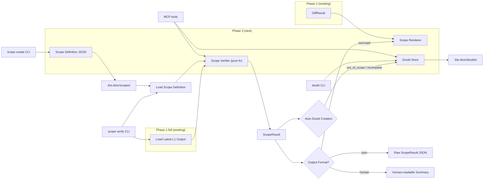
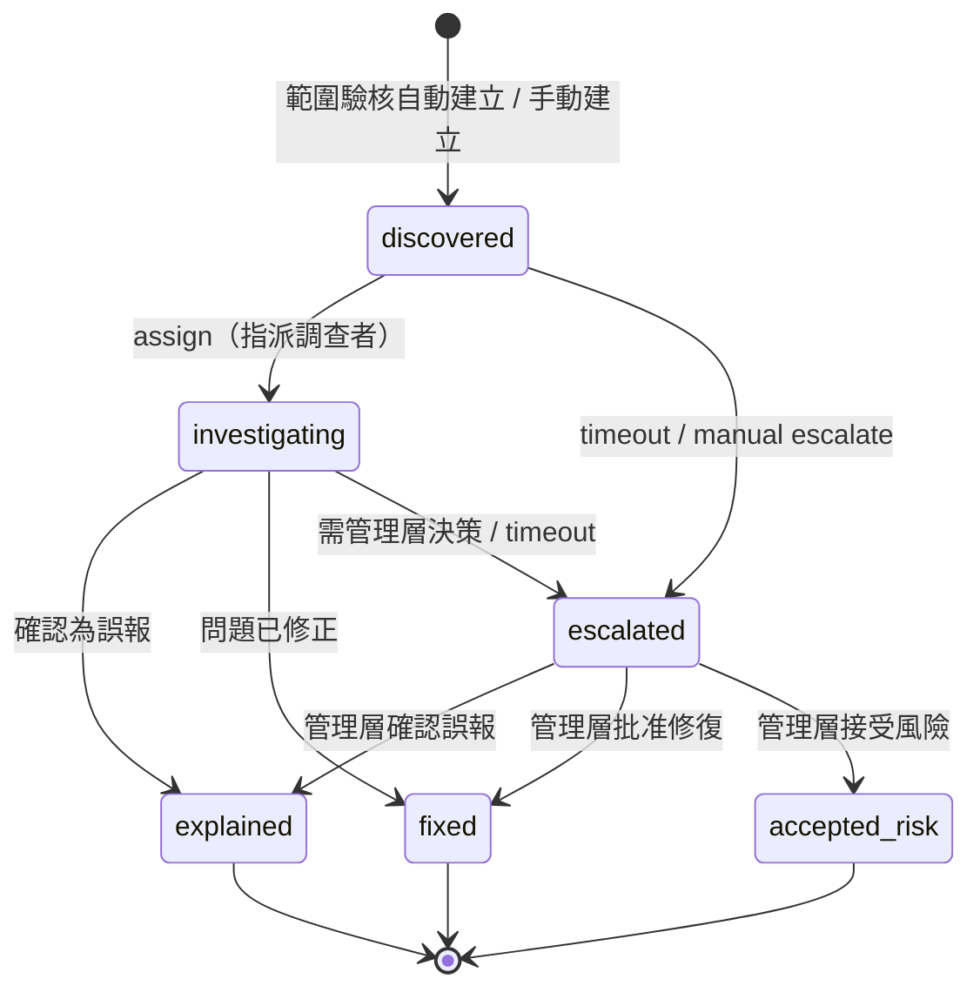
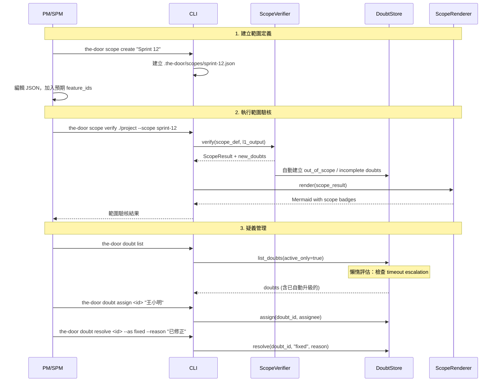

# Design Document — The Door Phase 3: Scope Verification Layer (範圍驗核層)

## Overview

Phase 3 在 Phase 2.5（漏洞資訊層）之上新增**範圍驗核**與**疑義路徑**兩大能力。Phase 1-full 提供完整的 LLM 翻譯管線，Phase 2 加入版本比對，Phase 2.5 加入漏洞掃描——Phase 3 則讓 PM/SPM 能夠預先定義 Sprint/Release 範圍，自動比對分析產出，並對超出範圍或未完成的功能啟動正式的疑義追蹤流程。

**Phase 3 在既有基礎上新增的能力：**

| 能力 | 說明 |
|---|---|
| **Scope Definition** | PM/SPM 以 JSON 檔案定義 Sprint 範圍（預期 feature_id 清單） |
| **Scope Verifier** | 純函式比對引擎：Scope Definition × L1 Output → ScopeResult（三態分類） |
| **Scope Renderer** | 在 Mermaid 節點標籤嵌入角標徽章（✓/⚠/○`<sup>scope</sup>`），不使用 classDef |
| **Scope Summary Panel** | 範圍驗核摘要面板（Mermaid 註解區塊） |
| **Diff+Scope Merged Panel** | 當 diff 與 scope 同時啟用時，合併為單一摘要面板 |
| **Doubt Path State Machine** | 6 狀態疑義生命週期（discovered → investigating → explained/fixed/escalated → accepted_risk） |
| **Doubt Store** | JSON 檔案持久化（`.the-door/doubts/`），同 SnapshotStore 模式 |
| **Timeout Escalation** | 懶惰評估超時升級（查詢時檢查，非背景 daemon） |
| **Auto Doubt Creation** | 範圍驗核自動為 out_of_scope / in_scope_incomplete 建立疑義記錄 |
| **Scope CLI** | `the-door scope verify/create/list/show` 四個子命令 |
| **Doubt CLI** | `the-door doubt list/show/assign/resolve/escalate` 五個子命令 |
| **MCP Tools** | 4 個新 MCP tools：`scope_verify`、`scope_create`、`doubt_list`、`doubt_transition` |
| **JSON Schemas** | `scope-definition.schema.json`、`doubt-record.schema.json`（Draft 2020-12） |

### 設計決策與理由

| 決策 | 理由 |
|---|---|
| Scope badges 用 label-embedded symbols（`✓<sup>scope</sup>`），不用 classDef | classDef 已被 confidence/diff/anomaly/vulnerability 佔用；Phase 0a §5.5 明確規定範圍標記不使用 classDef |
| Scope comparison 為 pure function（feature_id 字串比對） | 不需要 LLM 推斷——feature_id 是精確匹配；pure function 高度可測試 |
| ScopeVerifier 區分 pure function 與 orchestration | `verify()` 為 pure function（無 I/O）；`verify_and_create_doubts()` 為帶 I/O 副作用的 orchestration method |
| Doubt path 6 狀態（含 accepted_risk） | Phase 0a 概念設計的 5 狀態 + accepted_risk 作為管理層「知悉風險但不處理」的正式終態 |
| Timeout escalation 用 lazy evaluation | 避免背景 daemon 的複雜度；查詢時檢查即可滿足需求 |
| Timeout 配置為 project-level defaults only | Phase 3 不支援 per-doubt override，降低複雜度；未來可擴展 |
| Timeout 配置存於 `.the-door/scope-config.json` | 與 user-level 的 `~/.the-door/config.toml`（ConfigManager）分離；scope/doubt 是 project-level 資料 |
| Doubt 持久化為 JSON 檔案在 `.the-door/doubts/` | 同 SnapshotStore 模式：簡單、人類可讀、無資料庫依賴 |
| Doubt ID 用 UUID v4 | 同 SnapshotStore 的 version_id 模式，避免檔案系統不安全字元 |
| Placeholder node 用 inline style（`stroke-dasharray:5 5`） | 不佔用 classDef slot；僅用於 in_scope_incomplete 且 L1 中不存在的功能 |
| Scope badge 放在標籤最末端 | 標籤格式：`"[confidence_icon] [vuln_symbol] [diff_symbol] feature_label scope_badge"`——scope 是最外層資訊 |
| Merged panel 取代獨立 diff + scope panels | Phase 0a §6.6 規定合併檢視時用合併面板，避免資訊重複 |
| ScopeRenderer 獨立 class，compose 而非 copy | 與 DiffRenderer 模式一致（獨立 class）；內部複用 `escape_mermaid_label()`、`resolve_marker_state()`、`MARKER_DEFS`、`DiffRenderer.DIFF_SYMBOLS` 等共用工具，不重複實作 label escaping 和 confidence resolution 邏輯 |

## Architecture

### 高層資料流（Phase 3 Scope Verification）



### Doubt Path 狀態機



### Scope Verification 生命週期



### 模組邊界

| 模組 | 套件 | 職責 | 輸入 | 輸出 |
|---|---|---|---|---|
| `scope_verifier` | `core/scope/` | 範圍比對（`verify()` 為 pure function）+ 疑義建立 orchestration（`verify_and_create_doubts()` 帶 I/O 副作用） | ScopeDefinition + L1Output | ScopeResult + new Doubt_Records |
| `scope_renderer` | `core/scope/` | Mermaid 角標徽章 + 摘要面板 + 合併面板 | ScopeResult + optional DiffResult | Mermaid text |
| `doubt_store` | `core/scope/` | 疑義 CRUD + 狀態轉換 + timeout 檢查 + JSON 持久化 | DoubtRecord operations | DoubtRecord JSON files |
| `scope_cmd` | `cli/` | `the-door scope` 子命令群組 | CLI args | stdout / file |
| `doubt_cmd` | `cli/` | `the-door doubt` 子命令群組 | CLI args | stdout / file |
| `scope_verify_tool` | `mcp/tools/` | MCP scope_verify tool | MCP arguments | ScopeResult JSON |
| `scope_create_tool` | `mcp/tools/` | MCP scope_create tool | MCP arguments | file path |
| `doubt_list_tool` | `mcp/tools/` | MCP doubt_list tool | MCP arguments | DoubtRecord list JSON |
| `doubt_transition_tool` | `mcp/tools/` | MCP doubt_transition tool | MCP arguments | updated DoubtRecord JSON |

## Components and Interfaces

### 擴展後的資料夾結構

```
the_door/
├── src/
│   └── the_door/
│       ├── models.py                         # 擴展：Phase 3 scope + doubt models
│       ├── cli/
│       │   ├── main.py                       # 擴展：加入 scope, doubt 命令群組
│       │   ├── scope_cmd.py                  # NEW: scope verify/create/list/show
│       │   └── doubt_cmd.py                  # NEW: doubt list/show/assign/resolve/escalate
│       ├── core/
│       │   ├── scope/                        # NEW: scope verification package
│       │   │   ├── __init__.py
│       │   │   ├── scope_verifier.py         # 範圍比對 pure function + auto doubt creation
│       │   │   ├── scope_renderer.py         # Mermaid scope badges + summary panels
│       │   │   └── doubt_store.py            # 疑義 CRUD + state machine + timeout
│       │   ├── diff/                         # (existing, unchanged)
│       │   ├── rendering/                    # (existing, unchanged)
│       │   └── vulnerability/                # (existing, unchanged)
│       └── mcp/
│           ├── server.py                     # 擴展：註冊 4 個新 tools
│           └── tools/
│               ├── scope_verify_tool.py      # NEW
│               ├── scope_create_tool.py      # NEW
│               ├── doubt_list_tool.py        # NEW
│               └── doubt_transition_tool.py  # NEW
├── schemas/
│   ├── scope-definition.schema.json          # NEW
│   └── doubt-record.schema.json              # NEW
├── tests/
│   ├── unit/
│   │   ├── core/
│   │   │   └── scope/                        # NEW
│   │   │       ├── test_scope_verifier.py
│   │   │       ├── test_scope_renderer.py
│   │   │       └── test_doubt_store.py
│   │   ├── cli/
│   │   │   ├── test_scope_cmd.py             # NEW
│   │   │   └── test_doubt_cmd.py             # NEW
│   │   └── mcp/
│   │       └── test_scope_doubt_tools.py     # NEW
│   └── property/
│       ├── test_scope_properties.py          # NEW: scope PBT
│       └── test_doubt_properties.py          # NEW: doubt PBT
└── pyproject.toml                            # unchanged — no new dependencies
```


### 元件介面

#### Scope Verifier

```python
# src/the_door/core/scope/scope_verifier.py

class ScopeVerifier:
    """範圍比對引擎。
    
    verify() 為 pure function（無 I/O），將 ScopeDefinition 與 L1Output 比對，產生 ScopeResult。
    verify_and_create_doubts() 為 orchestration method（帶 I/O 副作用），在比對後自動建立疑義記錄。
    """

    def verify(
        self,
        scope_def: ScopeDefinition,
        l1_output: L1Output,
    ) -> ScopeResult:
        """比對範圍定義與 L1 分析產出（pure function，無 I/O）。
        
        分類規則（feature_id 字串比對）：
        - feature_id 同時存在於 scope_def 和 l1_output → in_scope_complete (✓)
        - feature_id 僅存在於 l1_output → out_of_scope (⚠)
        - feature_id 僅存在於 scope_def → in_scope_incomplete (○)
        
        回傳 ScopeResult 包含所有 ScopeEntry + 聚合計數。
        """
        ...

    def verify_and_create_doubts(
        self,
        scope_def: ScopeDefinition,
        l1_output: L1Output,
        doubt_store: DoubtStore,
    ) -> tuple[ScopeResult, list[DoubtRecord]]:
        """執行範圍驗核並自動建立疑義記錄（orchestration method，帶 I/O 副作用）。
        
        1. 呼叫 verify() 取得 ScopeResult
        2. 對每個 out_of_scope 和 in_scope_incomplete 項目：
           - 檢查 DoubtStore 是否已有同 source_node + doubt_type 的活躍疑義
           - 若無，建立新的 DoubtRecord（state=discovered, created_by=scope_verification）
        3. 回傳 (ScopeResult, new_doubts)
        """
        ...


def parse_scope_definition(file_path: Path) -> ScopeDefinition:
    """從 JSON 檔案解析 ScopeDefinition。
    
    1. 讀取檔案（encoding="utf-8"）
    2. JSON 解析（捕捉 JSONDecodeError，回傳描述性錯誤）
    3. jsonschema 驗證（scope-definition.schema.json）
    4. 轉換為 ScopeDefinition dataclass
    
    Raises:
        ScopeDefinitionError: 解析或驗證失敗
    """
    ...


def serialize_scope_definition(scope_def: ScopeDefinition) -> dict:
    """將 ScopeDefinition 序列化為 JSON-compatible dict（round-trip 用）。"""
    ...
```

#### Scope Renderer

```python
# src/the_door/core/scope/scope_renderer.py

class ScopeRenderer:
    """Mermaid 範圍角標徽章渲染器。
    
    在節點標籤末端嵌入 scope badge（✓/⚠/○ <sup>scope</sup>），
    不使用 classDef。可與 confidence icon、diff symbol、vuln symbol 共存。
    
    設計原則：compose 而非 copy。內部複用既有共用工具：
    - escape_mermaid_label()（from mermaid_utils）
    - resolve_marker_state() / MARKER_DEFS（from mermaid_renderer）
    - DiffRenderer.DIFF_SYMBOLS（from diff_renderer）
    不重複實作 label escaping、confidence resolution、diff symbol 邏輯。
    """

    # Scope badge 定義
    SCOPE_BADGES: dict[str, str] = {
        "in_scope_complete": "✓",
        "out_of_scope": "⚠",
        "in_scope_incomplete": "○",
    }

    def render_l1_with_scope(
        self,
        l1_output: L1Output,
        scope_result: ScopeResult,
        *,
        marker_context: dict[str, dict[str, bool]] | None = None,
        vulnerability_border_styles: dict[str, str] | None = None,
    ) -> str:
        """渲染帶有 scope badges 的 L1 Mermaid 圖。
        
        內部使用 escape_mermaid_label()、resolve_marker_state()、MARKER_DEFS 等
        既有共用工具，不重複實作 label escaping 和 confidence resolution 邏輯。
        
        1. 輸出 scope summary panel（Mermaid 註解）
        2. 輸出 confidence classDef 定義（複用 MARKER_DEFS）
        3. 對每個 L1 feature node：
           - 透過 resolve_marker_state() 取得 confidence icon
           - 標籤格式："{confidence_icon} {feature_label} {scope_badge}<sup>scope</sup>"
           - 指派 confidence classDef
        4. 對每個 in_scope_incomplete 且 L1 中不存在的 feature：
           - 建立 placeholder node（expected_label + ○<sup>scope</sup>）
           - 用 inline style: stroke-dasharray:5 5
        5. 輸出 edges
        """
        ...

    def render_l1_diff_with_scope(
        self,
        diff_result: DiffResult,
        scope_result: ScopeResult,
        *,
        marker_context: dict[str, dict[str, bool]] | None = None,
        vulnerability_markers: dict[str, str] | None = None,
    ) -> str:
        """渲染帶有 scope badges 的 L1 diff Mermaid 圖。
        
        內部使用 escape_mermaid_label()、DiffRenderer.DIFF_SYMBOLS 等既有共用工具，
        不重複實作 diff label 組裝邏輯。
        
        標籤格式："{confidence_icon} {vuln_symbol} {diff_symbol} {feature_label} {scope_badge}<sup>scope</sup>"
        
        1. 輸出 merged summary panel（diff + scope 合併）
        2. 輸出 diff classDef 定義（複用 DiffRenderer 的 classDef 常數）
        3. 對每個 diff node：組裝 label 並附加 scope badge
        4. 對每個 in_scope_incomplete placeholder：建立虛線節點
        5. 輸出 edge diffs
        """
        ...

    def render_scope_summary_panel(
        self,
        scope_result: ScopeResult,
    ) -> list[str]:
        """產生範圍驗核摘要面板（Mermaid 註解行）。
        
        格式：
        %% 📋 Sprint 12 範圍驗核
        %%    ✓ 範圍內已完成：N 個功能
        %%    ⚠ 超出範圍：N 個功能（需調查）
        %%    ○ 範圍內未完成：N 個功能
        
        顯示規則：
        - ✓ 行永遠顯示（即使計數為 0，因為這是主要指標）
        - ⚠ 行在 out_of_scope 計數為 0 時省略
        - ○ 行在 in_scope_incomplete 計數為 0 時省略
        """
        ...

    def render_merged_summary_panel(
        self,
        scope_result: ScopeResult,
        diff_result: DiffResult,
    ) -> list[str]:
        """產生 Diff+Scope 合併摘要面板。
        
        格式：
        %% 📊 Sprint 12 變更驗核
        %%    ✓ 範圍內變更：N 個（M 新增、K 修改）
        %%    ⚠ 範圍外變更：N 個（需調查）
        %%    ○ 預期變更缺失：N 個（尚未完成）
        """
        ...

    def build_scope_badge(self, scope_state: str) -> str:
        """產生 scope badge 字串，例如 '✓<sup>scope</sup>'。"""
        symbol = self.SCOPE_BADGES.get(scope_state, "")
        if not symbol:
            return ""
        return f"{symbol}<sup>scope</sup>"
```

#### Doubt Store

```python
# src/the_door/core/scope/doubt_store.py

class DoubtStore:
    """疑義記錄的持久化存儲與狀態機管理。
    
    所有檔案 I/O 使用 encoding="utf-8"（Windows 相容）。
    疑義記錄存為 .the-door/doubts/<doubt_id>.json。
    """

    # 有效狀態轉換表
    VALID_TRANSITIONS: dict[str, set[str]] = {
        "discovered": {"investigating", "escalated"},
        "investigating": {"explained", "fixed", "escalated"},
        "escalated": {"explained", "fixed", "accepted_risk"},
        # 終態：不允許任何轉換
        "explained": set(),
        "fixed": set(),
        "accepted_risk": set(),
    }

    TERMINAL_STATES: set[str] = {"explained", "fixed", "accepted_risk"}

    def __init__(self, project_root: Path):
        self._doubts_dir = project_root / ".the-door" / "doubts"

    def create_doubt(
        self,
        *,
        source_node: str,
        doubt_type: str,  # "out_of_scope" | "in_scope_incomplete" | "anomaly" | "low_confidence"
        created_by: str,
    ) -> DoubtRecord:
        """建立新的疑義記錄。
        
        - 產生 UUID v4 作為 doubt_id
        - 初始狀態：discovered
        - 持久化到 .the-door/doubts/<doubt_id>.json
        """
        ...

    def get_doubt(self, doubt_id: str) -> DoubtRecord:
        """依 doubt_id 載入疑義記錄。
        
        Raises:
            DoubtNotFoundError: 找不到指定的疑義記錄
        """
        ...

    def list_doubts(
        self,
        *,
        states: list[str] | None = None,
        types: list[str] | None = None,
        source_node: str | None = None,
        active_only: bool = False,
    ) -> list[DoubtRecord]:
        """列出疑義記錄，支援篩選。
        
        1. 載入所有 doubt JSON 檔案
        2. 對所有 discovered/investigating 疑義執行 timeout 檢查（lazy evaluation）
        3. 套用篩選條件
        4. 依 created_at 降序排列（最新優先）
        5. 回傳篩選後的結果
        
        效能說明：Phase 3 預期 doubt 數量在數十到數百量級，全量掃描可接受。
        若未來規模增長，可加入索引機制（如 doubts-index.json）。
        """
        ...

    def get_summary(self) -> DoubtSummary:
        """回傳疑義聚合統計：總活躍數、各狀態計數、各類型計數。"""
        ...

    def has_active_doubt(self, source_node: str, doubt_type: str) -> bool:
        """檢查是否已有同 source_node + doubt_type 的活躍（非終態）疑義。"""
        ...

    # === 狀態轉換操作 ===

    def assign(
        self,
        doubt_id: str,
        assignee: str,
        actor: str,
    ) -> DoubtRecord:
        """discovered → investigating：指派調查者。"""
        ...

    def explain(
        self,
        doubt_id: str,
        description: str,
        resolved_by: str,
    ) -> DoubtRecord:
        """investigating → explained：確認為誤報。"""
        ...

    def fix(
        self,
        doubt_id: str,
        description: str,
        resolved_by: str,
    ) -> DoubtRecord:
        """investigating → fixed：問題已修正。"""
        ...

    def escalate(
        self,
        doubt_id: str,
        reason: str,
        actor: str,
    ) -> DoubtRecord:
        """discovered/investigating → escalated：升級至管理層。"""
        ...

    def resolve_escalation(
        self,
        doubt_id: str,
        resolution_type: str,  # "explained" | "fixed" | "accepted_risk"
        description: str,
        resolved_by: str,
    ) -> DoubtRecord:
        """escalated → explained/fixed/accepted_risk：管理層決策。"""
        ...

    # === Timeout 機制 ===

    def check_timeouts(self, doubt: DoubtRecord) -> DoubtRecord | None:
        """檢查單一疑義是否超時，若超時則自動升級。
        
        基準時間規則：
        - discovered 狀態：從 created_at 算起，超過 discovery_timeout_days → escalated
        - investigating 狀態：從 state_history 最後一筆 entry 的 timestamp 算起
          （即進入 investigating 的轉換時間），超過 investigation_timeout_days → escalated
        - 使用 UTC 時間戳比較
        - 回傳更新後的 DoubtRecord，或 None 表示未超時
        """
        ...

    def _load_timeout_config(self) -> tuple[int, int]:
        """從 .the-door/scope-config.json 載入 timeout 設定。
        
        scope-config.json 為 project-level 配置（與 user-level 的 ~/.the-door/config.toml 分離），
        格式：{"discovery_timeout_days": 3, "investigation_timeout_days": 7}
        若檔案不存在或欄位缺失，使用預設值：discovery_timeout_days=3, investigation_timeout_days=7
        """
        ...

    # === 內部方法 ===

    def _transition(
        self,
        doubt: DoubtRecord,
        to_state: str,
        actor: str,
        reason: str | None = None,
    ) -> DoubtRecord:
        """執行狀態轉換並持久化。
        
        1. 驗證轉換合法性（VALID_TRANSITIONS）
        2. 建立 StateTransition 記錄
        3. 更新 current_state, updated_at, state_history
        4. 寫入 JSON 檔案
        
        Raises:
            InvalidTransitionError: 不合法的狀態轉換
            DoubtTerminalError: 疑義已在終態
        """
        ...

    def _serialize_doubt(self, doubt: DoubtRecord) -> dict:
        """將 DoubtRecord 序列化為 JSON-compatible dict。"""
        ...

    def _deserialize_doubt(self, data: dict) -> DoubtRecord:
        """從 JSON dict 反序列化為 DoubtRecord。"""
        ...

    def _persist(self, doubt: DoubtRecord) -> None:
        """將 DoubtRecord 寫入 JSON 檔案（encoding="utf-8"）。"""
        ...
```

#### CLI Commands

```python
# src/the_door/cli/scope_cmd.py

@click.group("scope")
def scope_group():
    """範圍驗核命令群組。"""
    pass

@scope_group.command("verify")
@click.argument("codebase_path", type=click.Path(exists=True))
@click.option("--scope", required=True, help="Scope definition 檔案路徑或 scope name")
@click.option("--json", "output_json", is_flag=True, help="輸出 JSON 格式")
@click.option("--render", is_flag=True, help="輸出帶 scope badges 的 Mermaid 圖")
@click.option("-o", "--output", "output_file", type=click.Path(), default=None)
def scope_verify(codebase_path, scope, output_json, render, output_file):
    """執行範圍驗核：比對 scope definition 與最新 L1 分析產出。"""
    ...

@scope_group.command("create")
@click.argument("scope_name")
@click.option("--codebase-path", type=click.Path(exists=True), default=".")
def scope_create(scope_name, codebase_path):
    """建立新的 scope definition 檔案。列出可用 feature_ids 供參考。"""
    ...

@scope_group.command("list")
@click.option("--codebase-path", type=click.Path(exists=True), default=".")
def scope_list(codebase_path):
    """列出所有 scope definition 檔案。"""
    ...

@scope_group.command("show")
@click.argument("scope_name")
@click.option("--codebase-path", type=click.Path(exists=True), default=".")
def scope_show(scope_name, codebase_path):
    """顯示指定 scope definition 的內容。"""
    ...
```

```python
# src/the_door/cli/doubt_cmd.py

@click.group("doubt")
def doubt_group():
    """疑義管理命令群組。"""
    pass

@doubt_group.command("list")
@click.option("--state", help="依狀態篩選")
@click.option("--type", "doubt_type", help="依類型篩選")
@click.option("--json", "output_json", is_flag=True, help="輸出 JSON 格式")
@click.option("--codebase-path", type=click.Path(exists=True), default=".")
def doubt_list(state, doubt_type, output_json, codebase_path):
    """列出所有活躍疑義。doubt_id 縮寫為前 8 字元。"""
    ...

@doubt_group.command("show")
@click.argument("doubt_id")
@click.option("--codebase-path", type=click.Path(exists=True), default=".")
def doubt_show(doubt_id, codebase_path):
    """顯示疑義完整記錄（含 state_history 和 resolution）。"""
    ...

@doubt_group.command("assign")
@click.argument("doubt_id")
@click.argument("assignee")
@click.option("--codebase-path", type=click.Path(exists=True), default=".")
def doubt_assign(doubt_id, assignee, codebase_path):
    """指派調查者（discovered → investigating）。"""
    ...

@doubt_group.command("resolve")
@click.argument("doubt_id")
@click.option("--as", "resolution_type", required=True,
              type=click.Choice(["explained", "fixed", "accepted_risk"]))
@click.option("--reason", required=True, help="解決原因說明")
@click.option("--codebase-path", type=click.Path(exists=True), default=".")
def doubt_resolve(doubt_id, resolution_type, reason, codebase_path):
    """解決疑義。--as explained/fixed 需在 investigating 狀態；--as accepted_risk 需在 escalated 狀態。
    
    分派邏輯（依 current_state 決定呼叫的 DoubtStore 方法）：
    - current_state == "investigating" 且 resolution_type == "explained" → doubt_store.explain()
    - current_state == "investigating" 且 resolution_type == "fixed" → doubt_store.fix()
    - current_state == "escalated" → doubt_store.resolve_escalation(resolution_type, ...)
    - 其他組合 → 顯示錯誤（例如 investigating + accepted_risk 不合法）
    """
    ...

@doubt_group.command("escalate")
@click.argument("doubt_id")
@click.option("--reason", required=True, help="升級原因")
@click.option("--codebase-path", type=click.Path(exists=True), default=".")
def doubt_escalate(doubt_id, reason, codebase_path):
    """手動升級疑義至管理層。"""
    ...
```

#### MCP Tools

```python
# src/the_door/mcp/tools/scope_verify_tool.py

TOOL_SCHEMA = {
    "type": "object",
    "required": ["scope_file"],
    "properties": {
        "scope_file": {"type": "string", "description": "Scope definition 檔案路徑"},
        "codebase_path": {"type": "string", "description": "Codebase 根目錄路徑（預設 '.'）"},
    },
}

async def execute(arguments: dict) -> dict:
    """執行 scope_verify MCP tool。回傳 ScopeResult JSON。"""
    ...
```

```python
# src/the_door/mcp/tools/scope_create_tool.py

TOOL_SCHEMA = {
    "type": "object",
    "required": ["scope_name"],
    "properties": {
        "scope_name": {"type": "string", "description": "Scope 名稱"},
        "codebase_path": {"type": "string", "description": "Codebase 根目錄路徑（預設 '.'）"},
    },
}

async def execute(arguments: dict) -> dict:
    """執行 scope_create MCP tool。建立空的 Scope Definition 檔案並回傳檔案路徑。"""
    ...
```

```python
# src/the_door/mcp/tools/doubt_list_tool.py

TOOL_SCHEMA = {
    "type": "object",
    "properties": {
        "codebase_path": {"type": "string", "description": "Codebase 根目錄路徑（預設 '.'）"},
        "state": {"type": "string", "description": "依狀態篩選"},
        "type": {"type": "string", "description": "依類型篩選"},
    },
}

async def execute(arguments: dict) -> dict:
    """執行 doubt_list MCP tool。回傳 DoubtRecord list JSON。"""
    ...
```

```python
# src/the_door/mcp/tools/doubt_transition_tool.py

TOOL_SCHEMA = {
    "type": "object",
    "required": ["doubt_id", "target_state", "actor"],
    "properties": {
        "doubt_id": {"type": "string", "description": "疑義 ID"},
        "target_state": {"type": "string", "description": "目標狀態"},
        "actor": {"type": "string", "description": "操作者"},
        "reason": {"type": "string", "description": "原因說明"},
        "assignee": {"type": "string", "description": "指派對象（assign 時使用）"},
        "codebase_path": {"type": "string", "description": "Codebase 根目錄路徑（預設 '.'）"},
    },
}

async def execute(arguments: dict) -> dict:
    """執行 doubt_transition MCP tool。回傳更新後的 DoubtRecord JSON。"""
    ...
```


## Data Models

### 新增 Data Classes（models.py）

所有新 model 遵循既有慣例：`frozen=True` 用於不可變值物件，`field(default_factory=...)` 用於可變預設值。

```python
# ============================================================================
# Phase 3: Scope Verification + Doubt Path models
# ============================================================================


# === Scope Definition models ===


@dataclass(frozen=True)
class ScopeFeatureEntry:
    """Scope definition 中的單一預期功能。"""
    feature_id: str
    expected_label: str | None = None


@dataclass(frozen=True)
class ScopeDefinition:
    """PM/SPM 定義的 Sprint/Release 範圍。"""
    scope_name: str
    features: list[ScopeFeatureEntry] = field(default_factory=list)
    description: str | None = None


# === Scope Result models ===


@dataclass(frozen=True)
class ScopeEntry:
    """單一功能的範圍驗核結果。"""
    feature_id: str
    scope_state: str  # "in_scope_complete" | "out_of_scope" | "in_scope_incomplete"
    feature_label: str | None = None      # 來自 L1Output（若存在）
    expected_label: str | None = None     # 來自 ScopeDefinition（若存在）


@dataclass(frozen=True)
class ScopeCounts:
    """範圍驗核聚合計數。"""
    in_scope_complete: int = 0
    out_of_scope: int = 0
    in_scope_incomplete: int = 0


@dataclass(frozen=True)
class ScopeResult:
    """完整的範圍驗核結果。"""
    scope_name: str
    entries: list[ScopeEntry] = field(default_factory=list)
    counts: ScopeCounts = field(default_factory=ScopeCounts)


# === Doubt Path models ===


@dataclass(frozen=True)
class StateTransition:
    """疑義狀態轉換記錄。"""
    from_state: str
    to_state: str
    timestamp: str  # ISO8601 UTC
    actor: str
    reason: str | None = None


@dataclass(frozen=True)
class Resolution:
    """疑義解決記錄。"""
    type: str  # "explained" | "fixed" | "accepted_risk"
    description: str
    resolved_by: str
    resolved_at: str  # ISO8601 UTC


@dataclass
class DoubtRecord:
    """疑義追蹤記錄。非 frozen — 狀態轉換需要修改。"""
    doubt_id: str  # UUID v4
    source_node: str  # feature_id
    doubt_type: str  # "out_of_scope" | "in_scope_incomplete" | "anomaly" | "low_confidence"
    current_state: str  # "discovered" | "investigating" | "explained" | "fixed" | "escalated" | "accepted_risk"
    created_by: str
    created_at: str  # ISO8601 UTC
    updated_at: str  # ISO8601 UTC
    assigned_to: str | None = None
    state_history: list[StateTransition] = field(default_factory=list)
    resolution: Resolution | None = None


@dataclass(frozen=True)
class DoubtSummary:
    """疑義聚合統計。"""
    total_active: int = 0
    by_state: dict[str, int] = field(default_factory=dict)
    by_type: dict[str, int] = field(default_factory=dict)


# === Phase 3: Custom exceptions ===


class ScopeDefinitionError(Exception):
    """Scope definition 解析或驗證錯誤。"""
    def __init__(self, file_path: str, message: str):
        self.file_path = file_path
        super().__init__(f"Scope definition error in '{file_path}': {message}")


class DoubtNotFoundError(Exception):
    """找不到指定的疑義記錄。"""
    def __init__(self, doubt_id: str):
        self.doubt_id = doubt_id
        super().__init__(f"Doubt not found: '{doubt_id}'")


class InvalidTransitionError(Exception):
    """不合法的狀態轉換。"""
    def __init__(self, current_state: str, target_state: str):
        self.current_state = current_state
        self.target_state = target_state
        super().__init__(
            f"Invalid transition: '{current_state}' → '{target_state}'"
        )


class DoubtTerminalError(Exception):
    """疑義已在終態，不允許進一步轉換。"""
    def __init__(self, doubt_id: str, current_state: str):
        self.doubt_id = doubt_id
        self.current_state = current_state
        super().__init__(
            f"Doubt '{doubt_id}' is in terminal state '{current_state}'"
        )
```

### 新增 JSON Schemas

#### `schemas/scope-definition.schema.json`

```json
{
  "$schema": "https://json-schema.org/draft/2020-12/schema",
  "$id": "https://the-door.dev/schemas/scope-definition.schema.json",
  "title": "The Door Scope Definition",
  "description": "PM/SPM 定義的 Sprint/Release 範圍",
  "type": "object",
  "required": ["scope_name", "features"],
  "properties": {
    "scope_name": {
      "type": "string",
      "minLength": 1,
      "description": "Sprint 或 Release 名稱"
    },
    "features": {
      "type": "array",
      "minItems": 1,
      "items": {
        "type": "object",
        "required": ["feature_id"],
        "properties": {
          "feature_id": {
            "type": "string",
            "minLength": 1,
            "description": "L1 feature_id"
          },
          "expected_label": {
            "type": "string",
            "description": "預期的功能標籤（選填，供人類參考）"
          }
        },
        "additionalProperties": false
      },
      "description": "預期功能清單"
    },
    "description": {
      "type": "string",
      "description": "範圍說明（選填）"
    }
  },
  "additionalProperties": false
}
```

#### `schemas/doubt-record.schema.json`

```json
{
  "$schema": "https://json-schema.org/draft/2020-12/schema",
  "$id": "https://the-door.dev/schemas/doubt-record.schema.json",
  "title": "The Door Doubt Record",
  "description": "疑義追蹤記錄",
  "type": "object",
  "required": [
    "doubt_id", "source_node", "doubt_type", "current_state",
    "created_by", "created_at", "updated_at", "state_history"
  ],
  "properties": {
    "doubt_id": {
      "type": "string",
      "format": "uuid",
      "description": "UUID v4 疑義識別碼"
    },
    "source_node": {
      "type": "string",
      "description": "觸發疑義的 feature_id"
    },
    "doubt_type": {
      "type": "string",
      "enum": ["out_of_scope", "in_scope_incomplete", "anomaly", "low_confidence"],
      "description": "疑義類型"
    },
    "current_state": {
      "type": "string",
      "enum": ["discovered", "investigating", "explained", "fixed", "escalated", "accepted_risk"],
      "description": "當前狀態"
    },
    "created_by": {
      "type": "string",
      "description": "建立者"
    },
    "created_at": {
      "type": "string",
      "format": "date-time",
      "description": "建立時間（ISO8601 UTC）"
    },
    "updated_at": {
      "type": "string",
      "format": "date-time",
      "description": "最後更新時間（ISO8601 UTC）"
    },
    "assigned_to": {
      "oneOf": [{ "type": "null" }, { "type": "string" }],
      "description": "指派的調查者"
    },
    "state_history": {
      "type": "array",
      "items": {
        "type": "object",
        "required": ["from_state", "to_state", "timestamp", "actor"],
        "properties": {
          "from_state": { "type": "string" },
          "to_state": { "type": "string" },
          "timestamp": { "type": "string", "format": "date-time" },
          "actor": { "type": "string" },
          "reason": { "oneOf": [{ "type": "null" }, { "type": "string" }] }
        },
        "additionalProperties": false
      },
      "description": "狀態轉換歷史"
    },
    "resolution": {
      "oneOf": [
        { "type": "null" },
        {
          "type": "object",
          "required": ["type", "description", "resolved_by", "resolved_at"],
          "properties": {
            "type": {
              "type": "string",
              "enum": ["explained", "fixed", "accepted_risk"]
            },
            "description": { "type": "string" },
            "resolved_by": { "type": "string" },
            "resolved_at": { "type": "string", "format": "date-time" }
          },
          "additionalProperties": false
        }
      ],
      "description": "解決記錄（終態時非 null）"
    }
  },
  "additionalProperties": false
}
```


## Correctness Properties

*A property is a characteristic or behavior that should hold true across all valid executions of a system — essentially, a formal statement about what the system should do. Properties serve as the bridge between human-readable specifications and machine-verifiable correctness guarantees.*

### Property 1: Scope Definition Round-Trip

*For any* valid ScopeDefinition object (with non-empty scope_name, at least one feature with non-empty feature_id, and optional description/expected_label), serializing to JSON and parsing back SHALL produce an equivalent ScopeDefinition.

**Validates: Requirements 1.7, 18.2**

### Property 2: Scope Partition Completeness

*For any* valid ScopeDefinition and L1Output pair, the ScopeResult SHALL contain exactly one ScopeEntry for each unique feature_id across both inputs. The three scope state sets (in_scope_complete, out_of_scope, in_scope_incomplete) SHALL be disjoint, and their union SHALL equal the set of all unique feature_ids from both inputs. No feature is lost, duplicated, or left unclassified.

**Validates: Requirements 2.1, 2.4, 2.5, 18.1**

### Property 3: Scope Comparison Idempotence

*For any* valid ScopeDefinition and L1Output pair, running scope verification twice with the same inputs SHALL produce identical ScopeResults (same entries in the same order, same counts).

**Validates: Requirements 2.6, 18.6**

### Property 4: Scope Badge Rendering Correctness

*For any* ScopeResult and L1Output, the rendered Mermaid text SHALL: (a) contain the correct scope badge symbol (`✓<sup>scope</sup>`, `⚠<sup>scope</sup>`, or `○<sup>scope</sup>`) at the end of each node's label matching its scope_state; (b) NOT contain any classDef line with "scope" in its name; (c) place the confidence icon at the beginning and scope badge at the end of each label; (d) generate placeholder nodes with `style ... stroke-dasharray:5 5` for in_scope_incomplete features not present in L1Output.

**Validates: Requirements 3.1, 3.2, 3.3, 3.4**

### Property 5: Scope Rendering Backward Compatibility

*For any* L1Output rendered without scope verification results, the ScopeRenderer output SHALL be identical to the existing MermaidRenderer output. Scope badge rendering SHALL NOT alter existing classDef assignments for confidence, diff, anomaly, or vulnerability styling.

**Validates: Requirements 3.5, 3.6**

### Property 6: Summary Panel Count Consistency

*For any* ScopeResult, the rendered scope summary panel SHALL: (a) contain count values that exactly match ScopeResult.counts; (b) always include the ✓ line (even when in_scope_complete count is zero, as it is the primary indicator); (c) omit the ⚠ line when out_of_scope count is zero; (d) omit the ○ line when in_scope_incomplete count is zero; (e) include the scope_name in the panel title.

**Validates: Requirements 4.1, 4.3, 4.4, 4.5**

### Property 7: Doubt Record Round-Trip

*For any* valid DoubtRecord object (with valid doubt_id, source_node, doubt_type, current_state, state_history, and optional resolution), serializing to JSON and deserializing back SHALL produce an equivalent DoubtRecord.

**Validates: Requirements 7.6, 18.3**

### Property 8: State Machine Transition Validity

*For any* sequence of state transitions applied to a DoubtRecord, each transition SHALL be validated against the state machine: only transitions in the VALID_TRANSITIONS table are accepted, invalid transitions are rejected with an error. After N valid transitions, the state_history array SHALL have length N, and the final entry's to_state SHALL match the DoubtRecord's current_state.

**Validates: Requirements 6.2, 6.4, 6.6, 18.4**

### Property 9: Terminal State Completeness

*For any* DoubtRecord in a terminal state ("explained", "fixed", or "accepted_risk"), the resolution field SHALL be non-null and contain a valid resolution type matching the terminal state, a non-empty description, a non-empty resolved_by, and a valid resolved_at timestamp. No further transitions SHALL be permitted from terminal states.

**Validates: Requirements 6.5, 18.5**

### Property 10: Timeout Boundary Correctness

*For any* DoubtRecord in "discovered" state, if the elapsed time since created_at equals or exceeds discovery_timeout_days, the timeout check SHALL escalate the doubt. If the elapsed time is less than discovery_timeout_days, the doubt SHALL NOT be escalated. The same boundary logic applies to "investigating" state with investigation_timeout_days. When a doubt is manually transitioned to "investigating" before the discovery timeout, the discovery timeout SHALL no longer apply.

**Validates: Requirements 8.1, 8.2, 8.5, 18.7**

### Property 11: Auto Doubt Creation Completeness

*For any* ScopeResult containing out_of_scope or in_scope_incomplete entries, verify_and_create_doubts SHALL create exactly one DoubtRecord for each such entry, unless an active (non-terminal) doubt already exists for the same source_node and doubt_type. No duplicate doubts SHALL be created.

**Validates: Requirements 9.1, 9.2, 9.3**

### Property 12: Multi-Indicator Label Format

*For any* node with a combination of confidence icon, vulnerability symbol, diff symbol, and scope badge, the rendered label SHALL follow the format `"{confidence_icon} {vuln_symbol} {diff_symbol} feature_label {scope_badge}<sup>scope</sup>"`, with each indicator in its designated position and no indicator interfering with another.

**Validates: Requirements 16.2, 16.5**


## Error Handling

### Scope Definition 錯誤

| 錯誤情境 | Exception | 訊息格式 | 處理方式 |
|---|---|---|---|
| JSON 語法錯誤 | `ScopeDefinitionError` | `"Scope definition error in '{path}': Invalid JSON — {json_error}"` | CLI 顯示錯誤訊息並退出；MCP 回傳 error response |
| 缺少必要欄位 | `ScopeDefinitionError` | `"Scope definition error in '{path}': Missing required fields: {fields}"` | 同上 |
| Schema 驗證失敗 | `ScopeDefinitionError` | `"Scope definition error in '{path}': Schema validation failed — {details}"` | 同上 |
| 檔案不存在 | `FileNotFoundError` | 標準 Python 錯誤 | CLI 顯示 "Scope definition file not found: {path}" |
| 空的 scope_name | `ScopeDefinitionError` | `"Scope definition error in '{path}': scope_name must be non-empty"` | 由 schema 驗證捕捉（minLength: 1） |
| 空的 features 陣列 | `ScopeDefinitionError` | `"Scope definition error in '{path}': features must contain at least one entry"` | 由 schema 驗證捕捉（minItems: 1） |

### Doubt Store 錯誤

| 錯誤情境 | Exception | 訊息格式 | 處理方式 |
|---|---|---|---|
| 疑義不存在 | `DoubtNotFoundError` | `"Doubt not found: '{doubt_id}'"` | CLI 顯示錯誤；MCP 回傳 error response |
| 不合法的狀態轉換 | `InvalidTransitionError` | `"Invalid transition: '{from}' → '{to}'"` | CLI 顯示錯誤並說明合法轉換；MCP 回傳 error |
| 疑義已在終態 | `DoubtTerminalError` | `"Doubt '{id}' is in terminal state '{state}'"` | CLI 顯示錯誤；MCP 回傳 error |
| JSON 檔案損壞 | `ScopeDefinitionError` / `json.JSONDecodeError` | 描述性錯誤訊息 | 跳過損壞檔案，記錄 warning |
| Schema 驗證失敗（載入時） | `jsonschema.ValidationError` | 描述性錯誤訊息 | 跳過不合規檔案，記錄 warning |
| 目錄不存在 | 自動建立 | — | `_doubts_dir.mkdir(parents=True, exist_ok=True)` |

### L1 Output 不存在

| 錯誤情境 | 處理方式 |
|---|---|
| `scope verify` 但無 L1 分析產出 | CLI 顯示 "No L1 analysis output found. Run `the-door analyze` first." 並退出 |
| `scope create` 但無 L1 分析產出 | CLI 建立空的 scope definition（不列出 feature_ids），提示使用者先執行分析 |

### MCP 錯誤回傳格式

所有 MCP tools 的錯誤回傳遵循既有模式：

```python
{
    "error": True,
    "message": "描述性錯誤訊息",
    "details": { ... }  # 選填，提供額外上下文
}
```

## Testing Strategy

### 測試架構

Phase 3 採用**雙軌測試策略**：

1. **Property-based tests（Hypothesis）**：驗證 12 個 correctness properties 的普遍正確性
2. **Unit tests（pytest）**：驗證具體範例、邊界條件、錯誤處理、整合點

### Property-Based Testing 配置

- **測試框架**：Hypothesis（已在專案中使用）
- **最低迭代次數**：每個 property test 100 次（`@settings(max_examples=100)`）
- **標記格式**：`# Feature: scope-verification, Property {N}: {property_text}`
- **策略限制**：Windows 上避免 Unicode 字元（cp950 編碼問題），使用 ASCII-only 字串或 `st.builds`

### Property Tests 對應表

| Property | 測試檔案 | 測試函式 | 驗證的需求 |
|---|---|---|---|
| P1: Scope Definition Round-Trip | `test_scope_properties.py` | `test_scope_definition_round_trip` | 1.7, 18.2 |
| P2: Scope Partition Completeness | `test_scope_properties.py` | `test_scope_partition_completeness` | 2.1, 2.4, 2.5, 18.1 |
| P3: Scope Comparison Idempotence | `test_scope_properties.py` | `test_scope_comparison_idempotence` | 2.6, 18.6 |
| P4: Scope Badge Rendering | `test_scope_properties.py` | `test_scope_badge_rendering_correctness` | 3.1, 3.2, 3.3, 3.4 |
| P5: Backward Compatibility | `test_scope_properties.py` | `test_scope_rendering_backward_compatibility` | 3.5, 3.6 |
| P6: Summary Panel Counts | `test_scope_properties.py` | `test_summary_panel_count_consistency` | 4.1, 4.3, 4.4, 4.5 |
| P7: Doubt Record Round-Trip | `test_doubt_properties.py` | `test_doubt_record_round_trip` | 7.6, 18.3 |
| P8: State Machine Validity | `test_doubt_properties.py` | `test_state_machine_transition_validity` | 6.2, 6.4, 6.6, 18.4 |
| P9: Terminal State Completeness | `test_doubt_properties.py` | `test_terminal_state_completeness` | 6.5, 18.5 |
| P10: Timeout Boundary | `test_doubt_properties.py` | `test_timeout_boundary_correctness` | 8.1, 8.2, 8.5, 18.7 |
| P11: Auto Doubt Creation | `test_doubt_properties.py` | `test_auto_doubt_creation_completeness` | 9.1, 9.2, 9.3 |
| P12: Multi-Indicator Label | `test_scope_properties.py` | `test_multi_indicator_label_format` | 16.2, 16.5 |

### Hypothesis Strategies

```python
# Scope Definition 策略
scope_feature_entries = st.builds(
    ScopeFeatureEntry,
    feature_id=st.text(alphabet=string.ascii_lowercase + string.digits + "_", min_size=1, max_size=30),
    expected_label=st.one_of(st.none(), st.text(alphabet=string.ascii_letters + string.digits + " ", min_size=1, max_size=50)),
)

scope_definitions = st.builds(
    ScopeDefinition,
    scope_name=st.text(alphabet=string.ascii_letters + string.digits + " -", min_size=1, max_size=50),
    features=st.lists(scope_feature_entries, min_size=1, max_size=20),
    description=st.one_of(st.none(), st.text(alphabet=string.ascii_letters + string.digits + " ", min_size=1, max_size=100)),
)

# L1Output 策略（簡化版，僅含 scope 比對所需欄位）
features = st.builds(
    Feature,
    feature_id=st.text(alphabet=string.ascii_lowercase + string.digits + "_", min_size=1, max_size=30),
    label=st.text(alphabet=string.ascii_letters + string.digits + " ", min_size=1, max_size=50),
    description=st.text(alphabet=string.ascii_letters + " ", min_size=1, max_size=100),
    trigger=st.sampled_from(["user_action", "scheduled", "auto_triggered"]),
    trigger_description=st.text(alphabet=string.ascii_letters + " ", min_size=1, max_size=50),
    confidence=st.sampled_from(["high", "medium", "low"]),
    confidence_reason=st.text(alphabet=string.ascii_letters + " ", min_size=1, max_size=50),
)

# Doubt Record 策略
doubt_records = st.builds(
    DoubtRecord,
    doubt_id=st.uuids().map(str),
    source_node=st.text(alphabet=string.ascii_lowercase + string.digits + "_", min_size=1, max_size=30),
    doubt_type=st.sampled_from(["out_of_scope", "in_scope_incomplete", "anomaly", "low_confidence"]),
    current_state=st.sampled_from(["discovered", "investigating", "explained", "fixed", "escalated", "accepted_risk"]),
    created_by=st.text(alphabet=string.ascii_letters, min_size=1, max_size=20),
    created_at=st.datetimes(min_value=datetime(2024, 1, 1), max_value=datetime(2026, 12, 31)).map(lambda dt: dt.isoformat() + "Z"),
    updated_at=st.datetimes(min_value=datetime(2024, 1, 1), max_value=datetime(2026, 12, 31)).map(lambda dt: dt.isoformat() + "Z"),
)

# State transition 策略（產生合法的轉換序列）
def valid_transition_sequences(max_length=5):
    """產生合法的狀態轉換序列。"""
    # 從 discovered 開始，隨機選擇合法的下一步
    ...
```

### Unit Tests 範圍

| 模組 | 測試檔案 | 測試重點 |
|---|---|---|
| `scope_verifier` | `test_scope_verifier.py` | 具體分類範例、空輸入、重複 feature_id、schema 驗證錯誤 |
| `scope_renderer` | `test_scope_renderer.py` | 具體渲染範例、placeholder 節點、merged panel、diff+scope 共存 |
| `doubt_store` | `test_doubt_store.py` | CRUD 操作、狀態轉換錯誤、timeout 配置、UTF-8 編碼、損壞檔案處理 |
| `scope_cmd` | `test_scope_cmd.py` | CLI 參數解析、錯誤訊息、輸出格式（human/json/mermaid） |
| `doubt_cmd` | `test_doubt_cmd.py` | CLI 參數解析、doubt_id 縮寫、resolve 狀態前提條件 |
| `scope_verify_tool` | `test_scope_doubt_tools.py` | MCP tool 參數驗證、錯誤回傳格式 |
| `doubt_transition_tool` | `test_scope_doubt_tools.py` | MCP tool 狀態轉換、錯誤回傳 |

### 測試數量預估

| 類別 | 預估數量 |
|---|---|
| Property tests（scope） | 6 個 property × 100 iterations |
| Property tests（doubt） | 6 個 property × 100 iterations |
| Unit tests（scope_verifier） | ~15 tests |
| Unit tests（scope_renderer） | ~20 tests |
| Unit tests（doubt_store） | ~25 tests |
| Unit tests（CLI） | ~15 tests |
| Unit tests（MCP tools） | ~10 tests |
| **總計** | ~85 unit tests + 12 property tests |
