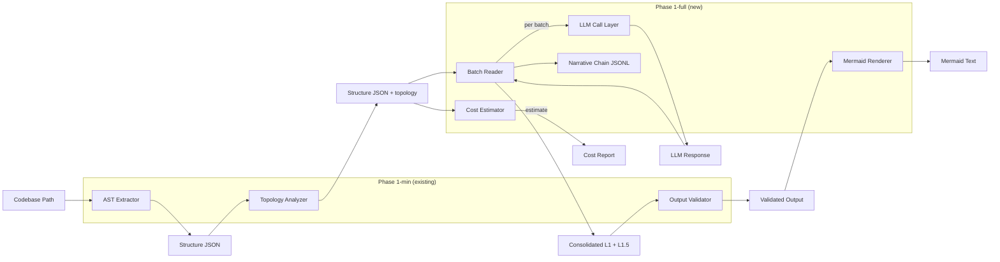
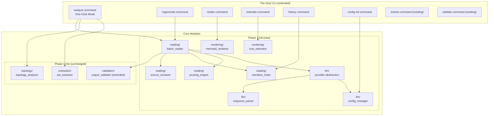

# Design Document — The Door Phase 1-full

## Overview

Phase 1-full extends the existing Phase 1-min codebase into a complete LLM translation engine. Where Phase 1-min delivers the "before and after LLM" pipeline (AST extraction → topology → validation), Phase 1-full adds the LLM interaction layer itself plus all supporting infrastructure.

**What Phase 1-full adds on top of Phase 1-min:**

| Capability | Description |
|---|---|
| **Batch Reading Engine** | Topology-guided sequential LLM calls with pruning |
| **Narrative Chain** | JSONL persistence for cross-session continuity and audit |
| **One-Click Mode** | CLI-internal LLM calls (OpenAI, Anthropic, Ollama) |
| **L1.5 + L2 Output** | Structural overview and module-level interaction with anomaly detection |
| **Mermaid Rendering** | L1/L1.5 JSON → valid Mermaid flowchart text |
| **Constraint Prompts ⑦–⑬** | Infrastructure consolidation, anti-hallucination, anti-over-interpretation |
| **Source Code Review** | Automatic source snippet retrieval for low-confidence nodes |
| **Regeneration Trigger** | Per-node re-analysis without full pipeline re-run |
| **API Cost Estimation** | Token/cost preview before LLM calls |
| **Confidence Markers** | Visual indicators in all output formats |

### Design Decisions & Rationale

| Decision | Rationale |
|---|---|
| Extend existing `core/` with new subpackages (`reading/`, `rendering/`, `llm/`) | Maintains Phase 1-min's clean folder organization; each concern gets its own package |
| `httpx` for LLM API calls | Async-capable, well-maintained, no heavy framework dependency; already common in Python ecosystem |
| `tomli`/`tomllib` for config parsing | TOML is the Python ecosystem standard (pyproject.toml); `tomllib` is stdlib in 3.11+ |
| Provider abstraction via protocol class | Avoids vendor lock-in; new providers added by implementing a single interface |
| JSONL for narrative chain (not SQLite) | Append-only, human-readable, trivially diffable, no binary format issues |
| Mermaid text generation (not SVG) | CLI outputs text; rendering is the AI medium's responsibility per spec §5.3 |
| Separate `reading/` package from `llm/` | Reading engine orchestrates batches and pruning (pure logic); LLM layer handles API transport (I/O). Testable independently. |

## Architecture

### High-Level Data Flow (Phase 1-full)



### Pipeline Architecture (One-Click Mode)



### Module Boundaries

| Module | Package | Responsibility | Input | Output |
|---|---|---|---|---|
| `batch_reader` | `core/reading/` | Orchestrate topology-guided batch LLM calls with pruning | Structure JSON + config | Consolidated L1 + L1.5 output |
| `pruning_engine` | `core/reading/` | Track high-confidence nodes, decide what to skip | Per-batch LLM results | Pruning decisions |
| `narrative_chain` | `core/reading/` | Append-only JSONL read/write, cross-session state | Batch results | JSONL file |
| `source_reviewer` | `core/reading/` | Extract function body from source for secondary LLM review | Node + codebase path | Source snippet |
| `mermaid_renderer` | `core/rendering/` | L1/L1.5 JSON → Mermaid flowchart text | Validated L1/L1.5 JSON | Mermaid text string |
| `cost_estimator` | `core/rendering/` | Estimate token count and API cost per provider | Structure JSON + config | Cost report |
| `llm_provider` | `core/llm/` | Abstract LLM API calls (OpenAI, Anthropic, Ollama) | Prompt + payload | LLM response text |
| `config_manager` | `core/llm/` | Read/write `~/.the-door/config.toml`, env var fallback | Config path / env | Config dict |
| `response_parser` | `core/llm/` | Parse LLM JSON response, handle malformed output | Raw LLM text | Parsed dict or error |
| `output_validator` | `core/validation/` | Extended: L1 + L1.5 + L2 schema/coverage/language/anchor/relation checks | LLM output + Structure JSON | Validation result |

## Components and Interfaces

### Extended Folder Structure

```
the_door/
├── src/
│   └── the_door/
│       ├── __init__.py
│       ├── models.py                         # Extended with L1.5, L2, narrative chain models
│       ├── cli/                              # CLI command layer (extended)
│       │   ├── __init__.py
│       │   ├── main.py                       # Extended: add analyze, regenerate, render, estimate, history, config
│       │   ├── extract_cmd.py                # (existing, unchanged)
│       │   ├── validate_cmd.py               # (existing, unchanged)
│       │   ├── mcp_serve_cmd.py              # (existing, unchanged)
│       │   ├── analyze_cmd.py                # NEW: one-click mode command
│       │   ├── regenerate_cmd.py             # NEW: regeneration trigger command
│       │   ├── render_cmd.py                 # NEW: Mermaid rendering command
│       │   ├── estimate_cmd.py               # NEW: cost estimation command
│       │   ├── history_cmd.py                # NEW: narrative chain display command
│       │   └── config_cmd.py                 # NEW: config init command
│       ├── core/
│       │   ├── __init__.py
│       │   ├── extraction/                   # (existing, unchanged)
│       │   │   ├── __init__.py
│       │   │   ├── ast_extractor.py
│       │   │   ├── file_discovery.py
│       │   │   ├── node_builder.py
│       │   │   └── edge_builder.py
│       │   ├── topology/                     # (existing, unchanged)
│       │   │   ├── __init__.py
│       │   │   ├── topology_analyzer.py
│       │   │   ├── graph_builder.py
│       │   │   ├── entry_point_detector.py
│       │   │   └── batch_assigner.py
│       │   ├── validation/                   # (existing, extended)
│       │   │   ├── __init__.py
│       │   │   ├── output_validator.py       # Extended: L1.5 + L2 validation
│       │   │   ├── schema_check.py           # Extended: L1.5 + L2 schemas
│       │   │   ├── coverage_check.py         # (existing, unchanged)
│       │   │   ├── language_check.py         # Extended: relaxed L1.5 rules
│       │   │   ├── anchor_check.py           # (existing, unchanged)
│       │   │   └── relation_check.py         # Extended: L1.5 block relations
│       │   ├── reading/                      # NEW: batch reading engine
│       │   │   ├── __init__.py
│       │   │   ├── batch_reader.py           # Orchestrator: batch loop + consolidation
│       │   │   ├── pruning_engine.py         # Pruning logic: track, decide, record
│       │   │   ├── narrative_chain.py        # JSONL persistence + cross-session resume
│       │   │   └── source_reviewer.py        # Source code snippet extraction for review
│       │   ├── rendering/                    # NEW: output rendering
│       │   │   ├── __init__.py
│       │   │   ├── mermaid_renderer.py       # L1/L1.5 JSON → Mermaid text
│       │   │   └── cost_estimator.py         # Token count + cost estimation
│       │   └── llm/                          # NEW: LLM call abstraction
│       │       ├── __init__.py
│       │       ├── provider.py               # Provider protocol + factory
│       │       ├── openai_provider.py         # OpenAI API implementation
│       │       ├── anthropic_provider.py      # Anthropic API implementation
│       │       ├── ollama_provider.py         # Ollama local model implementation
│       │       ├── config_manager.py          # Config file + env var management
│       │       └── response_parser.py         # JSON extraction from LLM responses
│       └── mcp/                              # MCP Server (extended)
│           ├── __init__.py
│           ├── server.py                     # Extended: register new tools
│           └── tools/
│               ├── __init__.py
│               ├── extract_tool.py           # (existing, unchanged)
│               ├── validate_tool.py          # (existing, unchanged)
│               ├── analyze_tool.py           # NEW: one-click mode MCP tool
│               ├── regenerate_tool.py        # NEW: regeneration MCP tool
│               ├── render_tool.py            # NEW: Mermaid rendering MCP tool
│               ├── history_tool.py           # NEW: narrative chain MCP tool
│               └── estimate_tool.py          # NEW: cost estimation MCP tool
├── prompts/
│   ├── l1-constraint.md                      # (existing, extended with ⑦–⑬)
│   ├── l1-5-constraint.md                    # NEW: L1.5 output constraints
│   ├── l2-constraint.md                      # NEW: L2 output + anomaly constraints
│   └── language-rules.md                     # (existing, unchanged)
├── schemas/
│   ├── ast-raw.schema.json                   # (existing, unchanged)
│   ├── l1-output.schema.json                 # (existing, unchanged)
│   ├── l1-5-output.schema.json               # NEW: L1.5 structural overview schema
│   ├── l2-output.schema.json                 # NEW: L2 module interaction schema
│   └── narrative.schema.json                 # NEW: narrative chain record schema
├── tests/
│   ├── unit/
│   │   ├── core/
│   │   │   ├── reading/                      # NEW
│   │   │   │   ├── test_batch_reader.py
│   │   │   │   ├── test_pruning_engine.py
│   │   │   │   ├── test_narrative_chain.py
│   │   │   │   └── test_source_reviewer.py
│   │   │   ├── rendering/                    # NEW
│   │   │   │   ├── test_mermaid_renderer.py
│   │   │   │   └── test_cost_estimator.py
│   │   │   ├── llm/                          # NEW
│   │   │   │   ├── test_provider.py
│   │   │   │   ├── test_config_manager.py
│   │   │   │   └── test_response_parser.py
│   │   │   ├── validation/                   # Extended
│   │   │   │   ├── test_l1_5_validation.py   # NEW
│   │   │   │   └── test_l2_validation.py     # NEW
│   │   │   └── ...                           # (existing tests unchanged)
│   │   ├── cli/
│   │   │   └── test_cli_commands.py          # Extended with new commands
│   │   └── mcp/
│   │       └── test_tools.py                 # Extended with new tools
│   ├── property/
│   │   ├── test_extraction_properties.py     # (existing, unchanged)
│   │   ├── test_topology_properties.py       # (existing, unchanged)
│   │   ├── test_validation_properties.py     # (existing, unchanged)
│   │   ├── test_reading_properties.py        # NEW: batch reading + pruning properties
│   │   ├── test_rendering_properties.py      # NEW: Mermaid + narrative chain properties
│   │   └── test_llm_properties.py            # NEW: response parsing + config properties
│   ├── integration/
│   │   ├── test_analyze_pipeline.py          # NEW: end-to-end one-click mode
│   │   └── test_cross_session.py             # NEW: narrative chain continuity
│   └── fixtures/
│       ├── sample_l1_5_output/               # NEW
│       ├── sample_l2_output/                 # NEW
│       └── sample_narrative_chain/           # NEW
└── pyproject.toml                            # Extended: new dependencies
```

### Component Interfaces

#### LLM Provider Abstraction

```python
# src/the_door/core/llm/provider.py

from typing import Protocol, runtime_checkable

@runtime_checkable
class LLMProvider(Protocol):
    """Protocol for LLM API providers. Implementations handle transport only."""

    async def complete(self, prompt: str, system_prompt: str | None = None) -> str:
        """Send prompt to LLM and return raw response text.

        Raises LLMCallError on transport/API failure.
        """
        ...

    def estimate_tokens(self, text: str) -> int:
        """Estimate token count for the given text (provider-specific tokenizer or heuristic)."""
        ...

    @property
    def provider_name(self) -> str:
        """Return provider identifier: 'openai', 'anthropic', 'ollama'."""
        ...

    @property
    def model_name(self) -> str:
        """Return the model being used (e.g., 'gpt-4o', 'claude-sonnet-4-20250514', 'qwen3:8b')."""
        ...

    @property
    def cost_per_1k_input(self) -> float:
        """Cost per 1000 input tokens in USD. 0.0 for local models."""
        ...

    @property
    def cost_per_1k_output(self) -> float:
        """Cost per 1000 output tokens in USD. 0.0 for local models."""
        ...


def create_provider(config: dict) -> LLMProvider:
    """Factory: create provider from config dict. Raises ConfigError if invalid."""
    ...
```

```python
# src/the_door/core/llm/openai_provider.py

class OpenAIProvider:
    """OpenAI API provider (GPT-4 family). Uses httpx for async HTTP calls."""

    def __init__(self, api_key: str, model: str = "gpt-4o", timeout: int = 120):
        ...

    async def complete(self, prompt: str, system_prompt: str | None = None) -> str: ...
    def estimate_tokens(self, text: str) -> int: ...
```

```python
# src/the_door/core/llm/anthropic_provider.py

class AnthropicProvider:
    """Anthropic API provider (Claude family). Uses httpx for async HTTP calls."""

    def __init__(self, api_key: str, model: str = "claude-sonnet-4-20250514", timeout: int = 120):
        ...

    async def complete(self, prompt: str, system_prompt: str | None = None) -> str: ...
    def estimate_tokens(self, text: str) -> int: ...
```

```python
# src/the_door/core/llm/ollama_provider.py

class OllamaProvider:
    """Ollama local model provider. Connects to local Ollama server via HTTP."""

    def __init__(self, base_url: str = "http://localhost:11434", model: str = "qwen3:8b", timeout: int = 300):
        ...

    async def complete(self, prompt: str, system_prompt: str | None = None) -> str: ...
    def estimate_tokens(self, text: str) -> int: ...
```

#### Config Manager

```python
# src/the_door/core/llm/config_manager.py

@dataclass
class TheDoorConfig:
    """Parsed configuration for The Door."""
    default_provider: str          # "openai" | "anthropic" | "ollama"
    openai_api_key: str | None
    openai_model: str
    anthropic_api_key: str | None
    anthropic_model: str
    ollama_url: str
    ollama_model: str
    max_retries: int               # Default: 3
    timeout_seconds: int           # Default: 120
    cost_warning_threshold: float  # Default: 1.00 USD

class ConfigManager:
    """Read config from ~/.the-door/config.toml with env var override."""

    CONFIG_PATH = Path.home() / ".the-door" / "config.toml"

    def load(self) -> TheDoorConfig:
        """Load config. Env vars (THE_DOOR_*) override file values."""
        ...

    def init_default(self) -> Path:
        """Create default config.toml at CONFIG_PATH. Returns path."""
        ...

    def validate(self) -> list[str]:
        """Check config validity. Returns list of warning messages."""
        ...
```

#### Response Parser

```python
# src/the_door/core/llm/response_parser.py

@dataclass
class ParseResult:
    """Result of parsing an LLM response."""
    success: bool
    data: dict | None              # Parsed JSON if success
    raw_text: str                  # Original LLM response
    error: str | None              # Parse error message if failed

class ResponseParser:
    """Extract and parse JSON from LLM response text."""

    def parse(self, raw_response: str) -> ParseResult:
        """Extract JSON from LLM response. Handles markdown code fences, leading text, etc."""
        ...
```

#### Batch Reader

```python
# src/the_door/core/reading/batch_reader.py

@dataclass
class BatchReadResult:
    """Result of the complete batch reading process."""
    l1_output: dict                # Consolidated L1 JSON
    l1_5_output: dict              # Consolidated L1.5 JSON
    narrative_path: Path           # Path to narrative chain JSONL
    total_batches: int
    total_tokens_used: int
    pruned_node_count: int

class BatchReader:
    """Orchestrate topology-guided batch reading with pruning and narrative chain."""

    def __init__(
        self,
        provider: LLMProvider,
        pruning_engine: PruningEngine,
        narrative_chain: NarrativeChain,
        source_reviewer: SourceReviewer,
        validator: OutputValidator,
        max_batches: int = 5,
        max_retries: int = 3,
    ): ...

    async def read(
        self,
        structure_json: dict,
        constraint_prompt: str,
        codebase_path: str | None = None,
        affected_nodes: set[str] | None = None,
    ) -> BatchReadResult:
        """Execute full batch reading pipeline.

        1. Group nodes by batch_assignment
        2. If affected_nodes is provided (partial change), only process those nodes
           and their direct dependents; preserve cached results for unchanged nodes
        3. For each batch: assemble payload → call LLM → parse → validate → prune
        4. If batch payload exceeds context window, auto-split into sub-batches
        5. Handle low-confidence escalation (source review, context supplement)
        6. Consolidate final L1 + L1.5 output
        7. Record everything in narrative chain
        """
        ...

    async def regenerate(
        self,
        feature_id: str,
        structure_json: dict,
        constraint_prompt: str,
        previous_result: dict,
    ) -> dict:
        """Re-analyze a specific feature node.

        Returns dict with:
          - previous_result: the old feature dict (preserved for comparison)
          - new_result: the regenerated feature dict
          - differs: bool indicating whether results differ
          - marker: appropriate confidence marker string if differs
        The previous result is preserved until user explicitly accepts via CLI --accept flag.
        """
        ...
```

#### Pruning Engine

```python
# src/the_door/core/reading/pruning_engine.py

@dataclass
class PruningDecision:
    """Record of a pruning decision."""
    node_id: str
    pruned_at_batch: int
    reason: str                    # "high_confidence"
    reinstated: bool = False       # True if later re-included
    reinstated_at_batch: int | None = None

class PruningEngine:
    """Track high-confidence nodes and decide what to skip in subsequent batches.

    Requires edge information to determine downstream dependencies of pruned nodes.
    """

    def __init__(self, edges: list[dict]): ...

    def record_confidence(self, node_id: str, confidence: str, batch: int) -> None:
        """Record a node's confidence from LLM output.
        If confidence is 'high', also marks downstream dependencies for pruning
        (unless they have other pending references from non-pruned nodes).
        """
        ...

    def get_pruned_nodes(self) -> set[str]:
        """Return set of node_ids currently pruned."""
        ...

    def should_prune(self, node_id: str) -> bool:
        """Check if a node should be skipped in the current batch."""
        ...

    def reinstate(self, node_id: str, batch: int) -> None:
        """Re-include a previously pruned node (referenced by low-confidence node)."""
        ...

    def get_decisions(self) -> list[PruningDecision]:
        """Return all pruning decisions for narrative chain recording."""
        ...
```

#### Narrative Chain

```python
# src/the_door/core/reading/narrative_chain.py
# Note: Uses NarrativeRecord and NarrativeNodeRead from models.py (see Data Models section)

class NarrativeChain:
    """Append-only JSONL narrative chain with cross-session resume."""

    def __init__(self, chain_path: Path): ...

    def append(self, record: NarrativeRecord) -> None:
        """Append a record to the JSONL file."""
        ...

    def read_all(self) -> list[NarrativeRecord]:
        """Read all records from the chain."""
        ...

    def get_last_state(self) -> dict | None:
        """Get the last recorded analysis state for resume detection."""
        ...

    def detect_structural_change(self, current_structure: dict) -> dict | None:
        """Compare current structure against last recorded. Returns change summary or None."""
        ...

    def format_human_readable(self) -> str:
        """Pretty-print the narrative chain for CLI display."""
        ...
```

#### Source Reviewer

```python
# src/the_door/core/reading/source_reviewer.py

@dataclass
class SourceSnippet:
    """Extracted source code snippet for LLM review."""
    node_id: str
    file_path: str
    source_text: str
    start_line: int
    end_line: int

class SourceReviewer:
    """Extract original source code snippets for nodes needing review."""

    def extract_snippet(self, node_id: str, structure_json: dict, codebase_path: str) -> SourceSnippet | None:
        """Extract function body or class definition from source file.

        Returns None if file not found or node cannot be located.
        Only extracts the specific node, not the entire file.
        """
        ...
```

#### Mermaid Renderer

```python
# src/the_door/core/rendering/mermaid_renderer.py

class MermaidRenderer:
    """Generate Mermaid flowchart text from L1 and L1.5 output."""

    def render_l1(self, l1_output: dict) -> str:
        """Generate Mermaid flowchart from L1 features and relations.

        - Each feature becomes a node with label + trigger indicator
        - Feature relations become edges
        - Confidence markers control node styling (solid/dashed/dotted borders)
        """
        ...

    def render_l1_5(self, l1_5_output: dict) -> str:
        """Generate Mermaid flowchart from L1.5 blocks and relations.

        - Each block becomes a node with label + responsibility
        - Block relations become edges
        - Infrastructure block rendered as a subgraph
        """
        ...
```

#### Cost Estimator

```python
# src/the_door/core/rendering/cost_estimator.py

@dataclass
class CostEstimate:
    """Estimated API cost for analyzing a codebase."""
    total_input_tokens: int
    total_output_tokens: int
    estimated_cost_usd: float
    provider: str
    model: str
    batch_count: int
    is_local: bool                 # True for Ollama (cost = 0)

class CostEstimator:
    """Estimate token consumption and API cost without making LLM calls."""

    def estimate(self, structure_json: dict, provider: LLMProvider, constraint_prompt: str) -> CostEstimate:
        """Calculate estimated cost based on structure size and provider pricing."""
        ...
```

## Data Models

### Extended models.py — New Data Classes

The following models extend the existing `models.py`. Existing models (FileInfo, ASTNode, Edge, TopologyEntry, ExtractionResult, TopologyResult, StructureJSON, Feature, FeatureRelation, L1Output, CheckResult, ValidationResult) remain unchanged.

```python
# === L1.5 Output models ===

@dataclass(frozen=True)
class L1_5Block:
    """A structural block in the L1.5 overview."""
    block_id: str
    label: str                     # Module name + functional description
    responsibility: str
    trigger_mechanism: str         # Human-readable trigger description
    related_features: list[str] = field(default_factory=list)  # L1 feature_ids

@dataclass(frozen=True)
class BlockRelation:
    """A relationship between two L1.5 blocks."""
    from_block: str                # block_id
    to_block: str                  # block_id
    relation: str
    relation_type: str             # "static" | "inferred"
    inferred_reason: str | None = None

@dataclass(frozen=True)
class InfrastructureBlock:
    """Consolidated infrastructure block in L1.5."""
    label: str                     # "System Infrastructure"
    components: list[str] = field(default_factory=list)

@dataclass
class L1_5Output:
    """Complete L1.5 structural overview output."""
    blocks: list[L1_5Block] = field(default_factory=list)
    block_relations: list[BlockRelation] = field(default_factory=list)
    infrastructure_block: InfrastructureBlock | None = None


# === L2 Output models ===

@dataclass(frozen=True)
class L2Module:
    """A module in the L2 interaction view."""
    module_id: str
    label: str
    source_nodes: list[str] = field(default_factory=list)
    confidence: str = "medium"     # "high" | "medium" | "low"
    confidence_reason: str = ""

@dataclass(frozen=True)
class ModuleInteraction:
    """An interaction between two L2 modules."""
    from_module: str               # module_id
    to_module: str                 # module_id
    description: str
    relation_type: str             # "static" | "inferred"
    inferred_reason: str | None = None

@dataclass(frozen=True)
class Anomaly:
    """An anomaly detected in L2 analysis."""
    anomaly_type: str              # "dead_code" | "logic_dead_end" | "uncertain_boundary"
    affected_node_ids: list[str] = field(default_factory=list)
    explanation: str = ""
    confidence: str = "medium"

@dataclass
class L2Output:
    """Complete L2 module interaction output."""
    modules: list[L2Module] = field(default_factory=list)
    module_interactions: list[ModuleInteraction] = field(default_factory=list)
    anomalies: list[Anomaly] = field(default_factory=list)


# === Narrative Chain models ===

@dataclass
class NarrativeNodeRead:
    """A node read in a batch, recorded in the narrative chain."""
    node_id: str
    topology_rank: int
    in_degree: int
    is_entry_point: bool

@dataclass
class NarrativeRecord:
    """A single record in the narrative chain JSONL."""
    record_type: str               # "batch" | "regeneration" | "structural_change"
    timestamp: str                 # ISO8601
    batch: int | None = None
    strategy: str = "topology_guided"
    nodes_read: list[NarrativeNodeRead] = field(default_factory=list)
    llm_judgment: str = ""
    pruned_nodes: list[str] = field(default_factory=list)
    pending_low_confidence: list[str] = field(default_factory=list)
    # Regeneration fields
    feature_id: str | None = None
    previous_summary: str | None = None
    new_summary: str | None = None
    # Structural change fields
    added_nodes: list[str] | None = None
    removed_nodes: list[str] | None = None
    modified_nodes: list[str] | None = None


# === LLM / Config models ===

@dataclass
class TheDoorConfig:
    """Parsed configuration for The Door one-click mode."""
    default_provider: str = "openai"
    openai_api_key: str | None = None
    openai_model: str = "gpt-4o"
    anthropic_api_key: str | None = None
    anthropic_model: str = "claude-sonnet-4-20250514"
    ollama_url: str = "http://localhost:11434"
    ollama_model: str = "qwen3:8b"
    max_retries: int = 3
    timeout_seconds: int = 120
    cost_warning_threshold: float = 1.00

@dataclass
class CostEstimate:
    """Estimated API cost for a codebase analysis."""
    total_input_tokens: int = 0
    total_output_tokens: int = 0
    estimated_cost_usd: float = 0.0
    provider: str = ""
    model: str = ""
    batch_count: int = 0
    is_local: bool = False

@dataclass
class ParseResult:
    """Result of parsing an LLM response."""
    success: bool = False
    data: dict | None = None
    raw_text: str = ""
    error: str | None = None
```

### New JSON Schema Files

#### `schemas/l1-5-output.schema.json`

```json
{
  "$schema": "https://json-schema.org/draft/2020-12/schema",
  "$id": "https://the-door.dev/schemas/l1-5-output.schema.json",
  "title": "The Door L1.5 Output",
  "description": "LLM-generated L1.5 structural overview output",
  "type": "object",
  "required": ["l1_5"],
  "properties": {
    "l1_5": {
      "type": "object",
      "required": ["blocks", "block_relations", "infrastructure_block"],
      "properties": {
        "blocks": {
          "type": "array",
          "items": {
            "type": "object",
            "required": ["block_id", "label", "responsibility", "trigger_mechanism", "related_features"],
            "properties": {
              "block_id": { "type": "string" },
              "label": { "type": "string" },
              "responsibility": { "type": "string" },
              "trigger_mechanism": { "type": "string" },
              "related_features": {
                "type": "array",
                "items": { "type": "string" }
              }
            }
          }
        },
        "block_relations": {
          "type": "array",
          "items": {
            "type": "object",
            "required": ["from", "to", "relation", "relation_type"],
            "properties": {
              "from": { "type": "string" },
              "to": { "type": "string" },
              "relation": { "type": "string" },
              "relation_type": { "type": "string", "enum": ["static", "inferred"] },
              "inferred_reason": { "type": ["string", "null"] }
            },
            "if": {
              "properties": { "relation_type": { "const": "inferred" } }
            },
            "then": {
              "required": ["inferred_reason"],
              "properties": { "inferred_reason": { "type": "string", "minLength": 1 } }
            }
          }
        },
        "infrastructure_block": {
          "type": "object",
          "required": ["label", "components"],
          "properties": {
            "label": { "type": "string" },
            "components": { "type": "array", "items": { "type": "string" } }
          }
        }
      }
    }
  }
}
```

#### `schemas/l2-output.schema.json`

```json
{
  "$schema": "https://json-schema.org/draft/2020-12/schema",
  "$id": "https://the-door.dev/schemas/l2-output.schema.json",
  "title": "The Door L2 Output",
  "description": "LLM-generated L2 module interaction output with anomaly detection",
  "type": "object",
  "required": ["l2"],
  "properties": {
    "l2": {
      "type": "object",
      "required": ["modules", "module_interactions", "anomalies"],
      "properties": {
        "modules": {
          "type": "array",
          "items": {
            "type": "object",
            "required": ["module_id", "label", "source_nodes", "confidence", "confidence_reason"],
            "properties": {
              "module_id": { "type": "string" },
              "label": { "type": "string" },
              "source_nodes": { "type": "array", "items": { "type": "string" }, "minItems": 1 },
              "confidence": { "type": "string", "enum": ["high", "medium", "low"] },
              "confidence_reason": { "type": "string" }
            }
          }
        },
        "module_interactions": {
          "type": "array",
          "items": {
            "type": "object",
            "required": ["from", "to", "description", "relation_type"],
            "properties": {
              "from": { "type": "string" },
              "to": { "type": "string" },
              "description": { "type": "string" },
              "relation_type": { "type": "string", "enum": ["static", "inferred"] },
              "inferred_reason": { "type": ["string", "null"] }
            }
          }
        },
        "anomalies": {
          "type": "array",
          "items": {
            "type": "object",
            "required": ["anomaly_type", "affected_node_ids", "explanation", "confidence"],
            "properties": {
              "anomaly_type": { "type": "string", "enum": ["dead_code", "logic_dead_end", "uncertain_boundary"] },
              "affected_node_ids": { "type": "array", "items": { "type": "string" }, "minItems": 1 },
              "explanation": { "type": "string" },
              "confidence": { "type": "string", "enum": ["high", "medium", "low"] }
            }
          }
        }
      }
    }
  }
}
```

#### `schemas/narrative.schema.json`

```json
{
  "$schema": "https://json-schema.org/draft/2020-12/schema",
  "$id": "https://the-door.dev/schemas/narrative.schema.json",
  "title": "The Door Narrative Chain Record",
  "description": "A single record in the narrative chain JSONL file",
  "type": "object",
  "required": ["record_type", "timestamp"],
  "properties": {
    "record_type": { "type": "string", "enum": ["batch", "regeneration", "structural_change"] },
    "timestamp": { "type": "string", "format": "date-time" },
    "batch": { "type": ["integer", "null"], "minimum": 1 },
    "strategy": { "type": "string" },
    "nodes_read": {
      "type": "array",
      "items": {
        "type": "object",
        "required": ["node_id", "topology_rank", "in_degree", "is_entry_point"],
        "properties": {
          "node_id": { "type": "string" },
          "topology_rank": { "type": "integer", "minimum": 1 },
          "in_degree": { "type": "integer", "minimum": 0 },
          "is_entry_point": { "type": "boolean" }
        }
      }
    },
    "llm_judgment": { "type": "string" },
    "pruned_nodes": { "type": "array", "items": { "type": "string" } },
    "pending_low_confidence": { "type": "array", "items": { "type": "string" } },
    "feature_id": { "type": ["string", "null"] },
    "previous_summary": { "type": ["string", "null"] },
    "new_summary": { "type": ["string", "null"] },
    "added_nodes": { "type": ["array", "null"], "items": { "type": "string" } },
    "removed_nodes": { "type": ["array", "null"], "items": { "type": "string" } },
    "modified_nodes": { "type": ["array", "null"], "items": { "type": "string" } }
  },
  "allOf": [
    {
      "if": { "properties": { "record_type": { "const": "batch" } } },
      "then": { "required": ["batch", "strategy", "nodes_read", "llm_judgment", "pruned_nodes", "pending_low_confidence"] }
    },
    {
      "if": { "properties": { "record_type": { "const": "regeneration" } } },
      "then": { "required": ["feature_id", "previous_summary", "new_summary"] }
    },
    {
      "if": { "properties": { "record_type": { "const": "structural_change" } } },
      "then": { "required": ["added_nodes", "removed_nodes", "modified_nodes"] }
    }
  ]
}
```

### Configuration File Format

`~/.the-door/config.toml`:

```toml
# The Door Configuration
default_provider = "openai"

[openai]
api_key = ""           # Or set THE_DOOR_OPENAI_KEY env var
model = "gpt-4o"

[anthropic]
api_key = ""           # Or set THE_DOOR_ANTHROPIC_KEY env var
model = "claude-sonnet-4-20250514"

[ollama]
url = "http://localhost:11434"   # Or set THE_DOOR_OLLAMA_URL env var
model = "qwen3:8b"

[settings]
max_retries = 3
timeout_seconds = 120
cost_warning_threshold = 1.00    # USD — warn before proceeding if estimate exceeds this
```

### New Dependencies

Added to `pyproject.toml`:

```toml
dependencies = [
    # Existing
    "tree-sitter-language-pack",
    "networkx",
    "jsonschema",
    "mcp",
    "click",
    "pathspec",
    # New for Phase 1-full
    "httpx",                       # Async HTTP client for LLM API calls
    "tomli; python_version < '3.11'",  # TOML parser (stdlib tomllib in 3.11+)
]
```

## Correctness Properties

*A property is a characteristic or behavior that should hold true across all valid executions of a system — essentially, a formal statement about what the system should do. Properties serve as the bridge between human-readable specifications and machine-verifiable correctness guarantees.*

> **Note:** Phase 1-min's 12 correctness properties (Properties 1–12) remain in effect and unchanged. Phase 1-full adds Properties 13–33 below. Property numbering continues from Phase 1-min.

### Property 13: Batch ordering follows topology assignment

*For any* Structure JSON with nodes assigned to batches 1 through N, the Batch Reader SHALL process batches in strictly ascending order, and every node in batch K SHALL be submitted to the LLM before any node in batch K+1.

**Validates: Requirements 1.1**

### Property 14: Batch consolidation preserves all features

*For any* sequence of per-batch LLM responses each containing a set of features, the consolidated L1 output SHALL contain every feature from every batch response, with no features lost and no duplicate feature_ids.

**Validates: Requirements 1.5**

### Property 15: Pruning invariant — high confidence excludes downstream dependencies

*For any* node that receives confidence "high" in batch N, the Pruning Engine SHALL mark that node as pruned AND exclude its downstream dependencies (nodes it calls) from subsequent batch payloads (batches N+1 through max_batches), provided those dependencies have no other pending references from non-pruned nodes. The high-confidence node itself is also excluded from re-submission.

**Validates: Requirements 1.6, 2.1, 2.2**

### Property 16: Pruning reinstatement on low-confidence reference

*For any* pruned node that is referenced as a dependency by a node with confidence "low" in a subsequent batch, the Pruning Engine SHALL reinstate the pruned node's context in that batch's payload.

**Validates: Requirements 2.4**

### Property 17: Pruning decisions recorded in narrative chain

*For any* pruning decision (prune or reinstate), the Narrative Chain SHALL contain a record with the pruned node_id, the batch number where the decision was made, and the reason. The count of pruning records in the narrative chain SHALL equal the total number of pruning decisions made.

**Validates: Requirements 2.3**

### Property 18: Narrative chain JSONL round-trip

*For any* list of valid NarrativeRecord objects, writing them to a JSONL file and reading them back SHALL produce a list of records equivalent to the original — no records lost, no fields altered, and the order preserved.

**Validates: Requirements 3.1, 28.4**

### Property 19: Narrative chain schema conformance

*For any* NarrativeRecord written to the chain, the JSON representation SHALL conform to narrative.schema.json. Specifically: batch records SHALL contain batch, strategy, nodes_read, llm_judgment, pruned_nodes, pending_low_confidence; regeneration records SHALL contain feature_id, previous_summary, new_summary; structural_change records SHALL contain added_nodes, removed_nodes, modified_nodes.

**Validates: Requirements 3.4, 22.1, 22.2, 22.3**

### Property 20: Structural change detection correctness

*For any* two Structure JSONs A and B, the structural change detector SHALL report: (a) added_nodes as the set of node_ids in B but not in A, (b) removed_nodes as the set of node_ids in A but not in B, and (c) modified_nodes as nodes present in both but with different edges or attributes. If A and B are identical, the detector SHALL report no changes.

**Validates: Requirements 3.5, 19.1**

### Property 21: Regeneration diff marking

*For any* regeneration where the new LLM result differs from the previous result (different label, description, or source_nodes), the output SHALL carry the marker "AI inference: regenerated, differs from previous". If the results are identical, no such marker SHALL be applied.

**Validates: Requirements 4.2**

### Property 22: Config environment variable precedence

*For any* configuration setting that has both a config file value and an environment variable value (THE_DOOR_OPENAI_KEY, THE_DOOR_ANTHROPIC_KEY, THE_DOOR_OLLAMA_URL), the loaded config SHALL use the environment variable value, not the file value.

**Validates: Requirements 5.3, 6.3**

### Property 23: Cost estimation scales with structure size

*For any* two Structure JSONs A and B where A has strictly more nodes than B (and the same provider/model), the estimated input token count for A SHALL be greater than or equal to the estimated input token count for B, and the estimated output token count for A SHALL be greater than or equal to the estimated output token count for B.

**Validates: Requirements 7.2, 7.3**

### Property 24: L1.5 schema validation accepts valid and rejects invalid

*For any* L1.5 output JSON that conforms to l1-5-output.schema.json (all required fields present, enums valid, types correct), the schema check SHALL pass. *For any* L1.5 output JSON missing a required field or containing an invalid type, the schema check SHALL fail and identify the non-conformant field.

**Validates: Requirements 8.2, 8.3, 8.5, 20.1, 27.1**

### Property 25: L1.5 cross-reference integrity

*For any* L1.5 output and L1 output pair: (a) every block_id referenced in block_relations SHALL exist in the blocks array, and (b) every feature_id referenced in any block's related_features SHALL exist in the L1 features array. Dangling references SHALL be reported as validation errors.

**Validates: Requirements 20.2, 20.3, 27.3**

### Property 26: Infrastructure consolidation into single block

*For any* L1 output containing infrastructure_nodes, the corresponding L1.5 output SHALL contain exactly one infrastructure_block, and that block's components list SHALL include a representation of every node_id in infrastructure_nodes.

**Validates: Requirements 8.4, 10.1, 10.2**

### Property 27: L2 schema validation accepts valid and rejects invalid

*For any* L2 output JSON that conforms to l2-output.schema.json (all required fields present, anomaly_type enum valid, types correct), the schema check SHALL pass. *For any* L2 output JSON missing a required field or containing an invalid anomaly_type, the schema check SHALL fail.

**Validates: Requirements 9.2, 9.3, 9.4, 9.5, 21.1, 21.3, 27.2**

### Property 28: L2 anomaly node reference integrity

*For any* L2 output and Structure JSON, every node_id in every anomaly's affected_node_ids SHALL exist in the Structure JSON nodes array. Any anomaly referencing a non-existent node_id SHALL be flagged as a validation error.

**Validates: Requirements 21.2, 27.4**

### Property 29: L1.5 language check with relaxed rules

*For any* L1.5 block label containing a prohibited technical term (from the same list as L1), the language check SHALL pass if and only if the label also contains a functional description accompanying the technical term. A bare technical term without functional context SHALL fail.

**Validates: Requirements 27.5**

### Property 30: Mermaid syntax validity

*For any* valid L1 output or valid L1.5 output, the Mermaid Renderer SHALL produce a string that is syntactically valid Mermaid flowchart text — specifically, it SHALL start with a valid graph declaration, contain only valid node and edge definitions, and use properly escaped labels.

**Validates: Requirements 17.1, 17.2, 17.6**

### Property 31: Mermaid content completeness

*For any* L1 output, the rendered Mermaid text SHALL contain: (a) one node per feature with the feature label in its display text, (b) one edge per feature_relation, (c) confidence-based styling (default for high, dashed for medium, dotted for low), and (d) trigger description text in each node's label.

**Validates: Requirements 17.3, 17.4**

### Property 32: Confidence marker label correctness

*For any* node with a given state (confidence level, source-reviewed flag, regenerated-with-diff flag, incomplete-reading flag), the displayed marker label SHALL match exactly one of the defined labels: "[AI inference: high confidence]", "[AI inference: medium confidence]", "[AI inference: low confidence]", "[AI inference: source code reviewed]", "[AI inference: regenerated, differs from previous]", or "[Information insufficient: incomplete reading]".

**Validates: Requirements 18.1, 18.2, 18.3, 18.4, 18.5**

### Property 33: Source code snippet extraction accuracy

*For any* AST node in a Structure JSON that references a real source file, the Source Reviewer SHALL extract a snippet containing the function body or class definition text that corresponds to that node, with correct start_line and end_line values matching the node's position in the source file.

**Validates: Requirements 14.2**

## Error Handling

### LLM Call Layer Errors

| Error Condition | Handling Strategy |
|---|---|
| LLM API returns non-JSON response | Retry up to 3 times with validation failure reason appended to prompt |
| LLM API returns valid JSON that fails output validation | Retry once with specific validation errors included in retry prompt |
| All retries exhausted | Mark affected nodes as "[Output validation failed]", continue processing remaining batches, log in narrative chain |
| LLM API timeout | Retry with exponential backoff (1s, 2s, 4s); after 3 retries, report failure |
| LLM API authentication failure (401/403) | Fail immediately with clear error message indicating which credential is missing/invalid |
| LLM API rate limit (429) | Retry with backoff respecting Retry-After header if present |
| Network connectivity failure | Retry up to 3 times; fail with message suggesting checking network/Ollama server |

### Batch Reading Errors

| Error Condition | Handling Strategy |
|---|---|
| Batch payload exceeds provider context window | Automatically split batch into sub-batches (halve node count), process each half sequentially. This is essential for handling large codebases — the entire project's value depends on progressive reading without stopping. Recursively halve until each sub-batch fits. Log split decisions in narrative chain. |
| LLM response missing expected features for submitted nodes | Mark missing nodes as unclassified, record in narrative chain, continue |
| Pruning reinstatement creates circular dependency | Cap reinstatement depth at 1 level (only direct references), log warning |
| Narrative chain file corrupted (invalid JSONL line) | Skip corrupted lines, log warning, continue from last valid record |
| Narrative chain file locked by another process | Wait up to 5 seconds with retry, then fail with clear message |

### Configuration Errors

| Error Condition | Handling Strategy |
|---|---|
| Config file not found | Use defaults + env vars; warn that config file is missing |
| Config file has invalid TOML syntax | Fail with parse error location and suggestion to run `the-door config init` |
| No API key for selected provider | Fail with message: "No API key configured for {provider}. Set THE_DOOR_{PROVIDER}_KEY or add it to ~/.the-door/config.toml" |
| Ollama server unreachable | Fail with message: "Cannot connect to Ollama at {url}. Is Ollama running?" |
| Cost estimate exceeds threshold | Display warning with estimate, require `--yes` flag or interactive confirmation |

### Source Code Review Errors

| Error Condition | Handling Strategy |
|---|---|
| Source file not found (deleted since extraction) | Skip review, maintain original confidence, log warning |
| Node cannot be located in source file | Skip review, maintain original confidence, log warning |
| Source snippet exceeds reasonable size (>10KB) | Truncate to first 10KB with "[truncated]" marker, proceed with review |

### Mermaid Rendering Errors

| Error Condition | Handling Strategy |
|---|---|
| Feature label contains Mermaid-unsafe characters | Escape characters (quotes, brackets, pipes) in labels |
| Empty L1/L1.5 output (no features/blocks) | Generate minimal valid Mermaid with a single "No features identified" node |
| Feature relation references non-existent feature_id | Skip that edge, log warning |

### Validation Extension Errors

| Error Condition | Handling Strategy |
|---|---|
| L1.5 block references non-existent feature_id | Report as cross-reference error with specific block_id and feature_id |
| L2 anomaly references non-existent node_id | Report as anchor error with specific anomaly and node_id |
| L1.5 label contains bare technical term | Report as language error with term and location; note relaxed rule |

## Testing Strategy

### TDD Approach (Continued from Phase 1-min)

All tests are written BEFORE implementation code. The test structure mirrors the source structure under `tests/`. Phase 1-min's 100 existing tests remain unchanged and must continue passing.

### Test Categories

| Category | Location | Purpose | Runner |
|---|---|---|---|
| Unit tests | `tests/unit/` | Test individual functions and classes in isolation | pytest |
| Property tests | `tests/property/` | Verify universal properties across generated inputs | pytest + Hypothesis |
| Integration tests | `tests/integration/` | Test full pipeline and cross-session behavior | pytest |

### Property-Based Testing Configuration

- **Library:** Hypothesis (already used in Phase 1-min)
- **Minimum iterations:** 100 per property test (via `@settings(max_examples=100)`)
- **Tag format:** Each property test includes a docstring: `Feature: the-door-phase-1-full, Property {number}: {property_text}`
- **Each correctness property (13–33) maps to exactly one property-based test**

### Property Test File Mapping

| Property | Test File | Key Strategy |
|---|---|---|
| 13 (Batch ordering) | `test_reading_properties.py` | Generate random Structure JSONs with batch assignments, verify ordering |
| 14 (Consolidation) | `test_reading_properties.py` | Generate random per-batch feature sets, verify union in consolidated output |
| 15 (Pruning invariant) | `test_reading_properties.py` | Generate random confidence sequences, verify pruned nodes excluded |
| 16 (Reinstatement) | `test_reading_properties.py` | Generate pruned + low-confidence reference scenarios, verify reinstatement |
| 17 (Pruning recorded) | `test_reading_properties.py` | Generate pruning sequences, verify narrative chain records match |
| 18 (JSONL round-trip) | `test_rendering_properties.py` | Generate random NarrativeRecords, write/read, verify equivalence |
| 19 (Narrative schema) | `test_rendering_properties.py` | Generate random records per type, verify schema conformance |
| 20 (Structural change) | `test_reading_properties.py` | Generate pairs of Structure JSONs, verify change detection |
| 21 (Regen diff marking) | `test_reading_properties.py` | Generate same/different result pairs, verify marker presence |
| 22 (Config precedence) | `test_llm_properties.py` | Generate random config + env var combinations, verify precedence |
| 23 (Cost scaling) | `test_rendering_properties.py` | Generate Structure JSONs of varying sizes, verify monotonic cost |
| 24 (L1.5 schema) | `test_validation_properties.py` (extended) | Generate valid/invalid L1.5 outputs, verify pass/fail |
| 25 (L1.5 cross-ref) | `test_validation_properties.py` (extended) | Generate L1.5 with valid/dangling refs, verify detection |
| 26 (Infra consolidation) | `test_reading_properties.py` | Generate L1 with infra nodes, verify single infra block |
| 27 (L2 schema) | `test_validation_properties.py` (extended) | Generate valid/invalid L2 outputs, verify pass/fail |
| 28 (L2 anomaly refs) | `test_validation_properties.py` (extended) | Generate L2 with valid/invalid anomaly refs, verify detection |
| 29 (L1.5 language) | `test_validation_properties.py` (extended) | Generate L1.5 labels with/without functional context, verify relaxed rules |
| 30 (Mermaid syntax) | `test_rendering_properties.py` | Generate random valid L1/L1.5 outputs, verify Mermaid syntax |
| 31 (Mermaid content) | `test_rendering_properties.py` | Generate L1 with features/relations/confidence, verify Mermaid contains all |
| 32 (Confidence labels) | `test_rendering_properties.py` | Generate all state combinations, verify correct label |
| 33 (Source snippet) | `test_reading_properties.py` | Generate codebases with known functions, verify snippet extraction |

### Unit Test Coverage (New Modules)

Unit tests cover specific examples and edge cases not addressed by property tests:

- **Batch Reader:** Empty structure (0 nodes), single-batch structure, max batch limit hit, LLM returns empty response
- **Pruning Engine:** No high-confidence nodes (nothing pruned), all high-confidence (everything pruned), reinstatement chain
- **Narrative Chain:** Empty chain file, corrupted JSONL line, concurrent access attempt
- **Source Reviewer:** File not found, node not in file, snippet exceeds size limit
- **Mermaid Renderer:** Empty output, single feature, special characters in labels, all confidence levels
- **Cost Estimator:** Zero nodes, Ollama (free), each paid provider pricing
- **Config Manager:** Missing config file, invalid TOML, env var override, missing API key
- **Response Parser:** Valid JSON, JSON in markdown fence, leading text before JSON, completely invalid response
- **LLM Providers:** Mock HTTP responses for each provider, timeout handling, auth failure
- **L1.5 Validation:** Valid output passes, missing block_id fails, dangling feature reference fails
- **L2 Validation:** Valid output passes, invalid anomaly_type fails, dangling node reference fails

### Integration Test Coverage

- **End-to-end analyze pipeline:** Extract → topology → batch read (mock LLM) → validate → render
- **Cross-session continuity:** Write narrative chain → new session → detect unchanged → use cache
- **Cross-session with changes:** Write chain → modify structure → detect changes → re-analyze affected
- **Regeneration flow:** Analyze → regenerate feature → verify diff marking → verify narrative record
- **MCP tool integration:** Each new MCP tool (analyze, regenerate, render, history, estimate) with mock LLM

### LLM Mocking Strategy

All tests that involve LLM calls use mock providers. No real LLM API calls in the test suite.

```python
class MockLLMProvider:
    """Mock LLM provider for testing. Returns pre-configured responses."""

    def __init__(self, responses: list[str]):
        self._responses = responses
        self._call_count = 0
        self.calls: list[dict] = []  # Record all calls for assertion

    async def complete(self, prompt: str, system_prompt: str | None = None) -> str:
        self.calls.append({"prompt": prompt, "system_prompt": system_prompt})
        response = self._responses[min(self._call_count, len(self._responses) - 1)]
        self._call_count += 1
        return response

    def estimate_tokens(self, text: str) -> int:
        return len(text) // 4  # Rough heuristic

    @property
    def provider_name(self) -> str: return "mock"
    @property
    def model_name(self) -> str: return "mock-model"
    @property
    def cost_per_1k_input(self) -> float: return 0.01
    @property
    def cost_per_1k_output(self) -> float: return 0.03
```
