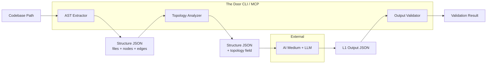
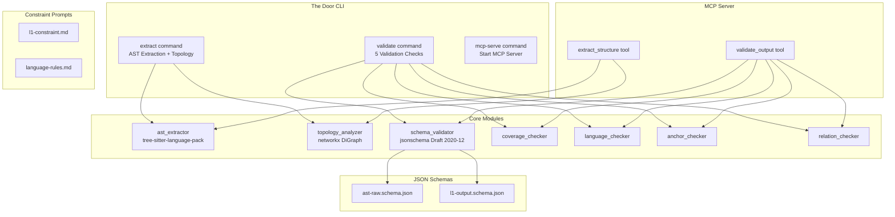

# Design Document — The Door Phase 1-min

## Overview

The Door Phase 1-min is the minimum viable LLM constraint pipeline that transforms source code into structured material for functional-language analysis. It delivers three core capabilities:

1. **AST Structure Extraction** — Parse any codebase using tree-sitter-language-pack into a standardized Structure JSON containing files, nodes, edges, and topology metadata
2. **Topology Analysis** — Compute dependency graph metrics (in-degree, out-degree, entry-point detection, batch assignment) to guide LLM reading order by code structure rather than guesswork
3. **Output Validation** — Verify LLM-generated L1 output against JSON schema, coverage, language constraints, anchor points, and relation layered verification rules
4. **MCP Server** — Expose `extract_structure` and `validate_output` as MCP tools for zero-integration access by any MCP-compatible AI medium
5. **Constraint Prompts** — Portable markdown files (items ①–⑥) that control LLM input/output behavior

The system operates in "complete mode" where the AI medium orchestrates LLM calls. The Door handles everything before (extraction + topology) and after (validation) the LLM call.

### Design Decisions & Rationale

| Decision | Rationale |
|---|---|
| Python CLI as primary runtime | tree-sitter-language-pack has Python bindings; rich ecosystem; `pip install` distribution |
| networkx for topology analysis | BSD-3 licensed, mature graph library, handles directed graph operations natively |
| jsonschema (Draft 2020-12) for validation | MIT licensed, standard JSON Schema validation, well-maintained |
| mcp Python SDK for MCP Server | Apache 2.0, official SDK, stdio transport for local operation |
| TDD approach | Tests written before implementation; test structure mirrors source structure |
| Separate extraction → topology → validation pipeline | Each stage is independently testable; clear data contracts between stages |

## Architecture

### High-Level Data Flow



### Pipeline Architecture



### Module Boundaries

| Module | Responsibility | Input | Output |
|---|---|---|---|
| `ast_extractor` | Parse source files via tree-sitter, extract nodes/edges | Codebase path | Partial Structure JSON (files, nodes, edges) |
| `topology_analyzer` | Build dependency graph, compute metrics, assign batches | Structure JSON (nodes, edges) | Topology array |
| `output_validator` | Run 5 validation checks on LLM output | L1 Output JSON + Structure JSON | Validation result |
| `mcp_server` | Expose tools via MCP protocol | MCP tool calls | Tool results |
| `cli` | Parse commands, orchestrate pipeline | CLI arguments | JSON output to stdout/file |

## Components and Interfaces

### Project Folder Structure

```
the_door/
├── src/
│   └── the_door/
│       ├── __init__.py
│       ├── cli/                          # CLI command layer
│       │   ├── __init__.py
│       │   ├── main.py                   # Entry point, argument parsing
│       │   ├── extract_cmd.py            # `extract` command handler
│       │   ├── validate_cmd.py           # `validate` command handler
│       │   └── mcp_serve_cmd.py          # `mcp-serve` command handler
│       ├── core/                         # Core business logic
│       │   ├── __init__.py
│       │   ├── extraction/               # AST extraction subsystem
│       │   │   ├── __init__.py
│       │   │   ├── ast_extractor.py      # Main extractor orchestrator
│       │   │   ├── file_discovery.py     # Codebase file enumeration
│       │   │   ├── node_builder.py       # AST node → Structure JSON node
│       │   │   └── edge_builder.py       # AST relationships → edges
│       │   ├── topology/                 # Topology analysis subsystem
│       │   │   ├── __init__.py
│       │   │   ├── topology_analyzer.py  # Main topology orchestrator
│       │   │   ├── graph_builder.py      # Build networkx DiGraph from edges
│       │   │   ├── entry_point_detector.py # is_entry_point logic
│       │   │   └── batch_assigner.py     # Batch assignment algorithm
│       │   └── validation/               # Output validation subsystem
│       │       ├── __init__.py
│       │       ├── output_validator.py   # Main validator orchestrator
│       │       ├── schema_check.py       # jsonschema validation
│       │       ├── coverage_check.py     # Node coverage verification
│       │       ├── language_check.py     # Prohibited terms scanning
│       │       ├── anchor_check.py       # Source node traceability
│       │       └── relation_check.py     # Static/inferred relation verification
│       └── mcp/                          # MCP Server
│           ├── __init__.py
│           ├── server.py                 # MCP server setup + tool registration
│           └── tools/
│               ├── __init__.py
│               ├── extract_tool.py       # extract_structure MCP tool
│               └── validate_tool.py      # validate_output MCP tool
├── prompts/                              # Constraint prompt files (portable)
│   ├── l1-constraint.md                  # L1 output constraints + topology hints
│   └── language-rules.md                 # Prohibited terms + positive examples
├── schemas/                              # JSON Schema files
│   ├── ast-raw.schema.json               # Structure JSON schema
│   └── l1-output.schema.json             # L1 output schema
├── tests/                                # Test suite (mirrors src structure)
│   ├── __init__.py
│   ├── unit/                             # Unit tests
│   │   ├── __init__.py
│   │   ├── core/
│   │   │   ├── __init__.py
│   │   │   ├── extraction/
│   │   │   │   ├── __init__.py
│   │   │   │   ├── test_ast_extractor.py
│   │   │   │   ├── test_file_discovery.py
│   │   │   │   ├── test_node_builder.py
│   │   │   │   └── test_edge_builder.py
│   │   │   ├── topology/
│   │   │   │   ├── __init__.py
│   │   │   │   ├── test_topology_analyzer.py
│   │   │   │   ├── test_graph_builder.py
│   │   │   │   ├── test_entry_point_detector.py
│   │   │   │   └── test_batch_assigner.py
│   │   │   └── validation/
│   │   │       ├── __init__.py
│   │   │       ├── test_output_validator.py
│   │   │       ├── test_schema_check.py
│   │   │       ├── test_coverage_check.py
│   │   │       ├── test_language_check.py
│   │   │       ├── test_anchor_check.py
│   │   │       └── test_relation_check.py
│   │   └── mcp/
│   │       ├── __init__.py
│   │       └── test_tools.py
│   ├── property/                         # Property-based tests
│   │   ├── __init__.py
│   │   ├── test_topology_properties.py
│   │   ├── test_validation_properties.py
│   │   └── test_extraction_properties.py
│   ├── integration/                      # Integration tests
│   │   ├── __init__.py
│   │   ├── test_extract_pipeline.py
│   │   ├── test_validate_pipeline.py
│   │   └── test_mcp_server.py
│   └── fixtures/                         # Test fixtures and sample data
│       ├── sample_codebases/
│       │   ├── python_simple/
│       │   ├── typescript_simple/
│       │   └── multi_language/
│       ├── sample_structure_json/
│       └── sample_l1_output/
├── pyproject.toml                        # Project config, dependencies, entry points
└── README.md
```

### Component Interfaces

#### AST Extractor

```python
# src/the_door/core/extraction/ast_extractor.py

@dataclass
class ExtractionResult:
    """Result of AST extraction from a codebase."""
    files: list[FileInfo]
    nodes: list[ASTNode]
    edges: list[Edge]
    errors: list[ExtractionError]  # Files that failed to parse

class ASTExtractor:
    def extract(self, codebase_path: str) -> ExtractionResult:
        """
        Parse all source files in codebase_path using tree-sitter-language-pack.
        Returns structured files, nodes, edges, and any extraction errors.
        Skips files that fail to parse and records them in errors.
        """
```

```python
# src/the_door/core/extraction/file_discovery.py

class FileDiscovery:
    def discover(self, codebase_path: str) -> list[FileInfo]:
        """
        Enumerate all source files in the codebase.
        Respects .gitignore patterns. Returns file path + detected language.
        """
```

```python
# src/the_door/core/extraction/node_builder.py

class NodeBuilder:
    def build_nodes(self, tree: Tree, file_info: FileInfo) -> list[ASTNode]:
        """
        Walk tree-sitter AST and extract function/class/method nodes
        with all attributes: node_id, type, name, file, language,
        decorators, parameters, return_type, docstring, comments.
        """
```

```python
# src/the_door/core/extraction/edge_builder.py

class EdgeBuilder:
    def build_edges(self, nodes: list[ASTNode], trees: dict[str, Tree]) -> list[Edge]:
        """
        Analyze call sites, imports, extends, implements relationships
        between nodes. Returns edges with type annotation.
        """
```

#### Topology Analyzer

```python
# src/the_door/core/topology/topology_analyzer.py

@dataclass
class TopologyResult:
    """Complete topology analysis for all nodes."""
    entries: list[TopologyEntry]

class TopologyAnalyzer:
    def analyze(self, nodes: list[ASTNode], edges: list[Edge]) -> TopologyResult:
        """
        Build dependency graph, compute in/out degree, detect entry points,
        assign topology ranks and batch assignments.
        Must complete in < 1 second for up to 1000 nodes.
        """
```

```python
# src/the_door/core/topology/entry_point_detector.py

KNOWN_ENTRY_DECORATORS: set[str]  # @app.route, @Controller, @Get, @Post, etc.
ENTRY_DIRECTORIES: set[str]       # routes/, handlers/, controllers/, views/, endpoints/

class EntryPointDetector:
    def is_entry_point(self, node: ASTNode, in_degree: int, out_degree: int) -> bool:
        """
        Returns True if node has a known entry decorator,
        OR has in_degree=0 AND out_degree>0 AND file path matches entry directories.
        """
```

```python
# src/the_door/core/topology/batch_assigner.py

class BatchAssigner:
    def assign_batches(
        self,
        nodes: list[ASTNode],
        in_degrees: dict[str, int],
        entry_points: set[str],
        max_batches: int = 5
    ) -> dict[str, int]:
        """
        Entry points → batch 1.
        Remaining nodes sorted by descending in_degree → assigned to batches 2..N.
        """
```

#### Output Validator

```python
# src/the_door/core/validation/output_validator.py

@dataclass
class ValidationResult:
    """Aggregated result of all 5 validation checks."""
    passed: bool
    schema_result: CheckResult
    coverage_result: CheckResult
    language_result: CheckResult
    anchor_result: CheckResult
    relation_result: CheckResult

class OutputValidator:
    def validate(self, llm_output: dict, structure_json: dict) -> ValidationResult:
        """
        Run all 5 checks: schema, coverage, language, anchor, relation.
        Returns aggregated result with per-check details.
        """
```

```python
# src/the_door/core/validation/schema_check.py

class SchemaCheck:
    def check(self, llm_output: dict) -> CheckResult:
        """Validate against l1-output.schema.json using jsonschema Draft 2020-12."""
```

```python
# src/the_door/core/validation/coverage_check.py

class CoverageCheck:
    def check(self, llm_output: dict, structure_json: dict) -> CheckResult:
        """
        Verify union of source_nodes + unclassified_nodes + infrastructure_nodes
        covers all node_ids in structure_json.
        Returns uncovered node_ids if incomplete.
        """
```

```python
# src/the_door/core/validation/language_check.py

PROHIBITED_TERMS: list[str]  # Service, Handler, Controller, Loader, IoC, etc.

class LanguageCheck:
    def check(self, llm_output: dict) -> CheckResult:
        """
        Scan all label and description fields in features array
        against prohibited technical terms list.
        Returns offending terms and their locations.
        """
```

```python
# src/the_door/core/validation/anchor_check.py

class AnchorCheck:
    def check(self, llm_output: dict, structure_json: dict) -> CheckResult:
        """
        Verify every node_id in source_nodes exists in structure_json nodes.
        Flag features with non-existent node_ids as hallucination anchor errors.
        """
```

```python
# src/the_door/core/validation/relation_check.py

class RelationCheck:
    def check(self, llm_output: dict, structure_json: dict) -> CheckResult:
        """
        Static relations: verify AST edge path exists between source_nodes.
        Inferred relations: verify both feature_ids exist + have valid source_nodes
        + inferred_reason is non-empty.
        """
```

#### MCP Server

```python
# src/the_door/mcp/server.py

class TheDoorMCPServer:
    def __init__(self):
        """Initialize MCP server with extract_structure and validate_output tools."""

    def run(self):
        """Start MCP server on stdio transport."""
```

```python
# src/the_door/mcp/tools/extract_tool.py

@mcp.tool()
async def extract_structure(codebase_path: str) -> dict:
    """
    Extract AST structure + topology from codebase.
    Returns complete Structure JSON.
    Raises structured error if path is invalid/inaccessible.
    """
```

```python
# src/the_door/mcp/tools/validate_tool.py

@mcp.tool()
async def validate_output(llm_output: dict, structure_json: dict) -> dict:
    """
    Run all 5 validation checks on LLM output.
    Returns structured validation result with per-check details.
    """
```

#### CLI Commands

```python
# src/the_door/cli/main.py

def main():
    """
    Entry point: `the-door <command> [args]`
    Commands: extract, validate, mcp-serve
    """
```

## Data Models

### Structure JSON (AST Output)

Conforms to `schemas/ast-raw.schema.json`. This is the primary data contract between extraction and all downstream consumers.

```python
@dataclass
class FileInfo:
    path: str
    language: str  # "python" | "typescript" | "java" | ...

@dataclass
class ASTNode:
    node_id: str          # Unique across entire output, format: "{file}::{name}"
    type: str             # "function" | "class" | "method"
    name: str
    file: str             # File path relative to codebase root
    language: str
    decorators: list[str]
    parameters: list[str]
    return_type: str | None
    docstring: str | None
    comments: list[str]

@dataclass
class Edge:
    from_node: str        # node_id
    to_node: str          # node_id
    type: str             # "calls" | "imports" | "extends" | "implements"

@dataclass
class TopologyEntry:
    node_id: str
    in_degree: int
    out_degree: int
    topology_rank: int    # 1 = highest priority
    is_entry_point: bool
    batch_assignment: int # 1 = first batch (entry points)

@dataclass
class StructureJSON:
    files: list[FileInfo]
    nodes: list[ASTNode]
    edges: list[Edge]
    topology: list[TopologyEntry]
```

### L1 Output JSON (LLM Output)

Conforms to `schemas/l1-output.schema.json`. This is what the LLM produces and what the validator checks.

```python
@dataclass
class Feature:
    feature_id: str
    label: str                    # Functional language, zero technical jargon
    description: str              # Functional language narrative
    trigger: str                  # "user_action" | "scheduled" | "auto_triggered"
    trigger_description: str      # Human-readable trigger description
    confidence: str               # "high" | "medium" | "low"
    confidence_reason: str
    source_nodes: list[str]       # node_ids from Structure JSON
    needs_source_review: bool
    review_reason: str | None

@dataclass
class FeatureRelation:
    from_feature: str             # feature_id
    to_feature: str               # feature_id
    relation: str                 # Functional language causal description
    relation_type: str            # "static" | "inferred"
    inferred_reason: str | None   # Required when relation_type == "inferred"

@dataclass
class L1Output:
    summary: str                  # One-paragraph system summary
    features: list[Feature]
    feature_relations: list[FeatureRelation]
    unclassified_nodes: list[str] # node_ids LLM cannot classify
    infrastructure_nodes: list[str] # node_ids LLM identifies as infrastructure
```

### Validation Result

```python
@dataclass
class CheckResult:
    passed: bool
    errors: list[str]             # Human-readable error messages
    details: dict | None          # Check-specific details (uncovered nodes, offending terms, etc.)

@dataclass
class ValidationResult:
    passed: bool                  # True only if ALL checks pass
    schema_result: CheckResult
    coverage_result: CheckResult
    language_result: CheckResult
    anchor_result: CheckResult
    relation_result: CheckResult
```

### Extraction Error

```python
@dataclass
class ExtractionError:
    file_path: str
    reason: str                   # Why parsing failed
```

### JSON Schema Files

**`schemas/ast-raw.schema.json`** — Validates Structure JSON output:
- `files`: array of `{path: string, language: string}`
- `nodes`: array with required fields: `node_id`, `type` (enum: function/class/method), `name`, `file`, `language`, `decorators`, `parameters`, `return_type`, `docstring`, `comments`
- `edges`: array with required fields: `from` (valid node_id), `to` (valid node_id), `type` (enum: calls/imports/extends/implements)
- `topology`: array with required fields: `node_id`, `in_degree` (≥0), `out_degree` (≥0), `topology_rank` (≥1), `is_entry_point` (boolean), `batch_assignment` (≥1)

**`schemas/l1-output.schema.json`** — Validates LLM L1 output:
- `l1.summary`: non-empty string
- `l1.features`: array with required fields per feature object
- `l1.feature_relations`: array with `relation_type` enum (static/inferred), `inferred_reason` required when type is inferred
- `l1.unclassified_nodes`: array of strings
- `l1.infrastructure_nodes`: array of strings
- `confidence` enum: high/medium/low
- `trigger` enum: user_action/scheduled/auto_triggered


## Correctness Properties

*A property is a characteristic or behavior that should hold true across all valid executions of a system — essentially, a formal statement about what the system should do. Properties serve as the bridge between human-readable specifications and machine-verifiable correctness guarantees.*

### Property 1: Extracted nodes contain all required attributes

*For any* source file containing functions, classes, or methods that tree-sitter can parse, every node in the extraction output SHALL contain all required attributes: node_id, type, name, file, language, decorators, parameters, return_type, docstring, and comments — with no attribute missing or null where a value exists in the source.

**Validates: Requirements 1.2, 1.7**

### Property 2: Extraction resilience — unparseable files do not halt processing

*For any* set of source files where some files are valid and some are unparseable (corrupt, unsupported encoding, binary), the AST extractor SHALL produce a result containing nodes from all parseable files AND record all unparseable files in the error list, with the error list length equal to the number of unparseable files.

**Validates: Requirements 1.5**

### Property 3: Docstring and comment preservation round-trip

*For any* source file containing docstrings or key comments (TODO, FIXME, business annotations), the extracted node output SHALL contain those strings verbatim — extracting a docstring and comparing it to the original source text SHALL produce an exact match.

**Validates: Requirements 1.6**

### Property 4: Extraction output structural integrity

*For any* valid codebase, the extraction output SHALL satisfy three invariants simultaneously: (a) all node_id values are unique across the entire output, (b) every edge references node_ids that exist in the nodes array for both `from` and `to` fields, and (c) the output conforms to the ast-raw.schema.json schema.

**Validates: Requirements 17.1, 17.2, 17.3**

### Property 5: Degree computation correctness

*For any* directed graph of AST nodes and edges, the computed in_degree for each node SHALL equal the count of edges where that node appears as the `to` target, and the computed out_degree SHALL equal the count of edges where that node appears as the `from` source.

**Validates: Requirements 2.1**

### Property 6: Entry point detection correctness

*For any* AST node, the entry point detector SHALL return true if and only if the node has a decorator in the known entry decorator set (e.g., @app.route, @Controller, @Get, @Post, @Cron, @EventSubscriber) OR the node has in_degree equal to 0 AND out_degree greater than 0 AND the file path contains one of the entry directory patterns (routes/, handlers/, controllers/, views/, endpoints/).

**Validates: Requirements 2.2**

### Property 7: Batch assignment correctness

*For any* set of nodes with computed topology, (a) all entry point nodes SHALL have batch_assignment equal to 1, (b) for any two non-entry-point nodes A and B where A has strictly higher in_degree than B, A's batch_assignment SHALL be less than or equal to B's batch_assignment, and (c) every node SHALL have a topology_rank where entry points have lower (better) ranks than non-entry-point nodes.

**Validates: Requirements 2.3, 2.4, 2.5, 2.6, 18.5**

### Property 8: Schema validation accepts valid output and rejects invalid output

*For any* L1 output JSON that conforms to the l1-output.schema.json specification (all required fields present, enums valid, types correct), the schema check SHALL pass. *For any* L1 output JSON missing a required field or containing an invalid enum value, the schema check SHALL fail and identify the non-conformant field.

**Validates: Requirements 9.1, 9.3**

### Property 9: Coverage check detects uncovered nodes

*For any* Structure JSON and L1 output, the coverage check SHALL pass if and only if the union of all source_nodes across features, unclassified_nodes, and infrastructure_nodes equals the complete set of node_ids in the Structure JSON. When coverage is incomplete, the returned uncovered node list SHALL equal the exact set difference.

**Validates: Requirements 10.1, 10.2**

### Property 10: Language check detects prohibited technical terms

*For any* L1 output where a feature's label or description contains a word from the prohibited terms list, the language check SHALL fail and return that term and its location. *For any* L1 output where no feature label or description contains a prohibited term, the language check SHALL pass.

**Validates: Requirements 11.1, 11.2**

### Property 11: Anchor check detects hallucinated node references

*For any* L1 output and Structure JSON, the anchor check SHALL pass if and only if every node_id referenced in any feature's source_nodes array exists in the Structure JSON nodes array AND every feature has at least one source_node. Any feature referencing a non-existent node_id SHALL be flagged as a hallucination anchor error.

**Validates: Requirements 8.1, 8.2, 12.1, 12.2**

### Property 12: Relation check validates static and inferred relations at correct strictness levels

*For any* L1 output and Structure JSON: (a) a static feature_relation SHALL pass validation if and only if there exists a path in the Structure JSON edges connecting the source_nodes of the two referenced features, (b) an inferred feature_relation SHALL pass validation if and only if both referenced feature_ids exist, each has at least one valid source_node, and inferred_reason is non-empty, and (c) a static relation with no corresponding AST edge path SHALL be flagged as a verification failure.

**Validates: Requirements 8.3, 13.1, 13.2, 13.3, 13.4**

## Error Handling

### AST Extraction Errors

| Error Condition | Handling Strategy |
|---|---|
| Invalid codebase path | Return structured error with reason "path not found" or "path not accessible" |
| File parse failure (single file) | Skip file, record in `errors` list with file path and reason, continue processing |
| Unsupported language | Skip file, record as "unsupported language" in errors list |
| Empty codebase (no source files) | Return valid Structure JSON with empty arrays for files, nodes, edges, topology |
| tree-sitter-language-pack not installed | Raise clear dependency error with installation instructions |

### Topology Analysis Errors

| Error Condition | Handling Strategy |
|---|---|
| Empty node list | Return empty topology array (valid edge case) |
| Orphan nodes (no edges) | Assign in_degree=0, out_degree=0; not entry points unless decorator match |
| Circular dependencies | networkx handles cycles; degrees computed correctly regardless of cycles |

### Output Validation Errors

| Error Condition | Handling Strategy |
|---|---|
| Schema validation failure | Return CheckResult with `passed=False`, list of non-conformant fields |
| Coverage incomplete | Return CheckResult with `passed=False`, list of uncovered node_ids |
| Prohibited terms found | Return CheckResult with `passed=False`, list of terms and locations |
| Anchor check failure | Return CheckResult with `passed=False`, list of features with hallucination errors |
| Static relation no path | Return CheckResult with `passed=False`, list of failed static relations |
| Inferred relation missing reason | Return CheckResult with `passed=False`, list of relations missing inferred_reason |

### MCP Server Errors

| Error Condition | Handling Strategy |
|---|---|
| Invalid codebase_path | Return MCP error response with structured reason |
| Malformed llm_output | Return MCP error response indicating JSON parse failure |
| Internal extraction error | Catch, wrap in structured error response, include traceback summary |
| Concurrent access | MCP SDK handles request isolation; no shared mutable state between tool calls |

### CLI Errors

| Error Condition | Handling Strategy |
|---|---|
| Missing required argument | Display usage message with expected arguments, exit code 1 |
| Invalid JSON input file | Display parse error with file path and line number, exit code 1 |
| Output file write failure | Display error with path and reason, exit code 1 |

## Testing Strategy

### TDD Approach

All tests are written BEFORE implementation code. The test structure mirrors the source structure under `tests/`.

### Test Categories

| Category | Location | Purpose | Runner |
|---|---|---|---|
| Unit tests | `tests/unit/` | Test individual functions and classes in isolation | pytest |
| Property tests | `tests/property/` | Verify universal properties across generated inputs | pytest + Hypothesis |
| Integration tests | `tests/integration/` | Test full pipeline and MCP server end-to-end | pytest |

### Property-Based Testing Configuration

- **Library:** [Hypothesis](https://hypothesis.readthedocs.io/) (Python PBT library, MPL-2.0)
- **Minimum iterations:** 100 per property test (via `@settings(max_examples=100)`)
- **Tag format:** Each property test includes a docstring comment: `Feature: the-door-phase-1-min, Property {number}: {property_text}`

### Unit Test Coverage

Unit tests cover specific examples and edge cases not addressed by property tests:

- **Extraction:** Known file types parse correctly (Python, TypeScript, Java); specific decorator patterns recognized; empty files handled
- **Topology:** Performance benchmark (1000 nodes < 1 second); specific graph patterns (star, chain, isolated nodes)
- **Validation:** Specific schema error messages; known-good and known-bad L1 outputs
- **MCP:** Tool registration; error response format; startup commands
- **CLI:** Argument parsing; usage messages; output file writing
- **Constraint Prompts:** Content verification (prohibited terms list present, trigger translation table present, batch instructions present)

### Integration Test Coverage

- Full extraction pipeline: codebase path → Structure JSON (with 2-3 sample codebases)
- Full validation pipeline: L1 output + Structure JSON → validation result
- MCP server: start server → call extract_structure → call validate_output → verify results
- CLI commands: `the-door extract`, `the-door validate`, `the-door mcp-serve`

### Test Fixtures

Sample codebases and expected outputs stored in `tests/fixtures/`:
- `sample_codebases/python_simple/` — Small Python project with known structure
- `sample_codebases/typescript_simple/` — Small TypeScript project
- `sample_codebases/multi_language/` — Mixed Python + TypeScript project
- `sample_structure_json/` — Pre-built Structure JSON for validation tests
- `sample_l1_output/` — Pre-built L1 output (valid and invalid variants) for validation tests

### Dependencies

| Package | Version | Purpose | License |
|---|---|---|---|
| tree-sitter-language-pack | latest | AST parsing (305+ languages) | MIT |
| networkx | ^3.0 | Directed graph operations for topology | BSD-3 |
| jsonschema | ^4.0 | JSON Schema Draft 2020-12 validation | MIT |
| mcp | latest | MCP Server SDK | Apache 2.0 |
| click | ^8.0 | CLI argument parsing | BSD-3 |
| pytest | ^8.0 | Test runner | MIT |
| hypothesis | ^6.0 | Property-based testing | MPL-2.0 |
