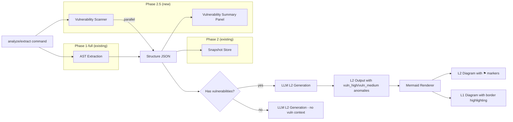
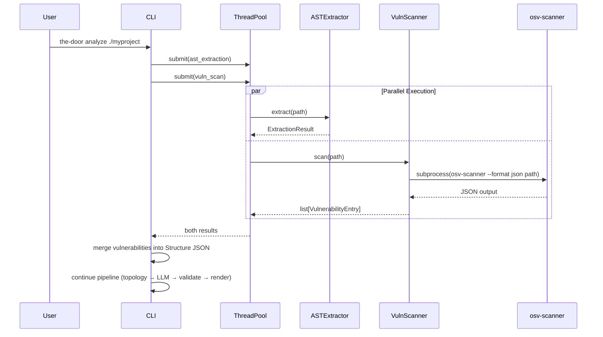

# Design Document — The Door Phase 2.5: Vulnerability Information Layer

## Overview

Phase 2.5 integrates osv-scanner into The Door's pipeline to surface known security vulnerabilities in the code visualization output. Where Phase 2 added version comparison (Diff Engine), Phase 2.5 adds a parallel vulnerability scanning step that enriches the Structure JSON with vulnerability data, which then flows through to L2 anomaly markers, L1 feature group border highlighting, and a structured summary panel.

**What Phase 2.5 adds on top of Phase 2:**

| Capability | Description |
|---|---|
| **Vulnerability Scanner** | Invoke osv-scanner as subprocess, parse JSON output into `VulnerabilityEntry` records |
| **Parallel Execution** | Run scanner concurrently with AST extraction via `concurrent.futures.ThreadPoolExecutor` |
| **Non-Fatal Error Handling** | All scanner failures produce empty results; main pipeline never blocked |
| **Offline Mode** | `--offline` flag passes through to osv-scanner for air-gapped environments |
| **Database Freshness** | Track and display when vulnerability data was last obtained |
| **Schema Extension** | Add `vulnerabilities` and `vulnerability_db_freshness` fields to `ast-raw.schema.json` |
| **L2 Anomaly Markers** | Extend `l2-output.schema.json` with `vuln_high`/`vuln_medium` anomaly types; render ⚑ markers |
| **L1 Border Highlighting** | Red/orange subgraph borders on L1 feature groups containing vulnerable modules |
| **Vulnerability Summary** | Structured JSON side panel with CVE IDs, severity, CVSS, action recommendations |
| **`scan` CLI Command** | Standalone `the-door scan` command for independent vulnerability scanning |
| **Pipeline Integration** | Vulnerability data flows through `extract` and `analyze` commands automatically |
| **Diff Coexistence** | Vulnerability markers coexist with diff markers per Phase 0a visual layering rules |
| **Snapshot Extension** | Vulnerability data persisted in snapshots; vulnerability diff in diff summary |
| **MCP `scan` Tool** | New MCP tool for programmatic vulnerability scanning |

### Design Decisions & Rationale

| Decision | Rationale |
|---|---|
| `concurrent.futures.ThreadPoolExecutor` for parallelism (not asyncio) | osv-scanner is a blocking subprocess call; `ThreadPoolExecutor` is simpler than wrapping `subprocess` in asyncio. The existing `analyze_cmd` already uses `asyncio.run()` for batch reading — adding a thread pool for the scanner avoids nested event loop issues |
| Scanner as a standalone class in `core/vulnerability/` | Clean separation from extraction; can be tested independently; follows the same package pattern as `core/diff/`, `core/extraction/` |
| Vulnerability data written into Structure JSON `vulnerabilities` field | Follows spec v4.1 §5.1 design; keeps all extraction-phase data in one JSON; LLM receives vulnerability context alongside structure data |
| LLM determines module↔vulnerability mapping | Consistent with The Door's LLM-Centric architecture — the LLM has semantic understanding of which modules use which packages based on imports and source_nodes |
| osv-scanner exit code 1 = "vulnerabilities found" (not an error) | osv-scanner uses exit code 1 to indicate vulnerabilities were detected; only other non-zero codes are actual errors |
| CVSS midpoint derivation when score is missing | Provides a reasonable numeric score for sorting/thresholding when osv-scanner doesn't report CVSS; midpoints are conservative estimates within each severity band |
| Deduplication by (cve_id, package, version) keeping highest CVSS | osv-scanner may report the same CVE from multiple sources; keeping highest CVSS is the conservative (most cautious) choice |
| Low-severity vulnerabilities excluded from diagram markers | Reduces visual noise; low-severity items appear only in the summary panel, following the principle that diagrams show actionable information |
| Diff classDef takes priority over vulnerability classDef in diff view | Follows Phase 0a §6.7 rule #1; vulnerability info preserved in label layer via ⚑ symbol |
| `VulnerabilitySummary` as structured JSON (not rendered text) | Follows the same pattern as `DiffSummary` — structured data that any AI medium's UI layer can render appropriately |
| 30-second default timeout for scanner | Balances thoroughness with responsiveness; large monorepos with many lockfiles may take time, but 30s is generous for most projects |

## Architecture

### High-Level Data Flow (Phase 2.5 Vulnerability Layer)



### Scanner Execution Sequence



### Module Boundaries

| Module | Package | Responsibility | Input | Output |
|---|---|---|---|---|
| `vulnerability_scanner` | `core/vulnerability/` | Invoke osv-scanner, parse JSON, produce `VulnerabilityEntry` list | Codebase path, offline flag, timeout | `ScanResult` (entries + freshness + warnings) |
| `vulnerability_models` | `models.py` | Data classes for vulnerability entries, scan results, summary | — | Frozen dataclasses |
| `vulnerability_renderer` | `core/vulnerability/` | Generate L2 anomaly markers, L1 border highlighting, summary panel JSON | L2 output anomalies + vulnerabilities | Extended Mermaid text, summary JSON |
| `vulnerability_diff` | `core/diff/diff_engine.py` | Compute vulnerability changes between snapshots | Two vulnerability lists | VulnerabilityDiffSummary |
| `scan_cmd` | `cli/` | Standalone `the-door scan` CLI command | CLI args | Human-readable or JSON output |
| `scan_tool` | `mcp/tools/` | MCP tool for vulnerability scanning | MCP arguments | Summary or raw JSON |

## Components and Interfaces

### Extended Folder Structure

```
the_door/
├── src/
│   └── the_door/
│       ├── models.py                         # Extended with Phase 2.5 vulnerability models
│       ├── cli/
│       │   ├── main.py                       # Extended: add scan command
│       │   ├── extract_cmd.py                # Extended: parallel vuln scan
│       │   ├── analyze_cmd.py                # Extended: parallel vuln scan + --offline flag
│       │   └── scan_cmd.py                   # NEW: standalone scan command
│       ├── core/
│       │   ├── vulnerability/                # NEW: vulnerability scanning package
│       │   │   ├── __init__.py
│       │   │   ├── vulnerability_scanner.py  # osv-scanner invocation + JSON parsing
│       │   │   └── vulnerability_renderer.py # L2 markers, L1 borders, summary panel
│       │   ├── diff/                         # Extended: vuln data in snapshots + vuln diff
│       │   │   ├── snapshot_store.py         # Extended: serialize/deserialize vulnerabilities
│       │   │   ├── diff_engine.py            # Extended: vulnerability diff computation
│       │   │   └── diff_renderer.py          # Extended: ⚑ prefix in diff labels
│       │   ├── extraction/                   # (existing, unchanged)
│       │   ├── topology/                     # (existing, unchanged)
│       │   ├── validation/                   # (existing, unchanged — schema validates new field)
│       │   ├── reading/                      # (existing, unchanged)
│       │   ├── rendering/                    # Extended: L1 border highlighting
│       │   │   ├── mermaid_renderer.py       # Extended: L1 subgraph border styles
│       │   │   ├── mermaid_utils.py          # (existing, unchanged)
│       │   │   └── cost_estimator.py         # (existing, unchanged)
│       │   └── llm/                          # (existing, unchanged)
│       └── mcp/
│           ├── server.py                     # Extended: register scan tool
│           └── tools/
│               └── scan_tool.py              # NEW: scan MCP tool
├── schemas/
│   ├── ast-raw.schema.json                   # Extended: vulnerabilities + vulnerability_db_freshness
│   ├── l2-output.schema.json                 # Extended: vuln_high, vuln_medium anomaly types
│   ├── snapshot.schema.json                  # Extended: vulnerabilities_snapshot field
│   └── ...                                   # (other schemas unchanged)
├── tests/
│   ├── unit/
│   │   ├── core/
│   │   │   └── vulnerability/                # NEW
│   │   │       ├── test_vulnerability_scanner.py
│   │   │       └── test_vulnerability_renderer.py
│   │   ├── cli/
│   │   │   └── test_scan_cmd.py              # NEW
│   │   └── mcp/
│   │       └── test_scan_tool.py             # NEW
│   └── property/
│       └── test_vulnerability_properties.py  # NEW: vulnerability PBT
└── pyproject.toml                            # (unchanged — no new Python dependencies)
```

### Component Interfaces

#### Vulnerability Scanner

```python
# src/the_door/core/vulnerability/vulnerability_scanner.py

class VulnerabilityScanner:
    """Invoke osv-scanner and parse results into VulnerabilityEntry records.
    
    All failures are non-fatal — returns empty results with warnings.
    Only passes codebase root path to osv-scanner (data privacy).
    """

    def __init__(
        self,
        *,
        timeout: int = 30,
        offline: bool = False,
    ):
        self._timeout = timeout
        self._offline = offline

    def scan(self, codebase_path: Path) -> ScanResult:
        """Run osv-scanner on the codebase and return parsed results.
        
        1. Check osv-scanner availability on PATH
        2. Build command: osv-scanner --format json [--offline] <path>
        3. Execute subprocess with timeout
        4. Parse JSON output into VulnerabilityEntry records
        5. Deduplicate by (cve_id, package, version), keeping highest CVSS
        6. Record database freshness timestamp
        
        Returns ScanResult with entries=[] and appropriate warnings on any failure.
        """
        ...

    def check_availability(self) -> bool:
        """Check if osv-scanner is available on the system PATH."""
        ...

    def _parse_osv_output(self, raw_json: str) -> list[VulnerabilityEntry]:
        """Parse osv-scanner JSON output into VulnerabilityEntry records.
        
        Maps severity levels: CRITICAL/HIGH/MEDIUM/LOW → critical/high/medium/low.
        Derives CVSS midpoint when score is missing.
        """
        ...

    def _deduplicate(
        self, entries: list[VulnerabilityEntry]
    ) -> list[VulnerabilityEntry]:
        """Deduplicate by (cve_id, package, version), keeping highest CVSS."""
        ...

    def _get_db_freshness(self) -> DatabaseFreshness:
        """Get database freshness info.
        
        Online mode: current scan timestamp.
        Offline mode: local database file modification timestamp.
        """
        ...
```

#### Vulnerability Renderer

```python
# src/the_door/core/vulnerability/vulnerability_renderer.py

class VulnerabilityRenderer:
    """Generate vulnerability visual elements for Mermaid diagrams.
    
    Handles:
    - L2 anomaly marker classDefs and ⚑ symbol prefixes
    - L1 feature group subgraph border highlighting
    - Vulnerability summary panel JSON generation
    """

    # Vulnerability classDef definitions (from Phase 0a §3.5)
    VULN_CLASSDEFS = {
        "vuln_high": "fill:#f8d7da,stroke:#dc3545,stroke-width:3",
        "vuln_medium": "fill:#ffe0cc,stroke:#fd7e14,stroke-width:3",
    }

    def build_l2_anomaly_markers(
        self,
        l2_anomalies: list,
    ) -> dict[str, str]:
        """Map module_id → classDef name based on L2 output anomaly entries.
        
        Data source: The LLM determines which L2 modules are affected by vulnerabilities
        during L2 generation (LLM-Centric architecture). This method reads the anomaly
        entries from the L2 output (anomaly_type = "vuln_high" or "vuln_medium") and
        maps each affected module_id to the corresponding classDef name.
        
        critical/high → vuln_high
        medium → vuln_medium
        low → no marker (side panel only)
        
        Returns dict of module_id → classDef name for affected modules.
        """
        ...

    def build_l1_border_styles(
        self,
        l2_anomalies: list,
        feature_source_nodes_map: dict[str, list[str]],
    ) -> dict[str, str]:
        """Map feature_id → subgraph border style based on highest severity.
        
        Data source: After L2 generation, the LLM has marked which modules have
        vulnerabilities (vuln_high/vuln_medium anomalies). This method cross-references
        L2 anomaly data with L1 feature source_nodes to determine which L1 feature
        groups contain vulnerable modules, then assigns border styles accordingly.
        
        high/critical → stroke:#dc3545,stroke-width:3 (red)
        medium → stroke:#fd7e14,stroke-width:3 (orange)
        low only → no highlighting
        
        Returns dict of feature_id → Mermaid style string.
        """
        ...

    def build_vulnerability_summary(
        self,
        vulnerabilities: list[VulnerabilityEntry],
        db_freshness: DatabaseFreshness,
    ) -> VulnerabilitySummary:
        """Build structured vulnerability summary for side panel display.
        
        Groups by severity (critical → high → medium → low).
        Generates action recommendations in Traditional Chinese.
        """
        ...

    # NOTE: Vulnerability diff computation (build_vulnerability_diff_summary)
    # lives in core/diff/diff_engine.py, not here — it's diff logic, not rendering.
```

#### CLI Commands

```python
# src/the_door/cli/scan_cmd.py

@click.command("scan")
@click.argument("codebase_path", type=click.Path(exists=True))
@click.option("--json", "output_json", is_flag=True, help="Output raw vulnerabilities as JSON")
@click.option("--offline", is_flag=True, help="Use local OSV database (air-gapped mode)")
@click.option("-o", "--output", "output_file", type=click.Path(), default=None, help="Write output to file")
def scan_cmd(codebase_path: str, output_json: bool, offline: bool, output_file: str | None):
    """Scan codebase for known vulnerabilities using osv-scanner."""
    ...
```

#### MCP Tool

```python
# src/the_door/mcp/tools/scan_tool.py

TOOL_SCHEMA = {
    "type": "object",
    "required": ["codebase_path"],
    "properties": {
        "codebase_path": {"type": "string", "description": "Path to the codebase root"},
        "offline": {"type": "boolean", "default": False, "description": "Use local OSV database"},
        "format": {
            "type": "string",
            "enum": ["raw", "summary"],
            "default": "summary",
            "description": "Output format: raw VulnerabilityEntry array or summary with groupings",
        },
    },
}

async def execute(arguments: dict) -> dict:
    """Execute the scan tool."""
    ...
```

## Data Models

### New Data Classes in models.py

All new models follow existing conventions: `frozen=True` for immutable value objects, `field(default_factory=...)` for mutable defaults.

```python
# === Phase 2.5: Vulnerability Layer models ===

@dataclass(frozen=True)
class VulnerabilityEntry:
    """A single vulnerability record from osv-scanner.
    
    Conforms to the vulnerabilities array format in ast-raw.schema.json.
    """
    cve_id: str
    package: str
    version: str
    severity: str  # "critical" | "high" | "medium" | "low"
    cvss: float  # 0.0–10.0
    source: str = "osv-scanner"


@dataclass(frozen=True)
class DatabaseFreshness:
    """Metadata about vulnerability database currency."""
    timestamp: str  # ISO8601
    mode: str  # "online" | "offline"
    stale_warning: str | None = None  # Warning message if offline DB > 7 days old


@dataclass(frozen=True)
class ScanResult:
    """Complete result of a vulnerability scan."""
    entries: list[VulnerabilityEntry] = field(default_factory=list)
    db_freshness: DatabaseFreshness | None = None
    warnings: list[str] = field(default_factory=list)
    scanner_available: bool = True


@dataclass(frozen=True)
class VulnerabilitySummaryEntry:
    """A single entry in the vulnerability summary panel."""
    cve_id: str
    package: str
    version: str
    severity: str
    cvss: float
    action: str  # "立即更新" | "建議更新" | "留意追蹤"
    affected_features: list[str] = field(default_factory=list)  # L1 feature labels


@dataclass(frozen=True)
class VulnerabilitySummary:
    """Structured vulnerability summary for side panel display.
    
    Contains only data — formatting (header text, no-vuln message) is done by the renderer.
    """
    total_critical: int = 0
    total_high: int = 0
    total_medium: int = 0
    total_low: int = 0
    entries: list[VulnerabilitySummaryEntry] = field(default_factory=list)
    db_freshness_display: str = ""  # Formatted freshness string


@dataclass(frozen=True)
class VulnerabilityDiffSummary:
    """Vulnerability changes between two snapshots.
    
    Contains only data — summary text formatting is done by the renderer.
    """
    new_vulnerabilities: list[VulnerabilityEntry] = field(default_factory=list)
    resolved_vulnerabilities: list[VulnerabilityEntry] = field(default_factory=list)
    unchanged_vulnerabilities: list[VulnerabilityEntry] = field(default_factory=list)
```

### Extended Existing Models

```python
# VersionSnapshot — extended with vulnerability data
@dataclass(frozen=True)
class VersionSnapshot:
    # ... existing fields ...
    vulnerabilities_snapshot: list[VulnerabilityEntry] = field(default_factory=list)  # NEW
    vulnerability_db_freshness: DatabaseFreshness | None = None  # NEW
```

```python
# Anomaly — extended anomaly_type enum
@dataclass(frozen=True)
class Anomaly:
    anomaly_type: str  # existing: "dead_code" | "logic_dead_end" | "uncertain_boundary"
                       # NEW: "vuln_high" | "vuln_medium"
    # ... rest unchanged ...
```

### Schema Extensions

#### `ast-raw.schema.json` — New Fields

```json
{
  "properties": {
    "vulnerabilities": {
      "type": "array",
      "default": [],
      "items": {
        "type": "object",
        "required": ["cve_id", "package", "version", "severity", "cvss", "source"],
        "properties": {
          "cve_id": { "type": "string" },
          "package": { "type": "string" },
          "version": { "type": "string" },
          "severity": { "type": "string", "enum": ["critical", "high", "medium", "low"] },
          "cvss": { "type": "number", "minimum": 0.0, "maximum": 10.0 },
          "source": { "type": "string" }
        }
      }
    },
    "vulnerability_db_freshness": {
      "type": ["object", "null"],
      "properties": {
        "timestamp": { "type": "string", "format": "date-time" },
        "mode": { "type": "string", "enum": ["online", "offline"] },
        "stale_warning": { "type": ["string", "null"] }
      }
    }
  }
}
```

#### `l2-output.schema.json` — Extended Enum

```json
{
  "anomaly_type": {
    "type": "string",
    "enum": ["dead_code", "logic_dead_end", "uncertain_boundary", "vuln_high", "vuln_medium"]
  }
}
```

#### `snapshot.schema.json` — New Fields

```json
{
  "properties": {
    "vulnerabilities_snapshot": {
      "type": "array",
      "default": [],
      "items": {
        "type": "object",
        "required": ["cve_id", "package", "version", "severity", "cvss", "source"],
        "properties": {
          "cve_id": { "type": "string" },
          "package": { "type": "string" },
          "version": { "type": "string" },
          "severity": { "type": "string", "enum": ["critical", "high", "medium", "low"] },
          "cvss": { "type": "number", "minimum": 0.0, "maximum": 10.0 },
          "source": { "type": "string" }
        }
      }
    },
    "vulnerability_db_freshness": {
      "type": ["object", "null"],
      "properties": {
        "timestamp": { "type": "string", "format": "date-time" },
        "mode": { "type": "string", "enum": ["online", "offline"] },
        "stale_warning": { "type": ["string", "null"] }
      }
    }
  }
}
```

### CVSS Severity Mapping

| osv-scanner Severity | Internal Severity | CVSS Range | Midpoint (when missing) | Visual Treatment |
|---|---|---|---|---|
| CRITICAL | critical | 9.0–10.0 | 9.5 | vuln_high classDef + ⚑ |
| HIGH | high | 7.0–8.9 | 8.0 | vuln_high classDef + ⚑ |
| MEDIUM | medium | 4.0–6.9 | 5.5 | vuln_medium classDef + ⚑ |
| LOW | low | 0.1–3.9 | 2.0 | Side panel only |


## Correctness Properties

*A property is a characteristic or behavior that should hold true across all valid executions of a system — essentially, a formal statement about what the system should do. Properties serve as the bridge between human-readable specifications and machine-verifiable correctness guarantees.*

### Property 1: Vulnerability entry round-trip serialization

*For any* list of valid `VulnerabilityEntry` records, serializing them to the Structure JSON `vulnerabilities` array format and parsing them back SHALL produce an equivalent list of entries — same cve_id, package, version, severity, cvss, and source for each entry.

**Validates: Requirements 1.3, 1.7, 15.1**

### Property 2: Severity classification determinism

*For any* `VulnerabilityEntry` with a given severity and CVSS score, the visual treatment classification SHALL be deterministic: "critical" or "high" severity (CVSS ≥ 7.0) always maps to `vuln_high` classDef with ⚑ symbol; "medium" severity (CVSS 4.0–6.9) always maps to `vuln_medium` classDef with ⚑ symbol; "low" severity (CVSS < 4.0) always maps to side-panel-only (no diagram marker). Applying the classification function twice to the same entry SHALL produce the same result.

**Validates: Requirements 7.1, 7.2, 7.3, 15.3**

### Property 3: L1 border highlighting uses highest severity

*For any* L1 feature group containing one or more vulnerable L2 modules, the subgraph border style SHALL be determined by the highest severity vulnerability within the group: red (`stroke:#dc3545`) if any vulnerability is critical/high, orange (`stroke:#fd7e14`) if the highest is medium, and no highlighting if all are low. The border color SHALL not change if additional lower-severity vulnerabilities are added to the group.

**Validates: Requirements 8.1, 8.2, 8.3, 8.4**

### Property 4: Vulnerability visual priority and coexistence

*For any* L2 module node that has both a vulnerability marker and a confidence marker (and possibly other anomaly types), the classDef SHALL be controlled by the vulnerability marker (highest priority per Phase 0a §3.3.1), the confidence icon SHALL be preserved as a label prefix, and the label format SHALL follow `[confidence_icon] ⚑ module_label`. The vulnerability anomaly SHALL always take visual priority over other anomaly types (dead_code, logic_dead_end, uncertain_boundary).

**Validates: Requirements 7.4, 7.5, 8.5**

### Property 5: Diff view vulnerability coexistence

*For any* node in a diff diagram that has both a diff state and a vulnerability marker, the classDef SHALL be controlled by the diff state (diff takes priority per Phase 0a §6.7 rule #1), and the ⚑ symbol SHALL be preserved in the label prefix following the format `[confidence_icon] ⚑ [diff_symbol] node_label`. For unchanged nodes with vulnerabilities, the `unchanged` classDef SHALL be applied with ⚑ preserved in the label.

**Validates: Requirements 12.1, 12.2, 12.3**

### Property 6: Vulnerability diff symmetry

*For any* two lists of vulnerability entries A and B, computing the vulnerability diff from A to B and from B to A SHALL produce symmetric results: vulnerabilities classified as "new" in diff(A, B) SHALL be classified as "resolved" in diff(B, A), and vice versa. The set of "unchanged" vulnerabilities SHALL be identical in both directions.

**Validates: Requirements 13.4, 15.5**

### Property 7: Backward compatibility with empty vulnerabilities

*For any* Structure JSON where the `vulnerabilities` array is empty (or absent), the Mermaid renderer output SHALL be identical to the output produced by the pre-Phase-2.5 renderer for the same input. No `vuln_high` or `vuln_medium` classDefs SHALL appear, no ⚑ symbols SHALL appear in labels, and no L1 subgraph border highlighting SHALL be applied.

**Validates: Requirements 11.5, 15.4**

### Property 8: Summary severity count consistency

*For any* list of vulnerability entries, the `VulnerabilitySummary` header counts (total_critical, total_high, total_medium, total_low) SHALL equal the actual count of entries with each respective severity in the input list. The sum of all severity counts SHALL equal the total number of entries.

**Validates: Requirements 9.4**

### Property 9: Summary severity ordering

*For any* list of vulnerability entries, the `VulnerabilitySummary.entries` list SHALL be ordered by severity in descending order: all critical entries before all high entries, all high before all medium, all medium before all low.

**Validates: Requirements 9.1**

### Property 10: Deduplication correctness

*For any* list of `VulnerabilityEntry` records (possibly containing duplicates by (cve_id, package, version) tuple), after deduplication: (a) no two entries SHALL share the same (cve_id, package, version) tuple, (b) for each unique tuple, the retained entry SHALL have the highest CVSS score among all original entries with that tuple, and (c) the number of deduplicated entries SHALL be less than or equal to the number of input entries.

**Validates: Requirements 1.6**

## Error Handling

### Error Categories and Responses

All vulnerability scanning errors are **non-fatal**. The main analysis pipeline (AST extraction → topology → LLM translation → validation → rendering) always completes regardless of scanner outcome.

| Error Scenario | Response | Log Level | User-Facing Message |
|---|---|---|---|
| osv-scanner not found on PATH | Empty vulnerabilities, `scanner_available=False` | INFO | "osv-scanner 未安裝，跳過漏洞掃描" (osv-scanner not installed, skipping vulnerability scan) |
| osv-scanner non-zero exit (not vuln-found) | Empty vulnerabilities, warning in `ScanResult` | WARNING | "osv-scanner 執行失敗（exit code N）" |
| osv-scanner timeout (> 30s default) | Cancel subprocess, empty vulnerabilities | WARNING | "漏洞掃描逾時（{timeout}秒），已跳過" (Vulnerability scan timed out) |
| Malformed JSON output | Empty vulnerabilities, raw output logged (truncated 500 chars) | WARNING | "osv-scanner 輸出格式錯誤" |
| No lockfile/manifest files found | Empty vulnerabilities (not an error) | DEBUG | (no user message — normal for projects without dependencies) |
| Offline mode, no local DB | Empty vulnerabilities, helpful message | WARNING | "本地 OSV 資料庫不存在，請執行 `osv-scanner --offline --download-offline-databases`" |
| Snapshot serialization failure | Vulnerability data omitted from snapshot, rest of snapshot saved | WARNING | "漏洞資料快照儲存失敗" |

### Error Propagation Rules

1. **Scanner → Pipeline**: Scanner errors never propagate as exceptions. `VulnerabilityScanner.scan()` always returns a `ScanResult` (possibly with `entries=[]` and populated `warnings`).
2. **Renderer → Output**: If vulnerability data is malformed when reaching the renderer, the renderer falls back to pre-Phase-2.5 behavior (no markers, no borders).
3. **Snapshot → Diff**: If a snapshot lacks vulnerability data (pre-Phase-2.5 snapshot), the diff engine treats it as having an empty vulnerability list.
4. **MCP → Client**: MCP tools return structured JSON with `warnings` array; never raise unhandled exceptions.

### osv-scanner Exit Code Handling

| Exit Code | Meaning | Scanner Response |
|---|---|---|
| 0 | No vulnerabilities found | Return empty entries list (success) |
| 1 | Vulnerabilities found | Parse JSON output normally (success) |
| Other | Error (e.g., 128 = not found, 2 = invalid args) | Log error, return empty entries |

## Testing Strategy

### Property-Based Testing (Hypothesis)

Property-based tests use the [Hypothesis](https://hypothesis.readthedocs.io/) library, consistent with the existing 322 tests in the project. Each property test runs a minimum of 100 iterations.

**Test file**: `tests/property/test_vulnerability_properties.py`

| Property | Test Function | Generators | Tag |
|---|---|---|---|
| Property 1: Round-trip serialization | `test_vulnerability_entry_round_trip` | Random `VulnerabilityEntry` lists (cve_id, package, version as text; severity from enum; cvss as float 0.0–10.0) | Feature: vulnerability-layer, Property 1: Vulnerability entry round-trip serialization |
| Property 2: Severity classification determinism | `test_severity_classification_determinism` | Random `VulnerabilityEntry` with varied severity/cvss combinations | Feature: vulnerability-layer, Property 2: Severity classification determinism |
| Property 3: L1 border highlighting | `test_l1_border_highest_severity` | Random feature groups with random vulnerability lists of mixed severities | Feature: vulnerability-layer, Property 3: L1 border highlighting uses highest severity |
| Property 4: Visual priority and coexistence | `test_vulnerability_visual_priority` | Random L2 modules with random combinations of vulnerability + confidence + anomaly types | Feature: vulnerability-layer, Property 4: Vulnerability visual priority and coexistence |
| Property 5: Diff view coexistence | `test_diff_view_vulnerability_coexistence` | Random nodes with random diff states + vulnerability markers | Feature: vulnerability-layer, Property 5: Diff view vulnerability coexistence |
| Property 6: Vulnerability diff symmetry | `test_vulnerability_diff_symmetry` | Random pairs of `VulnerabilityEntry` lists | Feature: vulnerability-layer, Property 6: Vulnerability diff symmetry |
| Property 7: Backward compatibility | `test_backward_compatibility_empty_vulns` | Random Structure JSON inputs with empty vulnerabilities array | Feature: vulnerability-layer, Property 7: Backward compatibility with empty vulnerabilities |
| Property 8: Summary count consistency | `test_summary_count_consistency` | Random `VulnerabilityEntry` lists | Feature: vulnerability-layer, Property 8: Summary severity count consistency |
| Property 9: Summary severity ordering | `test_summary_severity_ordering` | Random `VulnerabilityEntry` lists with mixed severities | Feature: vulnerability-layer, Property 9: Summary severity ordering |
| Property 10: Deduplication correctness | `test_deduplication_correctness` | Random `VulnerabilityEntry` lists with intentional duplicates (same cve_id/package/version, different cvss) | Feature: vulnerability-layer, Property 10: Deduplication correctness |

### Unit Tests (Example-Based)

**Test files**: `tests/unit/core/vulnerability/test_vulnerability_scanner.py`, `test_vulnerability_renderer.py`, `tests/unit/cli/test_scan_cmd.py`, `tests/unit/mcp/test_scan_tool.py`

| Area | Test Cases |
|---|---|
| Scanner invocation | Correct subprocess command construction; `--format json` flag present; `--offline` flag passthrough |
| Severity mapping | All 4 severity levels mapped correctly (CRITICAL→critical, HIGH→high, MEDIUM→medium, LOW→low) |
| CVSS midpoint derivation | Each severity → midpoint: critical=9.5, high=8.0, medium=5.5, low=2.0 |
| Error handling | osv-scanner not found; non-zero exit codes; malformed JSON; timeout; no lockfiles |
| Offline mode | `--offline` flag passed to subprocess; no local DB error message |
| Database freshness | Online timestamp; offline file timestamp; 7-day stale warning |
| Data privacy | Command args contain only path (no source files, no analysis flags) |
| Summary generation | Zero vulnerabilities message; action recommendations per severity; header format |
| CLI scan command | Default human-readable output; `--json` flag; `--offline` flag; UTF-8 encoding; osv-scanner not installed message |
| MCP scan tool | Tool registration; summary format; raw format; error response structure |
| Schema validation | Structure JSON with vulnerabilities validates against updated schema |
| Snapshot persistence | Vulnerabilities included in snapshot; deserialized correctly |
| Diff summary | Vulnerability change section text format |

### Integration Tests

| Area | Test Cases |
|---|---|
| Parallel execution | Scanner and extractor run concurrently via ThreadPoolExecutor |
| Pipeline integration | `analyze` command includes vulnerability data in Structure JSON |
| LLM data flow | Vulnerability data present in LLM prompt context |
| Snapshot round-trip | Create snapshot with vulnerabilities → reload → verify data integrity |
| Diff with vulnerabilities | Diff between snapshots with different vulnerability sets |
