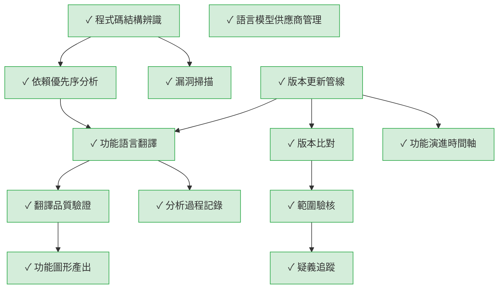

# The Door — 自我分析成果

> The Door 用自己分析自己的程式碼。

**分析時間：** 2026-05-06  
**分析對象：** `the_door/src/the_door/`  
**工具版本：** Phase UI-3（全功能）

---

## 結構統計

| 項目 | 數量 |
|---|---|
| Python 原始檔 | 70+ |
| AST 節點（函式 / 類別 / 方法） | 541 |
| 呼叫關係（edges） | 1,361 |
| 拓撲批次 | 5 |
| 識別出的 L1 功能 | 13 |
| 功能間關係 | 11 |

---

## L1 功能總覽

The Door 是一個把程式碼翻譯成功能語言圖形的工具鏈，讓非工程師能直接驗核開發產出。系統由 13 個核心功能組成，從程式碼結構辨識出發，經過依賴分析、LLM 翻譯、品質驗證，最終產出可互動的功能圖形，並支援版本比對、漏洞掃描、範圍驗核、疑義追蹤與功能演進追蹤。

| 功能 | 信心 | 觸發方式 |
|---|---|---|
| 程式碼結構辨識 | ✓ 高 | 使用者指定程式碼目錄後觸發 |
| 依賴優先序分析 | ✓ 高 | 程式碼結構辨識完成後自動執行 |
| 功能語言翻譯 | ✓ 高 | 使用者執行一鍵分析時觸發 |
| 語言模型供應商管理 | ✓ 高 | 使用者在設定檔中選擇供應商後，分析時自動使用 |
| 翻譯品質驗證 | ✓ 高 | 翻譯完成後自動執行 |
| 功能圖形產出 | ✓ 高 | 使用者要求產出圖形時觸發 |
| 版本比對 | ✓ 高 | 使用者指定兩個版本後觸發 |
| 漏洞掃描 | ✓ 高 | 分析程式碼時自動並行執行 |
| 範圍驗核 | ✓ 高 | 使用者指定範圍定義後觸發 |
| 疑義追蹤 | ✓ 高 | 使用者發現異常並建立疑義時觸發 |
| 功能演進時間軸 | ✓ 高 | 使用者查看功能演進時觸發 |
| 版本更新管線 | ✓ 高 | 使用者指定舊版和新版目錄後觸發 |
| 分析過程記錄 | ✓ 高 | 每次翻譯過程中自動記錄 |

---

## L1 功能關係圖



---

## 本地 UI 驗收

啟動方式：

```bash
cd the_door
the-door ui src/the_door
# 或
python -c "from the_door.cli.main import main; main(['ui', 'src/the_door'])"
```

開啟 `http://127.0.0.1:8765` 後可看到：

- **左側**：13 個功能節點清單
- **中央**：互動式 Cytoscape.js 圖形，13 個節點 + 11 條有向邊
- **右側**：點選任一節點顯示功能描述、信心標記、資料來源

API 端點驗收結果：

| 端點 | 狀態 | 回傳 |
|---|---|---|
| `GET /api/project` | ✅ 200 | `dot_the_door_exists: true`, `has_snapshots: true` |
| `GET /api/snapshots` | ✅ 200 | 1 個快照（`self-analysis-v1`） |
| `GET /api/report/latest` | ✅ 200 | UpdateReport JSON |
| `GET /api/l1` | ✅ 200 | 13 nodes, 11 edges |
| `GET /api/structure` | ✅ 200 | 541 nodes, 1361 edges |

---

## 產出檔案

| 檔案 | 說明 |
|---|---|
| `docs/self-analysis-structure.json` | AST 結構原料（541 節點，1361 邊，5 批次） |
| `docs/self-analysis-l1-output.json` | L1 功能分析輸出（13 功能，11 關係） |
| `docs/self-analysis-l1-diagram.md` | Mermaid 功能圖形 |
| `docs/frontend-local-version-viewer/viewer/data/l1-view-model.json` | 前端 ViewModel（供靜態 viewer 使用） |
| `the_door/src/the_door/.the-door/snapshots/` | 版本快照（`self-analysis-v1`） |
| `the_door/src/the_door/.the-door/structure.json` | 供 UI server 使用的 AST 結構 |
