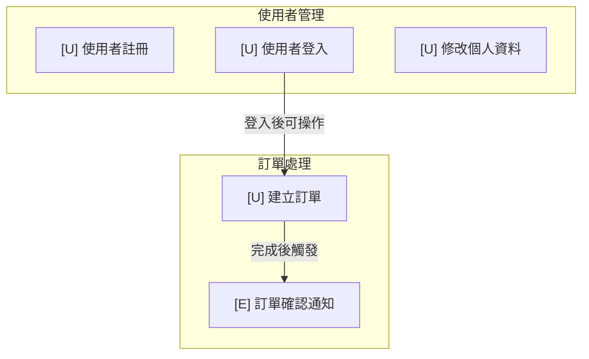

# L1 功能總覽層 (L1 Functional Overview Layer)

L1 是純功能語言層，**零技術詞彙**。節點代表「系統能做什麼」，邊代表功能之間的因果關係。L1 的目標受眾是 PM 和發布經理——他們只需要知道系統提供哪些功能、功能之間如何串聯。

---

## 1.1 節點形狀定義

節點形狀同時編碼**功能類別**與**觸發類型**，使用形狀 + 圖示前綴雙通道區分：

| 觸發類型 | Mermaid 形狀 | 視覺描述 | 圖示前綴 | 範例 |
|---|---|---|---|---|
| 使用者操作觸發 | `[" "]` 圓角矩形 | 圓角矩形（預設形狀），暗示「人為啟動」 | 👤 或 `[U]` | `[U] 使用者登入` |
| 定時自動執行 | `[/" "/]` 平行四邊形 | 傾斜形狀，暗示「自動、持續」 | ⏱ 或 `[S]` | `[S] 每日報表產出` |
| 由其他功能觸發 | `{" "}` 菱形 | 菱形，暗示「條件、事件」 | ⚡ 或 `[E]` | `[E] 訂單完成後通知` |

**雙通道設計理由：**

- **形狀通道**：圓角矩形 / 平行四邊形 / 菱形，三種形狀在視覺上明確可區分
- **圖示前綴通道**：`[U]` / `[S]` / `[E]` 文字標記，即使在無法辨識形狀的情境（如純文字模式）下仍可區分觸發類型
- 圓角矩形作為預設形狀，因為使用者操作觸發是最常見的類型

> **雙通道設計**是本視覺語言的核心原則：所有語意區分皆使用至少兩個獨立的視覺通道（形狀 + 符號、顏色 + 邊框等），確保不依賴單一視覺通道即可區分語意。後續各層級文件中的「雙通道設計理由」皆遵循此原則，不再重複完整解釋。

## 1.2 邊語意定義

L1 的邊表達功能之間的因果關係，使用人類可讀的標籤。線條樣式 + 標籤文字構成雙通道：

| 關係類型 | 線條樣式 | 標籤範例 | Mermaid 語法 |
|---|---|---|---|
| 完成後觸發 | 實線箭頭 `──→` | "完成後觸發" | `A -->\|"完成後觸發"\| B` |
| 依賴結果 | 虛線箭頭 `- - →` | "依賴結果" | `A -.->\|"依賴結果"\| B` |
| 推斷關係（LLM 推斷） | 點線箭頭 `· · →` | "可能相關" | `A -..->\|"可能相關"\| B` |

**邊語意說明：**

- **完成後觸發（實線）**：功能 A 完成後，自動啟動功能 B。這是最明確的因果關係。
- **依賴結果（虛線）**：功能 B 需要功能 A 的結果才能運作，但不是由 A 直接啟動。
- **推斷關係（點線）**：由 LLM 推斷出的可能關聯，尚未經人工確認。點線暗示「不確定性」。

## 1.3 語言規則

L1 層**禁止任何技術詞彙**。所有節點標籤和邊標籤必須使用功能語言——描述「做什麼」而非「怎麼做」。

**正確範例 ✅：**

| 類型 | 正確用法 |
|---|---|
| 節點標籤 | `[U] 使用者登入`、`[S] 每日報表產出`、`[E] 訂單完成後通知` |
| 邊標籤 | "完成後觸發"、"需要先完成"、"依賴結果"、"登入後可操作" |
| 群組標題 | "使用者管理"、"訂單處理"、"通知功能" |

**錯誤範例 ❌：**

| 類型 | 錯誤用法 | 問題 |
|---|---|---|
| 節點標籤 | `AuthService.login()` | 技術詞彙，非功能描述 |
| 節點標籤 | `POST /api/auth/login` | API 路徑，非功能描述 |
| 邊標籤 | "calls"、"invokes" | 英文技術動詞 |
| 邊標籤 | "subscribes to event" | 技術實作細節 |
| 群組標題 | "UserModule"、"OrderService" | 程式碼模組名稱 |

**判斷原則：** 如果一個標籤需要工程背景才能理解，它就不屬於 L1。

## 1.4 視覺群組機制

L1 使用 Mermaid `subgraph` 將相關功能聚集在一起，但**不暗示階層結構**——同一群組的功能可能分散在不同技術模組中。

**群組規則：**

- 群組標題使用功能語言（「使用者管理」而非「UserModule」）
- 群組之間的邊表示跨群組的因果關係
- 群組僅用於視覺聚集，不代表技術模組邊界
- 群組不暗示父子階層——群組內的功能彼此平等

**Mermaid 範例：**

