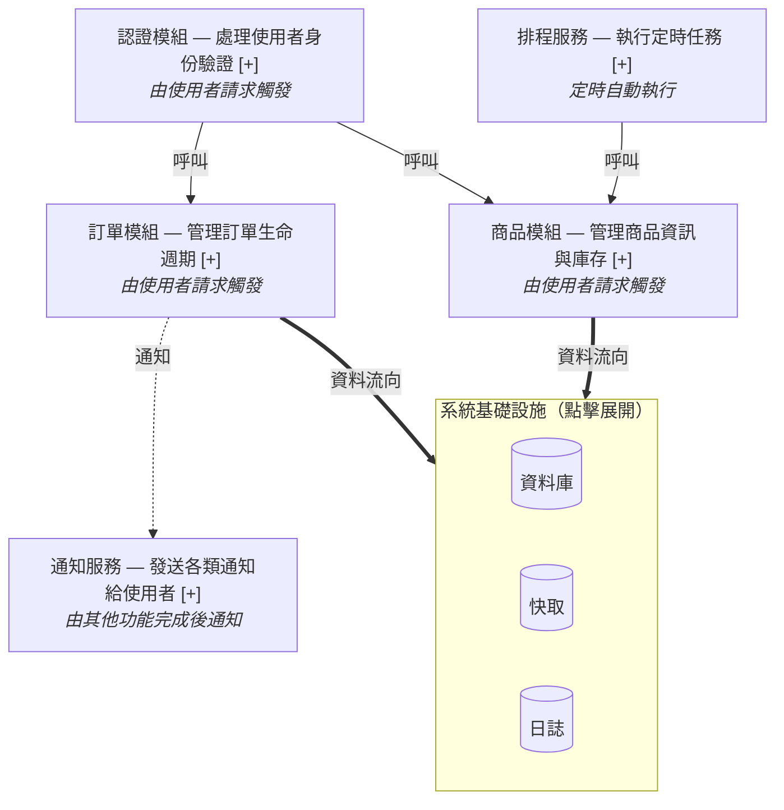

# L1.5 結構概覽層 (L1.5 Structural Overview Layer)

L1.5 是過渡語言層，回答「各區塊負責哪一段、彼此如何關聯」。節點代表系統的結構區塊（模組），邊代表區塊之間的互動方式。L1.5 的目標受眾與 L1 相同（PM 和發布經理），但視角從「功能」切換到「結構」——使用者可以建立系統架構的心智模型，而不需要進入技術細節。

L1.5 與 L1 是**平行視角**（透過 Tab 切換），不是父子階層。

---

## 2.1 節點形狀定義

L1.5 的節點形狀區分**結構區塊**與**基礎設施區塊**，使用形狀 + 視覺意象雙通道：

| 元素類型 | Mermaid 形狀 | 視覺描述 | 範例 |
|---|---|---|---|
| 結構區塊 | `[" "]` 圓角矩形 | 標準區塊，代表一個功能模組 | `["認證模組 — 處理使用者身份驗證"]` |
| 基礎設施區塊 | `[(" ")]` 圓柱 / `subgraph` | 圓柱形暗示資料儲存/基礎設施意象 | `[("系統基礎設施")]` |

## 2.2 節點標籤格式

每個 L1.5 結構區塊的節點標籤必須包含**模組名稱**和**功能說明**，使用過渡語言（允許模組名稱，但必須附帶功能描述）。格式為：

```
模組名稱 — 功能說明
```

**正確範例 ✅：**

| 標籤 | 說明 |
|---|---|
| `認證模組 — 處理使用者身份驗證` | 模組名稱 + 功能說明，完整 |
| `通知服務 — 發送各類通知給使用者` | 模組名稱 + 功能說明，完整 |
| `訂單模組 — 管理訂單生命週期` | 模組名稱 + 功能說明，完整 |

**錯誤範例 ❌：**

| 標籤 | 問題 |
|---|---|
| `AuthService` | 缺少功能說明，且使用純技術名稱 |
| `處理使用者身份驗證` | 缺少模組名稱，無法定位結構位置 |
| `auth_module` | 英文技術命名，非過渡語言 |

**判斷原則：** L1.5 標籤必須同時回答「這是什麼區塊」（模組名稱）和「它做什麼」（功能說明）。

## 2.3 邊語意定義

L1.5 的邊表達區塊之間的互動方式，使用線條樣式 + 標籤文字雙通道區分三種關係：

| 關係類型 | 線條樣式 | 標籤 | Mermaid 語法 | 說明 |
|---|---|---|---|---|
| 直接呼叫 | 實線箭頭 `──→` | "呼叫" | `A -->\|"呼叫"\| B` | 一個區塊直接使用另一個區塊的功能 |
| 事件通知 | 虛線箭頭 `- - →` | "通知" | `A -.->\|"通知"\| B` | 一個區塊完成後通知另一個區塊 |
| 資料流 | 粗線箭頭 `═══→` | "資料流向" | `A ==>\|"資料流向"\| B` | 資料從一個區塊流向另一個區塊 |

**邊語意說明：**

- **直接呼叫（實線）**：區塊 A 主動呼叫區塊 B 的功能。這是最常見的互動方式。
- **事件通知（虛線）**：區塊 A 完成某件事後，透過事件機制通知區塊 B。A 不直接依賴 B 的回應。
- **資料流（粗線）**：資料從區塊 A 流向區塊 B（例如寫入資料庫、傳送至快取）。粗線暗示「大量資料移動」。

## 2.4 觸發機制人話標籤對照表

L1.5 節點上的觸發機制使用人類可讀標籤，顯示在節點副標題（以斜體呈現），讓非技術人員理解「這個區塊是怎麼被啟動的」：

| 技術觸發機制 | L1.5 人話標籤 | 說明 |
|---|---|---|
| HTTP route handler | "由使用者請求觸發" | 使用者在介面上操作時啟動 |
| Cron job / Scheduler | "定時自動執行" | 系統按照排程自動執行 |
| Event subscriber | "由其他功能完成後通知" | 其他區塊完成工作後自動觸發 |
| IoC injection | "系統啟動時自動配置" | 系統啟動時自動準備好 |
| Middleware | "每次請求前自動檢查" | 每次使用者操作前自動執行檢查 |

**呈現方式：** 觸發機制標籤以斜體顯示在節點標籤下方：

```
認證模組 — 處理使用者身份驗證
  由使用者請求觸發
```

## 2.5 基礎設施收攏區塊

基礎設施（資料庫、快取、日誌等）統一收攏為一個可展開的區塊，避免在結構概覽中暴露過多技術細節：

- 使用 Mermaid `subgraph` 包裹所有基礎設施元件
- 標題包含「（點擊展開）」提示，告知使用者可以展開查看細節
- 預設狀態為**收合**，僅顯示「系統基礎設施（點擊展開）」

## 2.6 L2 展開指示器

L1.5 中可展開至 L2 詳細視圖的節點，在標籤末尾顯示 `[+]` 展開指示器：

- **Mermaid 實現**：節點標籤末尾加 `[+]`
- **MD 純文字**：節點行末加 `[+]` 標記
- **語意**：`[+]` 表示「此區塊可點擊展開，查看內部模組互動細節」

**範例：**

```
認證模組 — 處理使用者身份驗證 [+]
  由使用者請求觸發

訂單模組 — 管理訂單生命週期 [+]
  由使用者請求觸發

通知服務 — 發送各類通知 [+]
  由其他功能完成後通知
```

展開後，`[+]` 變為 `[−]`，表示可收合回 L1.5 視圖。

## 2.7 L1.5 Mermaid 範例

以下是一個 L1.5 結構概覽圖的 Mermaid 範例，展示節點形狀、標籤格式、邊語意、觸發機制、基礎設施收攏、L2 展開指示器的綜合運用：


