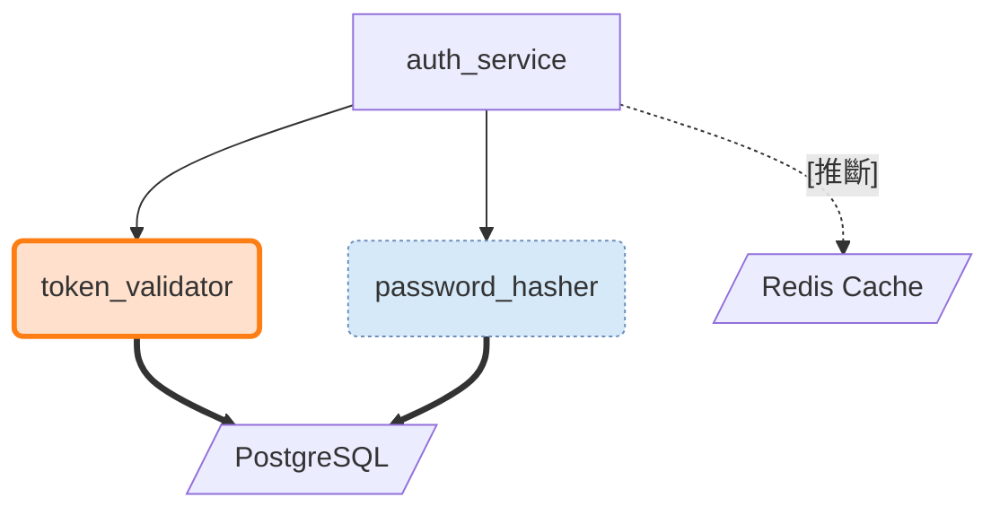

# L2 功能連動圖層 (L2 Functional Linkage Layer)

L2 是技術語言層，顯示模組層次的互動關係與異常標示。L2 回答的核心問題是「有沒有異常」——使用者可以在此層看到模組之間的呼叫關係、推斷關係、資料依賴，以及系統自動偵測到的各種異常狀態。

L2 不是獨立的全畫面視圖，而是從 L1.5 的結構區塊**點擊展開**進入的詳細視圖（參見 `02-l1_5-structural-overview.md` 的 `[+]` 展開指示器）。

---

## 3.1 節點形狀定義

L2 的節點形狀區分**模組**、**子模組**與**外部依賴**，使用形狀 + 大小雙通道：

| 元素類型 | Mermaid 形狀 | 視覺描述 | 範例 |
|---|---|---|---|
| 模組 | `[" "]` 圓角矩形 | 標準大小圓角矩形，代表主要模組 | `["auth_service"]` |
| 子模組 | `(" ")` 較小圓角矩形 | 較小的圓角矩形，代表從屬模組 | `("token_validator")` |
| 外部依賴 | `[/" "/]` 平行四邊形 | 傾斜形狀，暗示「外部、非本系統」 | `[/"Redis Cache"/]` |

## 3.2 邊語意定義

L2 的邊表達模組之間的技術關係，使用線條樣式 + 標籤雙通道區分三種關係：

| 關係類型 | 線條樣式 | Mermaid 語法 | 說明 |
|---|---|---|---|
| 靜態呼叫 | 實線箭頭 `──→` | `A --> B` | AST 可追蹤的直接呼叫，最明確的關係 |
| 推斷關係 | 虛線箭頭 `- - →` + `[推斷]` 標籤 | `A -.->|"[推斷]"| B` | LLM 推斷的非靜態關係，尚未經人工確認 |
| 資料依賴 | 粗線箭頭 `═══→` | `A ==> B` | 資料流向，暗示大量資料移動或儲存依賴 |

**邊語意說明：**

- **靜態呼叫（實線 `-->`）**：透過 AST 分析可追蹤的直接函式呼叫。這是最可靠的關係類型。
- **推斷關係（虛線 `-.->` + `[推斷]` 標籤）**：由 LLM 推斷出的非靜態關係（如透過反射、動態分派、事件匯流排等間接呼叫）。虛線 + `[推斷]` 標籤雙通道明確標示「這不是靜態分析的結果」。
- **資料依賴（粗線 `==>`）**：模組之間的資料流向關係（如讀寫資料庫、存取快取）。粗線暗示「大量資料移動」。

## 3.3 異常標示 (Anomaly Markers)

L2 層啟用異常標示，使用**填充色 + 符號**雙通道編碼。異常標示是 L2 的核心資訊——它讓使用者一眼看出哪些模組有潛在問題需要關注。

### 3.3.1 異常類型完整表格

| 異常類型 | 填充色 | 色彩描述 | 符號 | classDef 名稱 | 嚴重程度 |
|---|---|---|---|---|---|
| 已知漏洞（高危） | `#f8d7da` | 紅 | ⚑ | `vuln_high` | 1（最高） |
| 已知漏洞（中危） | `#ffe0cc` | 橘 | ⚑ | `vuln_medium` | 2 |
| 邏輯死路 | `#fff3cd` | 黃 | ⚠ | `logic_dead` | 3 |
| 死碼 | `#d6e9f8` | 藍灰 | ◎ | `dead_code` | 4 |
| 不確定邊界 | `#e9ecef` | 淺灰 | ⊙ | `uncertain` | 5（最低） |

**嚴重程度優先序：** 已知漏洞（高危）> 已知漏洞（中危）> 邏輯死路 > 死碼 > 不確定邊界

### 3.3.2 異常類型說明

- **已知漏洞（⚑ 高危/中危）**：模組存在已知的安全漏洞（如 CVE），需要優先處理。高危（紅色）和中危（橘色）透過色彩深淺區分嚴重程度，共用 ⚑ 符號表示「漏洞」語意。
- **邏輯死路（⚠）**：模組中存在永遠不會被執行的邏輯路徑（如條件永遠為 false 的分支），可能是 bug 或設計缺陷。
- **死碼（◎）**：模組中存在不再被任何路徑呼叫的程式碼，可能是重構遺留或功能廢棄。
- **不確定邊界（⊙）**：模組的職責邊界不明確，可能與其他模組有重疊或缺口，需要人工確認。

## 3.4 多異常共存規則

當一個節點同時存在多種異常時，遵循以下規則：

1. **節點上顯示最高優先級的異常**：節點的填充色和符號由嚴重程度最高的異常控制
2. **其餘異常列入側邊說明欄**：未顯示在節點上的異常，以文字列表形式呈現在側邊說明欄中

**側邊說明欄格式：**

```
⚑ 已知漏洞 CVE-2024-xxxx | ⚠ 邏輯死路：條件永遠為 false
```

**範例：** 若 `payment_processor` 同時有已知漏洞（高危）和邏輯死路：
- 節點顯示：紅色填充 + ⚑ 符號（已知漏洞，嚴重程度 1）
- 側邊說明欄：`⚠ 邏輯死路：某條件永遠為 false`

## 3.5 異常標示 Mermaid classDef 定義

以下是所有異常標示的 Mermaid classDef 定義，可直接用於 Mermaid 圖形渲染：

```
classDef vuln_high fill:#f8d7da,stroke:#dc3545,stroke-width:3
classDef vuln_medium fill:#ffe0cc,stroke:#fd7e14,stroke-width:3
classDef logic_dead fill:#fff3cd,stroke:#ffc107,stroke-dasharray:5 5
classDef dead_code fill:#d6e9f8,stroke:#6c8ebf,stroke-dasharray:2 2
classDef uncertain fill:#e9ecef,stroke:#6c757d,stroke-dasharray:2 2
```

**classDef 設計說明：**

| classDef 名稱 | 填充色 | 邊框色 | 邊框樣式 | 設計理由 |
|---|---|---|---|---|
| `vuln_high` | `#f8d7da` 紅 | `#dc3545` 紅 | 粗實線（`stroke-width:3`） | 粗實線表示「確定的、嚴重的」問題 |
| `vuln_medium` | `#ffe0cc` 橘 | `#fd7e14` 橘 | 粗實線（`stroke-width:3`） | 同上，色彩較淺表示嚴重程度較低 |
| `logic_dead` | `#fff3cd` 黃 | `#ffc107` 黃 | 虛線（`stroke-dasharray:5 5`） | 虛線表示「需要確認的」問題 |
| `dead_code` | `#d6e9f8` 藍灰 | `#6c8ebf` 藍灰 | 虛線（`stroke-dasharray:2 2`） | 細虛線表示「資訊性的」標記 |
| `uncertain` | `#e9ecef` 淺灰 | `#6c757d` 灰 | 虛線（`stroke-dasharray:2 2`） | 同上，最低嚴重程度 |

## 3.6 Mermaid classDef 限制與共存規則

**Mermaid classDef 限制：** Mermaid 中一個節點只能套用一個 classDef。這意味著當 L2 異常標示和 Phase 0b 信心標示同時存在於同一節點時，無法同時透過 classDef 表達兩者。

**共存規則：**

- **classDef 由異常標示控制**：異常是 L2 的核心資訊，優先於信心邊框。節點的 `fill`、`stroke`、`stroke-width`/`stroke-dasharray` 由異常 classDef 決定。
- **信心資訊退到圖示前綴通道**：Phase 0b 的信心圖示（`✓` high / `?` medium / `⚠` low / `✔` reviewed / `Δ` regenerated / `…` incomplete）以文字前綴形式保留在節點標籤中，不依賴 classDef。

**範例：**

```
✓ ◎ password_hasher
```

- `✓`：信心標示（high confidence），透過圖示前綴傳達
- `◎`：異常標示（死碼），透過符號 + classDef `dead_code` 傳達
- classDef 套用 `dead_code`（填充色 `#d6e9f8`，邊框 `#6c8ebf`，虛線）

> **注意：** 未來 Phase 若需要同時顯示異常邊框和信心邊框，需為每種組合生成複合 classDef（如 `vuln_high_conf_medium`）。這是 Phase 2+ 的實作決策，不在 Phase 0a 範圍內。

## 3.7 L2 Mermaid 範例

以下是一個 L2 功能連動圖的 Mermaid 範例，展示節點形狀、邊語意、異常標示的綜合運用：


