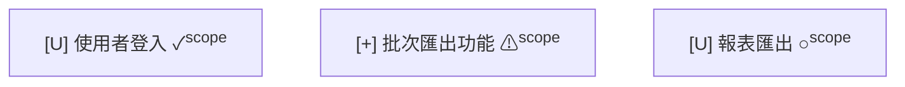

# 範圍邊界協定 (Scope Boundary Protocol)

範圍邊界協定回答「這些變更是否在預期範圍內」——讓 PM 和發布經理能夠將開發產出與 Sprint / Release 的承諾進行比對，快速識別超出範圍的意外變更和尚未完成的預期功能。

範圍邊界標記以**角標徽章**形式疊加在節點上，不替換其他視覺指標（信心標示、異常標示、Diff 符號），確保多種資訊可以共存。

---

## 5.1 範圍狀態定義

三種範圍狀態使用**符號 + 顏色**雙通道編碼：

| 狀態 | 符號 | 顏色 | 色碼 | 說明 |
|---|---|---|---|---|
| 範圍內已完成 | ✓ | 綠色 | `#28a745` | 預期功能，已完成開發 |
| 超出範圍（意外） | ⚠ | 橘色 | `#fd7e14` | 未預期的變更，需要調查原因 |
| 範圍內未完成 | ○ | 灰色 | `#6c757d` | 預期功能，尚未完成開發 |

## 5.2 角標徽章呈現方式

範圍邊界標記以**角標徽章**形式疊加在節點右上角，不替換其他視覺指標：

```
┌──────────────────────┐ [✓]
│ [U] 使用者登入        │
│ ✓ high confidence     │
└──────────────────────┘

┌──────────────────────┐ [⚠]
│ [+] 未預期的新功能    │
│ ? medium confidence   │
└──────────────────────┘

┌──────────────────────┐ [○]
│ [U] 報表匯出          │
│ … incomplete          │
└──────────────────────┘
```

**角標徽章規則：**

- 徽章位置固定在節點右上角，不隨節點大小變化
- 徽章不替換節點內的其他指標（信心標示圖示前綴、異常標示符號等）
- 徽章使用對應顏色的背景色，確保在各種節點填充色上都清晰可見
- 一個節點最多只有一個範圍狀態徽章（三種狀態互斥）

**Mermaid 實現方式：**

在節點標籤中加入角標符號，利用 HTML 上標模擬角標效果：

```
f1["[U] 使用者登入 ✓<sup>scope</sup>"]
f2["[+] 未預期的新功能 ⚠<sup>scope</sup>"]
f3["[U] 報表匯出 ○<sup>scope</sup>"]
```

## 5.3 範圍摘要面板

範圍視圖頂部顯示範圍驗核摘要，使用自然語言讓非技術人員快速掌握範圍狀態：

```
📋 Sprint 12 範圍驗核
   ✓ 範圍內已完成：8 個功能
   ⚠ 超出範圍：1 個功能（需調查）
   ○ 範圍內未完成：2 個功能
```

**摘要面板規則：**

- 標題包含 Sprint / Release 名稱，明確範圍的時間框架
- 三種狀態各自統計數量，使用對應的符號前綴
- 超出範圍的項目附加「（需調查）」提示，引導使用者關注
- 數字統計一目了然，無需逐一檢視圖形即可掌握範圍狀態

## 5.4 超出範圍 → 疑義路徑入口

當節點標記為 ⚠（超出範圍）時，提供「點擊調查」的視覺提示，引導使用者進入疑義路徑（Doubt Path）進行調查：

```
[⚠ 超出範圍] 未預期的新功能 → 點擊查看詳情 → 進入疑義路徑
```

**視覺提示設計：**

- ⚠ 徽章本身即為可點擊的互動元素
- 滑鼠懸停時顯示 tooltip：「超出範圍 — 點擊調查」
- 點擊後進入疑義路徑的「識別」階段（參見 `doubt-path-concept.md`）
- 在 MD 純文字格式中，以 `→ 點擊查看詳情` 文字提示替代互動效果

**與疑義路徑的銜接：**

超出範圍的節點進入疑義路徑後，系統自動記錄以下 metadata：
- **疑義類型**：範圍問題 — 超出範圍
- **來源節點**：被標記 ⚠ 的節點 ID 與功能描述
- **發現方式**：範圍邊界檢查

## 5.5 Mermaid 實現方式

範圍邊界標記在 Mermaid 中的實現策略：

**方式一：標籤內嵌符號（推薦）**

將範圍符號嵌入節點標籤，利用 HTML 上標模擬角標效果：



**方式二：獨立角標節點（備選）**

為每個需要範圍標記的節點建立一個小型角標節點，透過無箭頭連線附著：

```
f1["[U] 使用者登入"]
f1_scope(("✓"))
f1 --- f1_scope
```

**推薦方式一**，因為它不增加額外節點，保持圖形簡潔。方式二僅在方式一的 HTML 上標渲染不佳時作為備選。

> **注意：** 範圍邊界標記不使用 classDef 控制視覺樣式——classDef 已被 Diff 符號或異常標示佔用。範圍資訊完全透過標籤內的符號和文字傳達，與 classDef 系統互不干擾。
