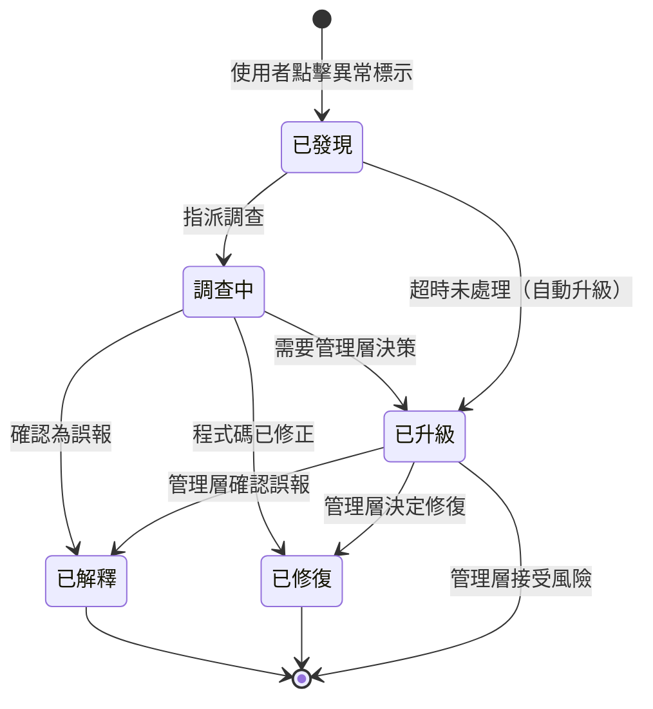

# The Door — 疑義路徑概念設計 (Doubt-Path Concept Design)

## 簡介

本文件定義 The Door 的**疑義路徑（Doubt-Path）**概念設計——當使用者在圖形上發現異常或疑義時，從「發現」到「解決」的完整處理流程。

疑義路徑的核心目標是：**讓疑義導向解決，而非停留在困惑。** 當 PM 或發布經理在圖形上看到 ⚠、⊙、◎、⚑ 等標示時，他們應該知道「下一步該做什麼」，而不是只看到一個警告符號卻不知如何處理。

> **注意：本文件為概念層級設計。** 完整的狀態機定義（具體狀態名稱、轉換條件、超時規則）將在 Phase 3 實作。此處的目的是驗證「使用者發現疑義後有明確的下一步」這個概念是否可行。

---

## 1. 三階段流程 (Three-Stage Process)

疑義路徑由三個階段組成，形成一條從發現到解決的完整路徑：

```
識別 (Identify)  →  追蹤 (Track)  →  解決 (Resolve)
    🔍                  📋                 ✅
```

| 階段 | 英文名稱 | 核心問題 | 執行者 |
|---|---|---|---|
| **識別** | Identify | 「這裡有問題嗎？」 | 使用者（PM / 發布經理） |
| **追蹤** | Track | 「誰在處理？進度如何？」 | 系統 + 指派的調查者 |
| **解決** | Resolve | 「結論是什麼？」 | 調查者 / 管理層 |

**流程概覽（Mermaid）：**


---

## 2. 識別階段 (Identify Stage)

識別階段是疑義路徑的入口——使用者在圖形上看到視覺標示，意識到「這裡可能有問題」。

### 2.1 入口點：異常標示 (Anomaly Markers, L2)

L2 功能連動圖層的異常標示是最直接的疑義入口。每種異常類型都有明確的視覺編碼（填充色 + 符號雙通道）：

| 異常類型 | 符號 | 填充色 | 含義 | 嚴重程度 |
|---|---|---|---|---|
| 邏輯死路 (logic dead-end) | ⚠ | `#fff3cd` 黃 | 某段邏輯永遠不會被執行，或條件永遠為 true/false | 3 |
| 不確定邊界 (uncertain boundary) | ⊙ | `#e9ecef` 淺灰 | 模組邊界不明確，可能有隱藏的依賴關係 | 5 |
| 死碼 (dead code) | ◎ | `#d6e9f8` 藍灰 | 程式碼存在但從未被呼叫 | 4 |
| 已知漏洞 (known vulnerability) | ⚑ | `#f8d7da` 紅 / `#ffe0cc` 橘 | 已知的安全漏洞，依嚴重程度分高危（紅）與中危（橘） | 1–2 |

**嚴重程度優先序：** 已知漏洞（高危 1 → 中危 2）> 邏輯死路 (3) > 死碼 (4) > 不確定邊界 (5)

### 2.2 入口點：範圍邊界警告 (Scope Boundary Warnings)

範圍邊界標記中，以下兩種狀態可觸發疑義路徑：

| 狀態 | 符號 | 含義 | 疑義性質 |
|---|---|---|---|
| 超出範圍 (out-of-scope) | ⚠ | 出現了未預期的變更，不在 sprint/release 計畫中 | 需要調查：為什麼會出現？是否應該納入範圍？ |
| 範圍內未完成 (in-scope incomplete) | ○ | 預期的功能尚未完成 | 需要追蹤：進度如何？是否有阻礙？ |

### 2.3 入口點：信心標示 (Confidence Markers, Phase 0b)

Phase 0b 定義的信心標示中，以下兩種低信心狀態可觸發疑義路徑：

| 信心等級 | 圖示 | 含義 | 疑義性質 |
|---|---|---|---|
| medium | ? | LLM 對此節點的分析結果信心中等 | 可能需要人工確認 |
| low | ⚠ | LLM 對此節點的分析結果信心低 | 強烈建議人工審查 |

### 2.4 識別階段的互動流程

使用者在圖形上看到上述任何標示時：

```
使用者看到標示（⚠ / ⊙ / ◎ / ⚑ / ○ / ?）
    │
    ├── 點擊標示
    │     └── 系統顯示「疑義詳情面板」
    │           ├── 什麼類型（異常 / 範圍問題 / 信心問題）
    │           ├── 哪個節點（節點名稱 + 功能描述）
    │           ├── 為什麼標記（標記原因的簡要說明）
    │           └── 下一步選項：
    │                 ├── [指派調查] → 進入追蹤階段
    │                 └── [直接升級] → 進入解決階段（升級）
    │
    └── 不點擊（僅視覺注意）
          └── 標示持續顯示，等待後續處理
```

---

## 3. 追蹤階段 (Track Stage)

追蹤階段負責記錄疑義的完整上下文，並追蹤從發現到解決的進展。

### 3.1 追蹤 Metadata

每個進入追蹤階段的疑義，系統記錄以下 metadata：

| 欄位 | 說明 | 範例 |
|---|---|---|
| **誰發現的** (who) | 發現疑義的使用者身份 | PM 王小明 |
| **何時發現** (when) | 發現時間戳 | 2024-03-15 14:30 |
| **哪個節點** (which node) | 節點 ID + 功能描述 | `inventory_checker` — 庫存檢查模組 |
| **什麼類型** (what type) | 疑義的分類 | 異常標示：邏輯死路 (⚠) |
| **追蹤狀態** (tracking status) | 從發現到解決的當前進展 | 已發現 / 調查中 / 已解釋 / 已修復 / 已升級 |

### 3.2 追蹤狀態說明

追蹤狀態反映疑義從發現到解決的生命週期：

- **已發現 (discovered)**：疑義已被使用者識別並記錄，尚未指派調查
- **調查中 (investigating)**：已指派調查者，正在分析疑義的根本原因
- **已解釋 (explained)**：調查完成，確認為誤報或已有合理解釋
- **已修復 (fixed)**：調查完成，對應的程式碼問題已修正
- **已升級 (escalated)**：疑義需要管理層決策，已提交至管理層

---

## 4. 概念層級狀態機 (Concept-Level State Machine)

以下狀態機描述疑義從發現到解決的概念流程。



### 4.1 狀態轉換說明

| 起始狀態 | 目標狀態 | 觸發條件 | 說明 |
|---|---|---|---|
| — | 已發現 | 使用者點擊異常標示 | 疑義進入追蹤系統 |
| 已發現 | 調查中 | 指派調查者 | 有人開始分析這個疑義 |
| 已發現 | 已升級 | 超時未處理 | N 天內無人處理，系統自動升級 |
| 調查中 | 已解釋 | 調查者確認為誤報 | 疑義有合理解釋，不需要修復 |
| 調查中 | 已修復 | 程式碼已修正 | 疑義對應的問題已被修復 |
| 調查中 | 已升級 | 調查者判斷需要管理層決策 | 問題超出調查者權限 |
| 已升級 | 已解釋 | 管理層確認為誤報 | 管理層審查後認為不需處理 |
| 已升級 | 已修復 | 管理層決定修復 | 管理層批准修復方案 |
| 已升級 | （結束） | 管理層接受風險 | 管理層知悉風險但決定不處理 |

> **注意：** 以上狀態名稱（已發現、調查中、已解釋、已修復、已升級）為概念層級命名，用於說明流程邏輯。Phase 3 實作時可能調整具體的狀態名稱、新增中間狀態、或細化轉換條件。

---

## 5. 解決階段 (Resolve Stage)

解決階段定義疑義的三種最終處理方式。每種方式都代表一個明確的結論，確保疑義不會永遠停留在「已標記」狀態。

### 5.1 已解釋 (Explained — False Alarm)

疑義經調查後確認為誤報，不需要程式碼修改。

- **適用場景：** LLM 推斷錯誤、標記條件過於敏感、功能設計本身如此
- **記錄內容：** 解釋原因（為什麼這不是問題）、確認者身份
- **視覺效果：** 原始標示移除或降調為灰色，標記「已解釋」

**範例：**
```
疑義：inventory_checker 標記 ⚠ 邏輯死路（條件永遠為 false）
解釋：該條件是 feature flag，目前關閉中，待 Sprint 14 啟用。非死碼。
結論：已解釋（false alarm）
```

### 5.2 已修復 (Fixed — Code Change)

疑義對應的程式碼問題已被修正。

- **適用場景：** 確認為真正的 bug、死碼需要清理、漏洞需要修補
- **記錄內容：** 修復方式、對應的 commit/PR、修復者身份
- **視覺效果：** 原始標示移除，節點恢復正常狀態

**範例：**
```
疑義：password_hasher 標記 ◎ 死碼
修復：已移除未使用的 legacy_hash() 函式，PR #142
結論：已修復（code change）
```

### 5.3 已升級 (Escalated — Management Decision)

疑義需要管理層決策，超出調查者的權限範圍。

- **適用場景：** 修復成本高需要排程決策、風險接受需要管理層簽核、跨團隊問題需要協調
- **記錄內容：** 升級原因、建議方案、管理層決策結果
- **管理層可選決策：**
  - **確認誤報** → 轉為「已解釋」
  - **決定修復** → 排入修復計畫，轉為「已修復」
  - **接受風險** → 記錄風險接受決策，疑義關閉

**範例：**
```
疑義：auth_service 標記 ⚑ 已知漏洞（CVE-2024-xxxx，中危）
升級原因：修復需要升級核心依賴，影響範圍大
管理層決策：排入 Sprint 15 修復，目前接受風險並加入監控
結論：已升級 → 管理層接受風險（暫時）
```

---

## 6. 超時升級概念 (Timeout Escalation Concept)

為防止疑義永遠停留在「已發現」或「調查中」狀態，疑義路徑包含超時自動升級機制。

### 6.1 概念描述

```
疑義發現 → [N 天未處理] → 自動升級至管理層
```

- 當疑義在「已發現」狀態停留超過 N 天，且無人指派調查，系統自動將其升級
- 當疑義在「調查中」狀態停留超過 M 天，且無進展更新，系統發出提醒或升級
- N 和 M 的具體數值為可配置參數，預設值將在 Phase 3 定義

### 6.2 超時升級的設計理由

| 問題 | 超時升級如何解決 |
|---|---|
| 疑義被標記後無人理會 | N 天後自動升級，確保管理層知悉 |
| 調查者忙於其他工作，疑義停滯 | M 天後發出提醒，避免遺忘 |
| 低優先級疑義被無限期擱置 | 超時機制確保所有疑義最終都有結論 |

### 6.3 Phase 3 待定義項目

以下項目為超時升級的實作細節，將在 Phase 3 完整定義：

- N（已發現→自動升級）的預設天數
- M（調查中→提醒/升級）的預設天數
- 不同嚴重程度是否有不同的超時閾值
- 超時通知的接收者與通知方式
- 超時升級是否可被手動延期
- 升級後的管理層回應期限

---

## 7. 概念層級設計聲明

> **本文件為概念層級設計（concept-level design）。**
>
> 本文件的目的是驗證疑義路徑的核心概念——「使用者發現疑義後有明確的下一步」——是否可行。文件中描述的三階段流程、狀態機、超時機制都是概念框架，用於指導後續的詳細設計與實作。
>
> **以下內容將在 Phase 3 完整定義：**
>
> - 具體的狀態名稱與狀態碼
> - 詳細的狀態轉換條件與驗證規則
> - 超時規則的具體數值與配置方式
> - 疑義追蹤的資料庫 schema
> - 疑義面板的 UI 互動細節
> - 通知與升級的技術實作
> - 與現有 `models.py` 的整合方式
>
> Phase 0a 的驗證方式是透過 paper prototype 測試：使用者能否在圖形上找到疑義標示、點擊後看到詳情、並說出「下一步該做什麼」。

---

## 附錄：疑義路徑與其他視覺系統的關係

疑義路徑不是獨立的視覺系統，而是**串聯其他視覺系統的互動流程**。以下表格說明疑義路徑如何與其他 Phase 0a / 0b 的視覺系統互動：

| 視覺系統 | 與疑義路徑的關係 | 入口觸發 |
|---|---|---|
| L2 異常標示 | 異常標示是疑義路徑最直接的入口 | 點擊 ⚠ / ⊙ / ◎ / ⚑ |
| 範圍邊界協定 | 超出範圍（⚠）和未完成（○）可觸發疑義路徑 | 點擊 ⚠ 超出範圍 / ○ 未完成 |
| 信心標示 (Phase 0b) | 低信心（? / ⚠）可觸發疑義路徑 | 點擊 ? medium / ⚠ low |
| Diff 視覺符號 | Diff 視圖中的變更可能揭示疑義（如新增了超出範圍的功能） | 透過範圍邊界標記間接觸發 |
| 層級切換 | 使用者可能在 L2 展開後才看到異常標示 | L1.5 → L2 展開後觸發 |
