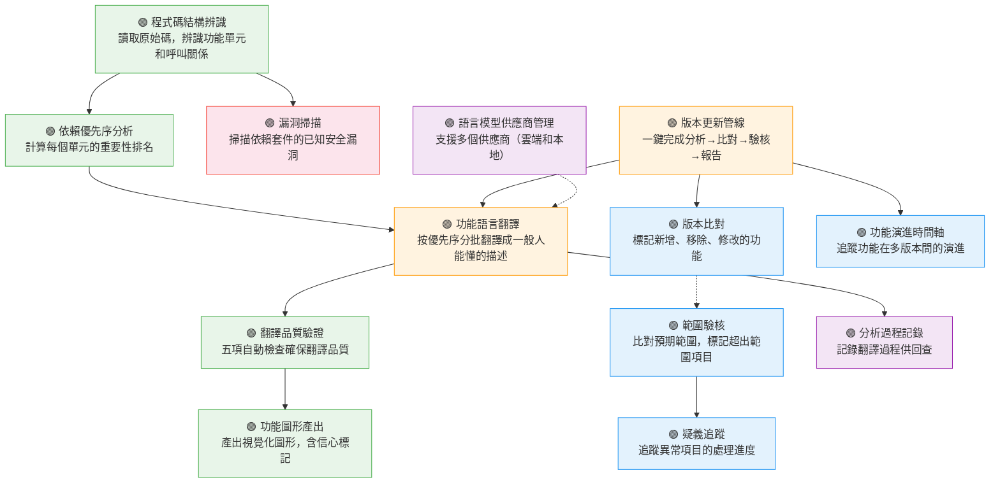

# The Door — L1 功能總覽圖形

> 由 The Door 對自己的原始碼執行結構提取 + Kiro 作為 LLM 產出的功能語言翻譯結果。

## L0 摘要

The Door 是一套程式碼驗核工具，讓不讀程式碼的人能理解系統做了什麼、改了什麼、有沒有異常。它讀取程式碼後自動產出功能語言圖形和報告，支援版本比對、範圍驗核、漏洞掃描、功能演進追蹤，以及完整的版本更新管線。

## L1 功能圖形



## 功能說明

| # | 功能 | 說明 | 觸發方式 |
|---|---|---|---|
| 1 | 程式碼結構辨識 | 讀取任何程式語言的原始碼，辨識功能單元和呼叫關係 | 使用者指定目錄 |
| 2 | 依賴優先序分析 | 計算每個單元被依賴的程度，決定翻譯優先序 | 結構辨識後自動 |
| 3 | 功能語言翻譯 | 按優先序分批送給語言模型，翻譯成功能描述 | 使用者執行分析 |
| 4 | 語言模型供應商管理 | 支援多個供應商（雲端 API 和本地模型） | 設定檔選擇 |
| 5 | 翻譯品質驗證 | 格式、覆蓋率、語言、錨點、關係五項檢查 | 翻譯後自動 |
| 6 | 功能圖形產出 | 產出 Mermaid 圖形，含信心標記和費用預估 | 使用者要求 |
| 7 | 版本比對 | 比較兩版差異，標記新增/移除/修改 | 使用者指定版本 |
| 8 | 漏洞掃描 | 掃描依賴套件的已知 CVE | 分析時自動並行 |
| 9 | 範圍驗核 | 比對預期範圍，標記 ✓ 完成 / ⚠ 超出 / ○ 未完成 | 使用者指定範圍 |
| 10 | 疑義追蹤 | 建立疑義 → 指派 → 解決，含超時升級 | 發現異常時 |
| 11 | 功能演進時間軸 | 追蹤功能從何時出現、改了幾次、語意漂移偵測 | 使用者查看 |
| 12 | 版本更新管線 | 一鍵完成分析→比對→驗核→時間軸→報告 | 使用者指定兩個目錄 |
| 13 | 分析過程記錄 | 記錄每次翻譯的判斷過程供回查 | 翻譯時自動 |

## 功能關係

```
程式碼結構辨識 ──→ 依賴優先序分析 ──→ 功能語言翻譯 ──→ 翻譯品質驗證 ──→ 功能圖形產出
      │                                    │
      │                                    └──→ 分析過程記錄
      └──→ 漏洞掃描

版本更新管線 ──→ 功能語言翻譯（分析兩個版本）
            ──→ 版本比對
            ──→ 功能演進時間軸

版本比對 ─ ─ ─→ 範圍驗核 ──→ 疑義追蹤

語言模型供應商管理 ─ ─ ─→ 功能語言翻譯
```

實線 = 直接呼叫關係（AST 可見）
虛線 = 推斷關係（透過管線串接）

## 數據

- 94 個原始碼檔案（全部 Python）
- 459 個 AST 節點
- 1,145 條依賴邊
- 13 個功能、15 個基礎設施節點、0 個未歸類節點
- 信心等級：全部 high（自己分析自己，結構清晰）
